# Basic Structure

Unicode (ISO 10646) and UTF-8 are used for all messages. Please note that
the JSON elements are formatted as JSON string elements and not as JSON
number elements or as JSON boolean elements, with the exception of the
message type "aggregated status" and "status subscribe" where
JSON boolean elements are used.

The reason why JSON string elements are heavily used is to simplify
deserialisation of values where the data type is unknown before casting is
performed, for instance for the values in "return values".

Parsing needs to be performed case sensitive.
All enum values (e.g. [alarm status](#alarm-status)) must use the exact casing stated
in this specification.

Empty values are sent as `""` for simple values and as `[]` for arrays.
Optional values can be omitted, but can not be sent as `null` unless
otherwise stated.

In the following example the message type is an alarm message.

```json
{
    "mType": "rSMsg",
    "type": "Alarm",
    "mId": "E68A0010-C336-41ac-BD58-5C80A72C7092",
    "ntsOId": "F+40100=416CG100",
    "xNId": "23055",
    "cId": "AB+84001=860SG001",
    "aCId": "A0001",
    "xACId": "Serious lamp error",
    "xNACId": "3143",
    "aSp": "Issue",
    "ack": "notAcknowledged",
    "aS": "Active",
    "sS": "notSuspended",
    "aTs": "2009-10-01T11:59:31.571Z",
    "cat": "D",
    "pri": "2",
    "rvs": [
        {
            "n": "color",
            "v": "red"
        }
    ]
}
```

The following table describes the variable content of all message types.

<table>
  <thead>
    <tr><th>Element</th><th>Value</th><th>Description</th></tr>
  </thead>
  <tbody>
    <tr><td>mType</td><td>rSMsg</td><td>RSMP identifier</td></tr>
    <tr>
      <td rowspan="14">type</td>
      <td>Alarm</td><td>Alarm message</td>
    </tr>
    <tr><td>AggregatedStatus</td><td>Aggregated status message</td></tr>
    <tr><td>AggregatedStatusRequest</td><td>Aggregated status request message</td></tr>
    <tr><td>StatusRequest</td><td>Status message. Request status</td></tr>
    <tr><td>StatusResponse</td><td>Status message. Status response</td></tr>
    <tr><td>StatusSubscribe</td><td>Status message. Start subscription</td></tr>
    <tr><td>StatusUpdate</td><td>Status message. Update of status</td></tr>
    <tr><td>StatusUnsubscribe</td><td>Status message. End subscription</td></tr>
    <tr><td>CommandRequest</td><td>Command message. Request command</td></tr>
    <tr><td>CommandResponse</td><td>Command message. Response of command</td></tr>
    <tr><td>MessageAck</td><td>Message acknowledgement. Successful</td></tr>
    <tr><td>MessageNotAck</td><td>Message acknowledgement. Unsuccessful</td></tr>
    <tr><td>Version</td><td>RSMP / SXL version message</td></tr>
    <tr><td>Watchdog</td><td>Watchdog message</td></tr>
    <tr>
      <td>mId <em>(or)</em> oMId</td>
      <td><em>(GUID)</em></td>
      <td>Message identity</td>
    </tr>
  </tbody>
</table>

{: .note }
> - **mId** is generated as GUID (Globally unique identifier) in the equipment
>   that sent the message
> - **mId** is used in all messages as a reference for the message ack
> - **oMId** is used in the message ack to refer to the message which is being acked
> - Only version 4 of Leach-Salz UUID is used for the GUID
> - Each message sent should have a new GUID, even if the message is resent or the
>   content is the same

The following table describes the variable content in all message types
which is defined by the signal exchange list (SXL), except version
messages, message acknowledgement messages and watchdog messages.

| Element | Description |
|---------|-------------|
| ntsOId | [Component id]({{ '/3.3.0/definitions/#component-id' | relative_url }}) for the NTS object |
| xNId | External NTS id |
| cId | [Component id]({{ '/3.3.0/definitions/#component-id' | relative_url }}) |

## Alarm messages
{: #alarm-messages}

An alarm message is sent to the supervision system when:

- An alarm becomes active / inactive
- An alarm is requested
- An alarm is acknowledged
- An alarm is being suspended / un-suspended

An acknowledgment of an alarm does not cause a single alarm event to
be acknowledged but all alarm events for the specific object with the
associated alarm code id. This approach simplifies both in
implementation but also in handling — if many alarms occur on the same
equipment with short time intervals.

The ability to request an alarm is used in case the supervision system
loses track of the latest state of the alarms.

A suspend of an alarm causes all alarms from the specific object with
the associated alarm code id to be suspended. This means that alarm messages
stops being sent from the site as long as the suspension is active. As soon
as the suspension is inactivated alarms can be sent again.

Suspending alarms does not affect alarm acknowledgment. This means that
when unsuspending an alarm an alarm can be inactive and not acknowledged.

Alarm messages are event driven and sent to the supervision system
when the alarm occurs. Acknowledgement of alarms and alarm suspend
messages are interaction driven.

Alarm events are referring to 'active' (aSp:Issue), 'suspended' (aSp:Suspend)
and 'acknowledged' (aSp:Acknowledged).

The timestamp (`aTs`) reflects the individual event according to the
element 'aSp'.

### Structure of an alarm message
{: #structure-of-an-alarm-message}

An alarm message has the structure according to the example below.

```json
{
    "mType": "rSMsg",
    "type": "Alarm",
    "mId": "E68A0010-C336-41ac-BD58-5C80A72C7092",
    "ntsOId": "F+40100=416CG100",
    "xNId": "23055",
    "cId": "AB+84001=860SG001",
    "aCId": "A0001",
    "xACId": "Serious lamp error",
    "xNACId": "3143",
    "aSp": "Issue",
    "ack": "notAcknowledged",
    "aS": "Active",
    "sS": "notSuspended",
    "aTs": "2009-10-01T11:59:31.571Z",
    "cat": "D",
    "pri": "2",
    "rvs": [
        {
            "n": "color",
            "v": "red"
        }
    ]
}
```

The following table describes the variable content of the message which is
defined by the SXL.

| Element | Description |
|---------|-------------|
| aCId | [Alarm code id]({{ '/3.3.0/definitions/#alarm-code-id' | relative_url }}) |
| xACId | [External alarm code id]({{ '/3.3.0/definitions/#external-alarm-code-id' | relative_url }}) |
| xNACId | [External NTS alarm code id]({{ '/3.3.0/definitions/#external-nts-alarm-code-id' | relative_url }}) |

The following table describes additional variable content of the message.

<table>
  <thead>
    <tr><th>Element</th><th>Value</th><th>Origin</th><th>Description</th></tr>
  </thead>
  <tbody>
    <tr>
      <td rowspan="7">aSp</td>
      <td>Issue</td><td>Site</td><td>An alarm becomes active/inactive.</td>
    </tr>
    <tr><td>Request</td><td>Supervision system</td><td>Request the current state of an alarm</td></tr>
    <tr><td rowspan="2">Acknowledge</td><td>Supervision system</td><td>Acknowledge an alarm</td></tr>
    <tr><td>Site</td><td>An alarm becomes acknowledged.</td></tr>
    <tr><td rowspan="2">Suspend</td><td>Supervision system</td><td>Suspend an alarm</td></tr>
    <tr><td>Site</td><td>An alarm becomes suspended/unsuspended</td></tr>
    <tr><td>Resume</td><td>Supervision system</td><td>Unsuspend an alarm</td></tr>
  </tbody>
</table>

### Alarm status
{: #alarm-status}

Alarm status is only used by alarm messages (not by alarm acknowledgement
or alarm suspend messages).

<table>
  <thead>
    <tr><th>Element</th><th>Value</th><th>Description</th></tr>
  </thead>
  <tbody>
    <tr>
      <td rowspan="2">ack</td>
      <td>Acknowledged</td><td>The alarm is acknowledged</td>
    </tr>
    <tr><td>notAcknowledged</td><td>The alarm is not acknowledged</td></tr>
    <tr>
      <td rowspan="2">aS</td>
      <td>inActive</td><td>The alarm is inactive</td>
    </tr>
    <tr><td>Active</td><td>The alarm is active</td></tr>
    <tr>
      <td rowspan="2">sS</td>
      <td>Suspended</td><td>The alarm is suspended</td>
    </tr>
    <tr><td>notSuspended</td><td>The alarm is not suspended</td></tr>
    <tr>
      <td>aTs</td>
      <td><em>(timestamp)</em></td>
      <td>
        Timestamp for when the alarm changes status.
        See the contents of aSp to determine which type of timestamp is used.<br>
        - aSp: Issue: When the alarm gets <strong>active</strong> or <strong>inactive</strong><br>
        - aSp: Acknowledge: When the alarm gets <strong>acknowledged</strong> or <strong>not acknowledged</strong><br>
        - aSp: Suspend: When the alarm gets <strong>suspended</strong> or <strong>not suspended</strong><br><br>
        All timestamps are set at the local level (and not in the supervision system) when
        the alarm occurs (and not when the message is sent).
        See also the <a href="{{ '/3.3.0/data-types/' | relative_url }}">data type</a> section.
      </td>
    </tr>
  </tbody>
</table>

The following diagram shows possible transitions between different alarm states.

Continuous lines define possible alarm status changes controlled by logic
and dashed lines define possible changes controlled by user.

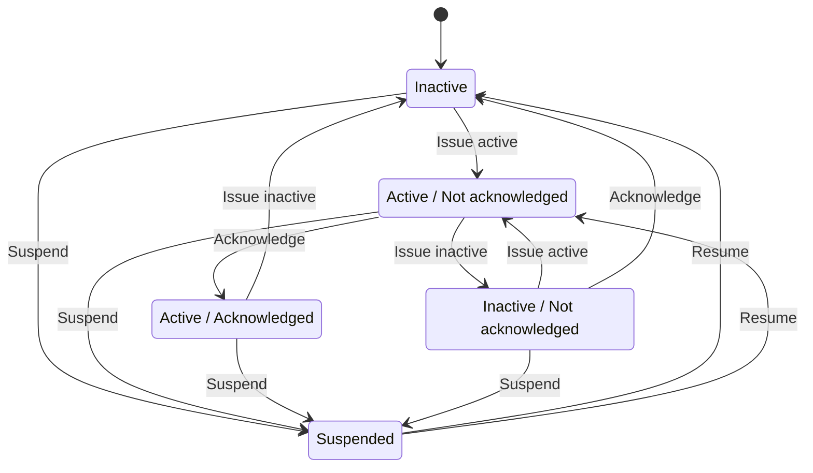

Alarms should not be sent unless:

- Alarms are unblocked and their state changes
- Alarms are sent as part of
  [communication establishment between sites and supervision system]({{ '/3.3.0/transport-of-data/#communication-establishment-between-sites-and-supervision-system' | relative_url }})
- Alarms are explicitly requested using [alarm request](#structure-for-alarm-request-message)

The following table describes the variable content of the message which is
defined by the SXL.

| Element | Description |
|---------|-------------|
| cat | [Alarm category]({{ '/3.3.0/signal-exchange-list/#alarm-category' | relative_url }}) |
| pri | [Alarm priority]({{ '/3.3.0/signal-exchange-list/#alarm-priority' | relative_url }}) |

### Return values
{: #return-values}

Return values (`rvs`) are used by alarm messages (but not by alarm
acknowledgment or alarm suspend messages) and are always sent but can
be empty (i.e. `[]`) if no return values are defined.

| Element | Value | Description |
|---------|-------|-------------|
| rvs | *(array)* | Return values. Contains the element **n** and **v** in an array |

The following table describes the content for each return value which is
defined by the signal exchange list (SXL).

| Element | Description |
|---------|-------------|
| n | Name of the return value |
| v | Value from equipment |

### Structure for alarm request message
{: #alarmmessages-req}

An alarm request message has the structure according to the example below.

```json
{
    "mType": "rSMsg",
    "type": "Alarm",
    "mId": "3d2a0097-f91c-4249-956b-dac702545b8f",
    "ntsOId": "",
    "xNId": "",
    "cId": "AB+84001=860VA001",
    "aCId": "A0004",
    "xACId": "",
    "xNACId": "",
    "aSp": "Request"
}
```

### Structure for alarm acknowledgement message
{: #alarmmessages-ack}

An alarm acknowledgement message has the structure according to the example
below.

```json
{
    "mType": "rSMsg",
    "type": "Alarm",
    "mId": "3d2a0097-f91c-4249-956b-dac702545b8f",
    "ntsOId": "",
    "xNId": "",
    "cId": "AB+84001=860VA001",
    "aCId": "A0004",
    "xACId": "",
    "xNACId": "",
    "aSp": "Acknowledge"
}
```

An alarm acknowledgement response message has the structure according to the
example below.

```json
{
    "mType": "rSMsg",
    "type": "Alarm",
    "mId": "f6843ac0-40a0-424e-8ddf-d109f4cfe487",
    "ntsOId": "",
    "xNId": "",
    "cId": "AB+84001=860VA001",
    "aCId": "A0004",
    "xACId": "",
    "xNACId": "",
    "aSp": "Acknowledge",
    "ack": "Acknowledged",
    "aS": "Active",
    "sS": "notSuspended",
    "aTs": "2015-05-29T08:55:04.691Z",
    "cat": "D",
    "pri": "3",
    "rvs": [
        {
            "n": "Temp",
            "v": "-18.5"
        }
    ]
}
```

### Structure for alarm suspend message
{: #alarmmessages-suspend}

An alarm suspend message has the structure according to the example below.

```json
{
    "mType": "rSMsg",
    "type": "Alarm",
    "mId": "b6579d6d-3a9d-4169-b777-f094946a863e",
    "ntsOId": "",
    "xNId": "",
    "cId": "AB+84001=860VA001",
    "aCId": "A0004",
    "xACId": "",
    "xNACId": "",
    "aSp": "Suspend"
}
```

```json
{
    "mType": "rSMsg",
    "type": "Alarm",
    "mId": "2ea7edfc-8e3a-4765-85e7-db844c4702a0",
    "ntsOId": "",
    "xNId": "",
    "cId": "AB+84001=860VA001",
    "aCId": "A0004",
    "xACId": "",
    "xNACId": "",
    "aSp": "Suspend",
    "ack": "Acknowledged",
    "aS": "Active",
    "sS": "Suspended",
    "aTs": "2015-05-29T08:56:25.390Z",
    "cat": "D",
    "pri": "3",
    "rvs": [
        {
            "n": "Temp",
            "v": "-18.5"
        }
    ]
}
```

```json
{
    "mType": "rSMsg",
    "type": "Alarm",
    "mId": "2a744145-403a-423f-ba80-f38e283a778e",
    "ntsOId": "",
    "xNId": "",
    "cId": "AB+84001=860VA001",
    "aCId": "A0004",
    "xACId": "",
    "xNACId": "",
    "aSp": "Resume"
}
```

```json
{
    "mType": "rSMsg",
    "type": "Alarm",
    "mId": "3313526e-b744-434a-b4dd-0cfa956512e0",
    "ntsOId": "",
    "xNId": "",
    "cId": "AB+84001=860VA001",
    "aCId": "A0004",
    "xACId": "",
    "xNACId": "",
    "aSp": "Suspend",
    "ack": "Acknowledged",
    "aS": "Active",
    "sS": "notSuspended",
    "aTs": "2015-05-29T08:58:28.166Z",
    "cat": "D",
    "pri": "3",
    "rvs": [
        {
            "n": "Temp",
            "v": "-18.5"
        }
    ]
}
```

Allowed content in alarm suspend message is the same as for alarm messages
(see [Structure of an alarm message](#structure-of-an-alarm-message)) with the exception for
[Alarm status](#alarm-status) and [Return values](#return-values).

### Message exchange — alarm messages

Message acknowledgement (see section [Message acknowledgement](#message-acknowledgement)) is
implicit in the following figures.

**An alarm is active/inactive**

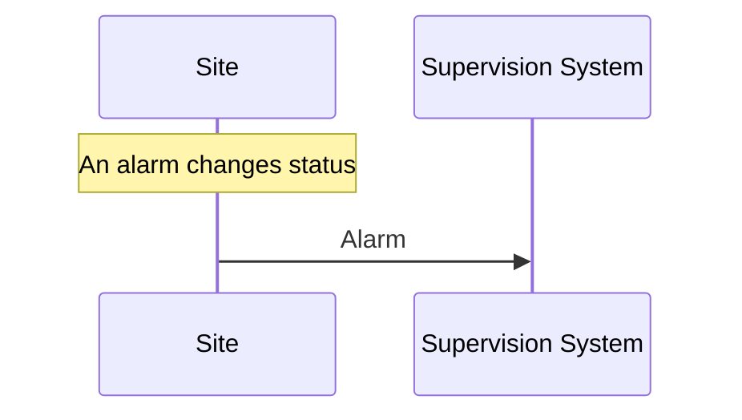

1. An alarm message is sent to supervision system with the status of the alarm (the alarm is active/inactive)

**An alarm is requested**

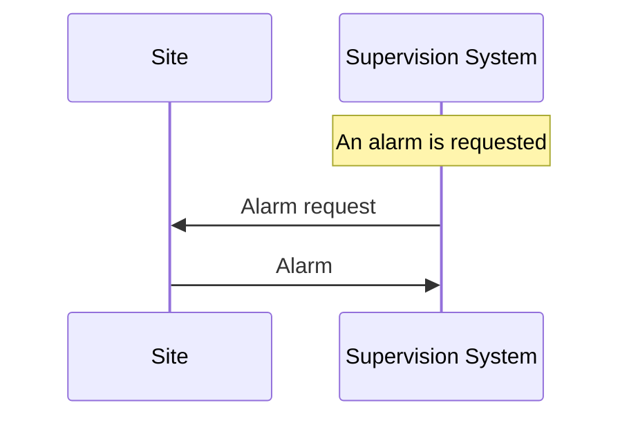

1. An alarm is requested from the supervision system
2. An alarm message is sent to supervision system with the status of the alarm

**An alarm is acknowledged at the supervision system**

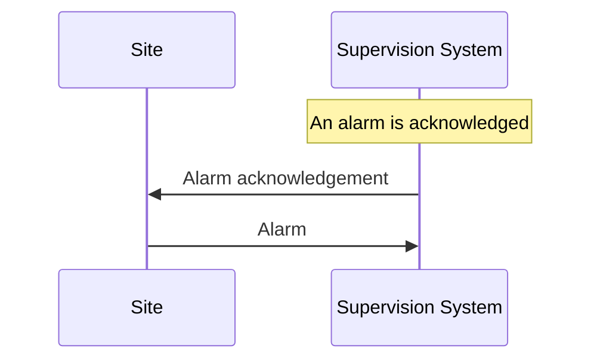

1. An alarm acknowledgement message is sent to the site
2. An alarm message is sent to the supervision system (that the alarm is acknowledged)

**An alarm is acknowledged at the site**

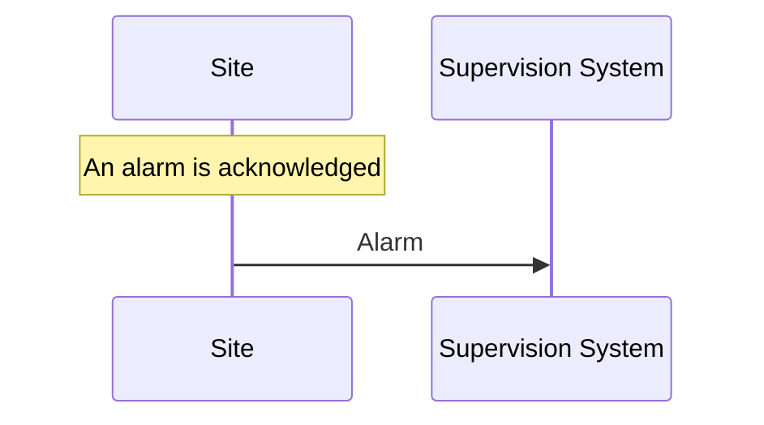

1. An alarm message is being sent to the supervision system with the status of the alarm (that the alarm is acknowledged)

**An alarm is suspended/unsuspended from the supervision system**

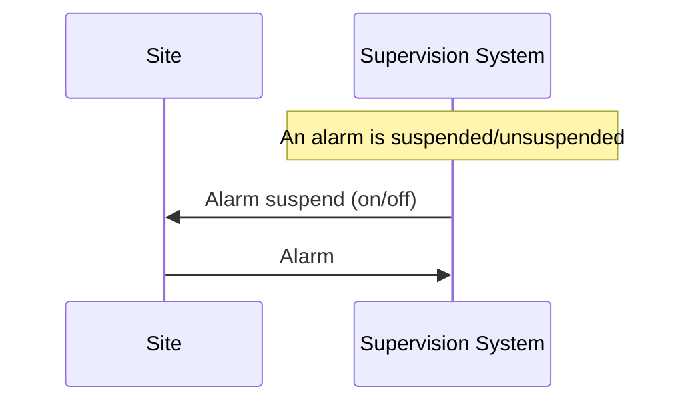

1. An alarm suspend message is being sent to the site
2. An alarm message is sent to the supervision system with the status of the alarm (that the suspension is activated/deactivated)

**An alarm is suspended/unsuspended from the site**

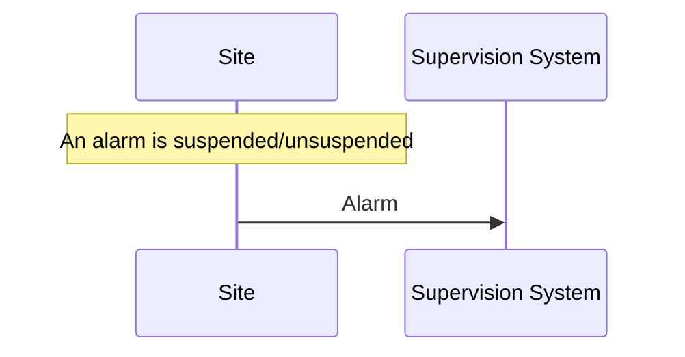

1. An alarm message is sent to the supervision system with the status of the alarm (that suspension is activated/deactivated)

## Aggregated status message
{: #aggregated-status-message}

This type of message is sent to the supervision system to inform about the
status of the site. The aggregated status applies to the object which is
defined by **ObjectType** in the signal exchange list. If no object is defined
then no aggregated status message is sent.

Aggregated status messages are interaction driven and are sent if state,
functional position or functional status are changed at the site.

### Message structure

An aggregated status message has the structure according to the example
below.

```json
{
    "mType": "rSMsg",
    "type": "AggregatedStatus",
    "mId": "be12ab9a-800c-4c19-8c50-adf832f22420",
    "ntsOId": "O+14439=481WA001",
    "xNId": "",
    "cId": "O+14439=481WA001",
    "aSTS": "2015-06-08T08:05:06.584Z",
    "fP": null,
    "fS": null,
    "se": [
        true,false,false,false,false,false,false,false
    ]
}
```

The following tables describe the variable content of the message:

| Element | Value | Description |
|---------|-------|-------------|
| aSTS | *(timestamp)* | Timestamp for the aggregated status. All timestamps are set at the site (and not in the supervision system) when the event occurs (and not when the message is sent). See also the [data type]({{ '/3.3.0/data-types/' | relative_url }}) section. |

The following table describes the variable content defined by the signal
exchange list (SXL).

| Element | Description |
|---------|-------------|
| fP | [Functional position]({{ '/3.3.0/definitions/#functional-position' | relative_url }}) |
| fS | [Functional state]({{ '/3.3.0/definitions/#functional-state' | relative_url }}) |
| se | Array of eight booleans. See [State bits](#state-bits) |

`fP` and `fS` is set to `null` or empty string if no value is defined
in the SXL.

### State bits
{: #state-bits}

- **State bits** `se` is an array of eight booleans. The boolean elements define
  the status of the site to [NTS]({{ '/3.3.0/definitions/#nts' | relative_url }}).

- It is technically valid in RSMP to set the boolean elements to nonsensical
  values, e.g. all boolean elements to `false`, but it is not defined how to
  interpret it at the receiving end.

A definition of each boolean element (1–8):

| Bit | Description | Status |
|-----|-------------|--------|
| 1 | The site is out of operation by the local control system or maintenance personnel | <span class="state-swatch" style="background:#00ffff">Local control</span> |
| 2 | Supervision system has no contact with the site | <span class="state-swatch" style="background:#7030a0;color:white">Communication disruption</span> |
| 3 | The site has an alarm that requires immediate action (Priority 1) | <span class="state-swatch" style="background:#ff0000">High priority alarm</span> |
| 4 | The site has an alarm that does not require immediate action but is planned during the next work shift (Priority 2) | <span class="state-swatch" style="background:#ffff00">Medium priority alarm</span> |
| 5 | The site has an alarm that will be corrected at the next planned maintenance shift (Priority 3) | <span class="state-swatch" style="background:#548dd4">Low priority alarm</span> |
| 6 | The site is connected and is currently in use | <span class="state-swatch" style="background:#00b050">Normal - In use</span> |
| 7 | The site is connected but is currently not in use | <span class="state-swatch" style="background:#404040;color:white">Rest</span> |
| 8 | The site is not connected to the supervision system | <span class="state-swatch" style="background:#a6a6a6">Not Connected</span> |

- Bit 3 is true if there are any active alarms with priority 1
- Bit 4 is true if there are any active alarms with priority 2
- Bit 5 is true if there are any active alarms with priority 3

See section [Alarm priority]({{ '/3.3.0/signal-exchange-list/#alarm-priority' | relative_url }}).

## Aggregated status request message
{: #aggregated-status-request-message}

This type of message is sent from the supervision system to request the
latest aggregated status, in case the supervision system has lost track
of the current status.

### Message structure

An aggregated status request message has the structure according to the example
below.

```json
{
    "mType": "rSMsg",
    "type": "AggregatedStatusRequest",
    "mId": "be12ab9a-800c-4c19-8c50-adf832f22425",
    "ntsOId": "O+14439=481WA001",
    "xNId": "",
    "cId": "O+14439=481WA001"
}
```

### Message exchange — aggregated status

Message acknowledgement (see section [Message acknowledgement](#message-acknowledgement)) is
implicit in the following figures.

**Functional state, functional position or state booleans change at the site**

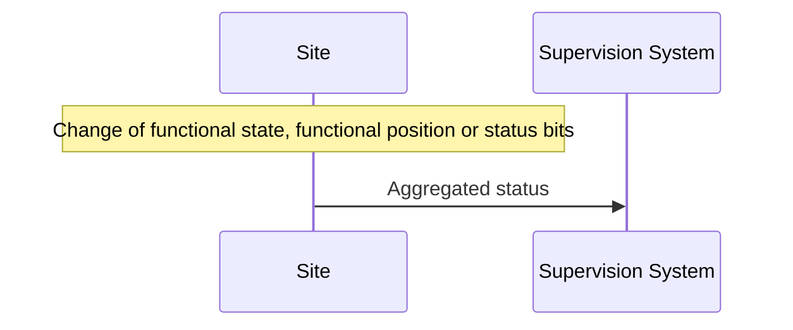

1. An aggregated status message is sent to the supervision system.

**The supervision system requests aggregated status**

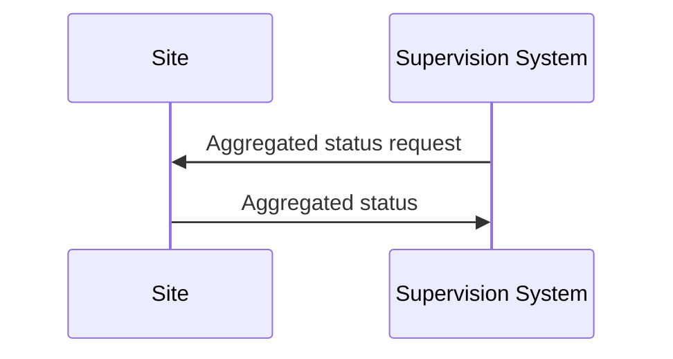

1. An aggregated status request message is sent to the site.
2. An aggregated status message is sent to the supervision system.

## Status messages

The status message is a type of message that is sent to the supervision
system or other equipment with the value of one or more requested
statuses, for the referenced object.

The status message can both be interaction driven or event driven and
can be sent during the following prerequisites:

- When status is requested from the supervision system or other equipment.
- According to subscription — either by using a fixed time interval or
  when the status changes.

### Structure of a status request
{: #status-request}

A status request message has the structure according to the example
below.

```json
{
    "mType": "rSMsg",
    "type": "StatusRequest",
    "mId": "f1a13213-b90a-4abc-8953-2b8142923c55",
    "ntsOId": "O+14439=481WA001",
    "xNId": "",
    "cId": "O+14439=481WA001",
    "sS": [
        {
            "sCI": "S0003",
            "n": "inputstatus"
        },{
            "sCI": "S0003",
            "n": "extendedinputstatus"
        }
    ]
}
```

The status code id (`sCI`) and name (`n`) are placed in an array
(`sS`) in order to enable support for requesting multiple statuses at
once.

<a id="table-statusrequest"></a>

| Element | Description |
|---------|-------------|
| sCI | [Status code id]({{ '/3.3.0/definitions/#status-code-id' | relative_url }}) |
| n | Name of the return value |

### Structure for status response message
{: #status-response}

A status response message has the structure according to the example below.

The status code id (`sCI`) and name (`n`) are placed in an array
(`sS`) in order to enable support for responding to multiple statuses at once.

```json
{
    "mType": "rSMsg",
    "type": "StatusResponse",
    "mId": "0a95e463-192a-4dd7-8b57-d2c2da636584",
    "ntsOId": "O+14439=481WA001",
    "xNId": "",
    "cId": "O+14439=481WA001",
    "sTs": "2015-06-08T09:15:18.266Z",
    "sS": [
        {
            "sCI": "S0003",
            "n": "inputstatus",
            "s": "100101",
            "q": "recent"
        },{
            "sCI": "S0003",
            "n": "extendedinputstatus",
            "s": "100100101",
            "q": "recent"
        }
    ]
}
```

<a id="table-statusresponse"></a>

| Element | Value | Description |
|---------|-------|-------------|
| sTs | *(timestamp)* | Timestamp. All timestamps are set at the site (and not in the supervision system) when the status is fetched (and not when the message is sent). See also the [data type]({{ '/3.3.0/data-types/' | relative_url }}) section. |

### Return values (returnvalue)
{: #table-statusresponse-returnvalues}

Return values (`sS`) are always sent but can be empty if no return values exist.

| Element | Value | Description |
|---------|-------|-------------|
| sS | *(array)* | Return values. Contains the elements `sCI`, `s`, `n` and `q` in an array. |

| Element | Description |
|---------|-------------|
| sCI | [Status code id]({{ '/3.3.0/definitions/#status-code-id' | relative_url }}) |
| n | Name of the return value |
| s | Value from equipment |

The following table describes additional variable content of the message.

<table>
  <thead>
    <tr><th>Element</th><th>Value</th><th>Description</th></tr>
  </thead>
  <tbody>
    <tr>
      <td rowspan="4">q</td>
      <td>recent</td><td>The value is up to date</td>
    </tr>
    <tr><td>old</td><td>The value is not up to date. Used when sending buffered values</td></tr>
    <tr><td>undefined</td><td>The component does not exist</td></tr>
    <tr><td>unknown</td><td>The value is unknown</td></tr>
  </tbody>
</table>

If the component does not exist or the value `s` is unknown then:

- Subscription will not be performed
- `q` is set according to the table above
- `s` must be set to `null`

### Structure for a status subscription request message

A message with the request of subscription to a status has the
structure according to the example below. The message is used for
constructing a list of subscriptions of statuses, digital and analogue
values and events that are desirable to send to supervision system,
e.g. temperature, wind speed, power consumption, manual control.

```json
{
    "mType": "rSMsg",
    "type": "StatusSubscribe",
    "mId": "d6d97f8b-e9db-4572-8084-70b55e312584",
    "ntsOId": "O+14439=481WA001",
    "xNId": "",
    "cId": "O+14439=481WA001",
    "sS": [
        {
            "sCI": "S0001",
            "n": "signalgroupstatus",
            "uRt": "5",
            "sOc": false
        },{
            "sCI": "S0001",
            "n": "cyclecounter",
            "uRt": "5",
            "sOc": false
        },{
            "sCI": "S0001",
            "n": "basecyclecounter",
            "uRt": "5",
            "sOc": false
        },{
            "sCI": "S0001",
            "n": "stage",
            "uRt": "5",
            "sOc": false
        }
    ]
}
```

| Element | Value | Description |
|---------|-------|-------------|
| uRt | *(string)* | updateRate |
| sOc | boolean | sendOnChange |

The **updateRate** `uRt` and **sendOnChange** `sOc` determine when a
status update should be sent.

The following applies:

- **updateRate** defines a specific interval when to send updates.
  Defined in seconds with decimals, e.g. "2.5" for 2.5 seconds.
  Dot (.) is used as a decimal point.
- If **updateRate** is set to "0" it means that no update is sent using an
  interval.
- **sendOnChange** defines if a status update should be sent as soon as the
  value changes.
- It is possible to combine **updateRate** and **sendOnChange** to send an
  update when the value changes and at the same time using a specific
  interval.
- If **updateRate** and **sendOnChange=true** are combined, the updateRate
  timer is reset when the value changes.
  For example, if updateRate is set to 5 seconds but the value changes after
  2 seconds (triggering sendOnChange) the updateRate timer starts over and
  waits another 5 seconds to trigger.
- It is not valid to set **updateRate=0** and **sendOnChange=false** since
  it means that no subscription updates will be sent.
- It is allowed to change **updateRate** and **sendOnChange** by sending a
  new StatusSubscribe during an active subscription.

### Structure for a status update message

The status update message is an answer to a request for status subscription.

The following applies:

- A StatusUpdate is always sent immediately after subscription request,
  unless the subscription is already active. The reason for sending the
  response immediately is because subscriptions usually are established
  shortly after RSMP connection establishment and the supervision system
  needs to update with the current statuses.
- If a subscription is already active then the site must not establish
  a new subscription but use the existing one. It's allowed to change
  **updateRate** and **sendOnChange**.

```json
{
    "mType": "rSMsg",
    "type": "StatusUpdate",
    "mId": "dabb67f9-2601-4db9-bb8a-c7c47f57e100",
    "ntsOId": "O+14439=481WA001",
    "xNId": "",
    "cId": "O+14439=481WA001",
    "sTs": "2015-06-08T09:33:04.735Z",
    "sS": [
        {
            "sCI": "S0001",
            "n": "signalgroupstatus",
            "s": "A021BC01",
            "q": "recent"
        },{
            "sCI": "S0001",
            "n": "cyclecounter",
            "s": "20",
            "q": "recent"
        },{
            "sCI": "S0001",
            "n": "basecyclecounter",
            "s": "10",
            "q": "recent"
        },{
            "sCI": "S0001",
            "n": "stage",
            "s": "1",
            "q": "recent"
        }
    ]
}
```

The allowed content is described in [Status response](#status-response) and
[Return values](#table-statusresponse-returnvalues).

Since different updateRate can be defined for different objects it means that
partial StatusUpdates can be sent.

```json
{
    "mType": "rSMsg",
    "type": "StatusSubscribe",
    "mId": "6bbcb26e-78fe-4517-9e3d-8bb4f972c076",
    "ntsOId": "",
    "xNId": "",
    "cId": "O+14439=481WA001",
    "sS": [
        {
            "sCI": "S0096",
            "n": "hour",
            "uRt": "120",
            "sOc": false
        },{
            "sCI": "S0096",
            "n": "minute",
            "uRt": "60",
            "sOc": false
        }
    ]
}
```

```json
{
    "mType": "rSMsg",
    "type": "StatusUpdate",
    "mId": "b6bd7c96-f150-4756-9752-47a661e116db",
    "ntsOId": "",
    "xNId": "",
    "cId": "O+14439=481WA001",
    "sTs": "2015-05-29T13:47:56.740Z",
    "sS": [
        {
            "sCI": "S0096",
            "n": "minute",
            "s": "47",
            "q": "recent"
        }
    ]
}
```

### Structure for a status unsubscription message

A message with the request of unsubscription to a status has the structure
according to the example below. The request unsubscribes on one or several
statuses. No particular answer is sent for this request, other than the
usual message acknowledgement.

```json
{
    "mType": "rSMsg",
    "type": "StatusUnsubscribe",
    "mId": "5ff528c5-f2f0-4bc4-a335-280c52b6e6d8",
    "ntsOId": "O+14439=481WA001",
    "xNId": "",
    "cId": "O+14439=481WA001",
    "sS": [
        {
            "sCI": "S0001",
            "n": "signalgroupstatus"
        },{
            "sCI": "S0001",
            "n": "cyclecounter"
        },{
            "sCI": "S0001",
            "n": "basecyclecounter"
        },{
            "sCI": "S0001",
            "n": "stage"
        }
    ]
}
```

The allowed content is described in [Status request](#status-request).

### Message exchange — status request/response

Message acknowledgement (see section [Message acknowledgement](#message-acknowledgement)) is
implicit in the following figure.

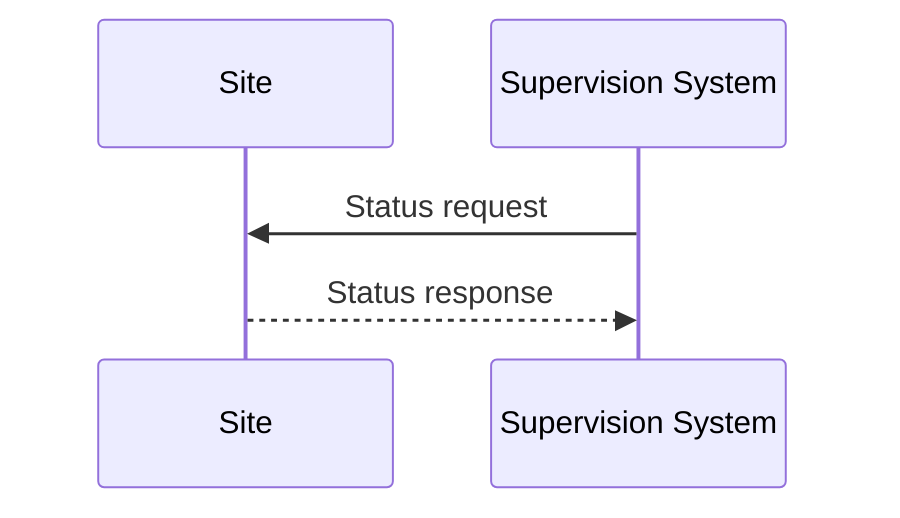

1. Status request
2. Status response

### Message exchange — status subscription

Message acknowledgement (see section [Message acknowledgement](#message-acknowledgement)) is
implicit in the following figure.

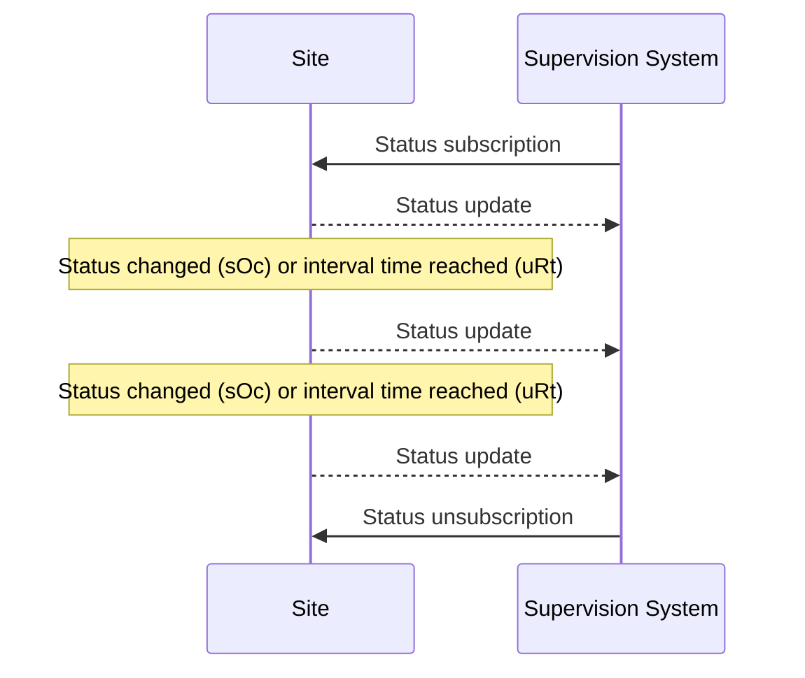

Example of message exchange with subscription, status updates and unsubscription.

## Command messages

Command messages are used to give order using one or more commands, for the
referenced object.
The site responds with a command acknowledgement.

All arguments need to be included in a command, otherwise it results in a serious
error resulting in MessageNotAck. See section about [incomplete commands]({{ '/3.3.0/error-handling/#incomplete-commands' | relative_url }}).

Command messages are interaction driven and are sent when commands are
requested on any given object by the supervision system or other equipment.

### Structure of a command request

A command request message has the structure according to the example
below. A command request message with the intent to change a value of the
requested object.

```json
{
    "mType": "rSMsg",
    "type": "CommandRequest",
    "mId": "cf76365e-9c7b-44a4-86bd-d107cdfc3fcf",
    "ntsOId": "O+14439=481WA001",
    "xNId": "",
    "cId": "O+14439=481WA001",
    "arg": [
        {
            "cCI": "M0001",
            "n": "status",
            "cO": "setValue",
            "v": "YellowFlash"
        },{
            "cCI": "M0001",
            "n": "securityCode",
            "cO": "setValue",
            "v": "123"
        },{
            "cCI": "M0001",
            "n": "timeout",
            "cO": "setValue",
            "v": "30"
        },{
            "cCI": "M0001",
            "n": "intersection",
            "cO": "setValue",
            "v": "1"
        }
    ]
}
```

The command code (`cCI`) and name (`n`) are placed in an array
(`arg`) in order to enable support for requesting multiple commands at
once.

| Element | Value | Description |
|---------|-------|-------------|
| arg | *(array)* | Argument. Contains the elements **cCI**, **n**, **cO**, **v** in an array |

The following table describes the variable content defined by the SXL.

| Element | Description |
|---------|-------------|
| cCI | [Command code id]({{ '/3.3.0/definitions/#command-code-id' | relative_url }}) |
| n | Name of the argument |
| cO | Command. Optionally used for RPC (Remote Procedure Call) |
| v | Value |

### Structure of a command response message

A command response message has the structure according to the example
below. A command response message informs about the updated value of the
requested object.

The command code (`cCI`) and name (`n`) are placed in an array
(`rvs`) in order to enable support for responding to multiple commands at
once.

```json
{
    "mType": "rSMsg",
    "type": "CommandResponse",
    "mId": "0fd63726-be19-4c09-8553-48451735cb0b",
    "ntsOId": "O+14439=481WA001",
    "xNId": "",
    "cId": "O+14439=481WA001",
    "cTS": "2015-06-08T11:49:03.293Z",
    "rvs": [
        {
            "cCI": "M0001",
            "n": "status",
            "v": "YellowFlash",
            "age": "recent"
        },{
            "cCI": "M0001",
            "n": "securityCode",
            "v": "123",
            "age": "recent"
        },{
            "cCI": "M0001",
            "n": "timeout",
            "v": "30",
            "age": "recent"
        },{
            "cCI": "M0001",
            "n": "intersection",
            "v": "1",
            "age": "recent"
        }
    ]
}
```

| Element | Value | Description |
|---------|-------|-------------|
| cTS | *(timestamp)* | Timestamp for the command response. All timestamps are set at the site (and not in the supervision system) when the event occurs (and not when the message is sent). See also the [data type]({{ '/3.3.0/data-types/' | relative_url }}) section. |

Return values (`rvs`) are always sent but can be empty if no return values are defined.

| Element | Value | Description |
|---------|-------|-------------|
| rvs | *(array)* | Return values. Contains the elements **cCI**, **v**, **n** and **age** in an array. |

| Element | Description |
|---------|-------------|
| cCI | [Command code id]({{ '/3.3.0/definitions/#command-code-id' | relative_url }}) |
| n | Name of the return value |
| v | Value from equipment |

<table>
  <thead>
    <tr><th>Element</th><th>Value</th><th>Description</th></tr>
  </thead>
  <tbody>
    <tr>
      <td rowspan="4">age</td>
      <td>recent</td><td>The value is up to date</td>
    </tr>
    <tr><td>old</td><td>The value is not up to date</td></tr>
    <tr><td>undefined</td><td>The component does not exist. <strong>v</strong> should be set to <strong>null</strong>.</td></tr>
    <tr><td>unknown</td><td>The value is unknown. <strong>v</strong> should be set to <strong>null</strong>.</td></tr>
  </tbody>
</table>

### Message exchange — command request/response

Message acknowledgement (see section [Message acknowledgement](#message-acknowledgement)) is
implicit in the following figure.

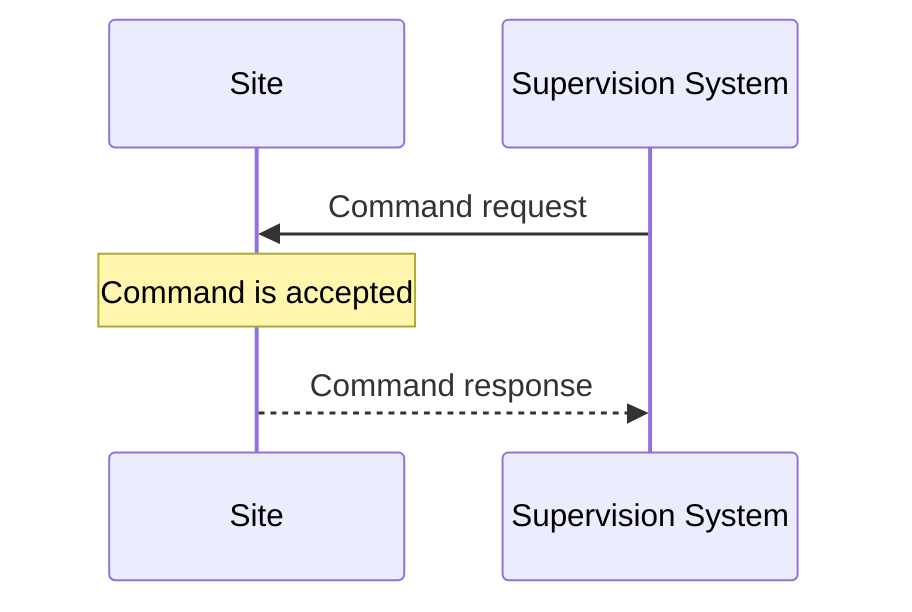

1. Command request
2. Command response

## Message acknowledgement
{: #message-acknowledgement}

Message acknowledgement is sent as an initial answer to all other
messages. This type of message should not be mixed up with alarm
acknowledgement, which has a different function. The purpose of
message acknowledgement is to detect communication disruptions,
function as an acknowledgment that the message has reached its
destination and to verify that the message was understood.

There are two types of message acknowledgement — **Message
acknowledgment** (MessageAck) which confirms that the message was understood and
**Message not acknowledged** (MessageNotAck) which indicates that the message
was not understood.

- If no message acknowledgement is received within a predefined time, then
  each communicating party should treat it as a communication disruption.
  (see [Communication disruption]({{ '/3.3.0/transport-of-data/#communication-disruption' | relative_url }}))
- The default timeout value should be 30 seconds.
- If the version messages has not been exchanged according to communication
  establishment sequence
  (see [Communication establishment between sites and supervision system]({{ '/3.3.0/transport-of-data/#communication-establishment-between-sites-and-supervision-system' | relative_url }})
  and [Communication establishment between sites]({{ '/3.3.0/transport-of-data/#communication-establishment-between-sites' | relative_url }})) then
  message acknowledgement (MessageAck/MessageNotAck) should not be sent as a
  response to any other messages other than the version message
  (see [RSMP/SXL Version](#rsmpsxl-version)). The lack of acknowledgement forces the other
  communicating party to treat it as communication disruption and disconnect
  and reconnect, ensuring that the connection restarts with communication
  establishment sequence.

The acknowledgement messages are interaction driven and are sent when
any other type of message is received.

### Message structure — Message acknowledgement

An acknowledgement message has the structure according to the example
below.

```json
{
    "mType": "rSMsg",
    "type": "MessageAck",
    "oMId": "49c6c824-d593-4c16-b335-f04feda16986"
}
```

### Message structure — Message not acknowledged

A "not acknowledgement" message has the structure according to the example
below.

```json
{
    "mType": "rSMsg",
    "type": "MessageNotAck",
    "oMId": "554dff0-9cc5-4232-97a9-018d5796e86a",
    "rea": "Unknown packet type: Watchdddog"
}
```

| Element | Value | Description |
|---------|-------|-------------|
| rea | *(optional)* | Error message where all relevant information about the nature of the error can be provided. |

### Message exchange — message acknowledgement

Supervision system sends initial message:

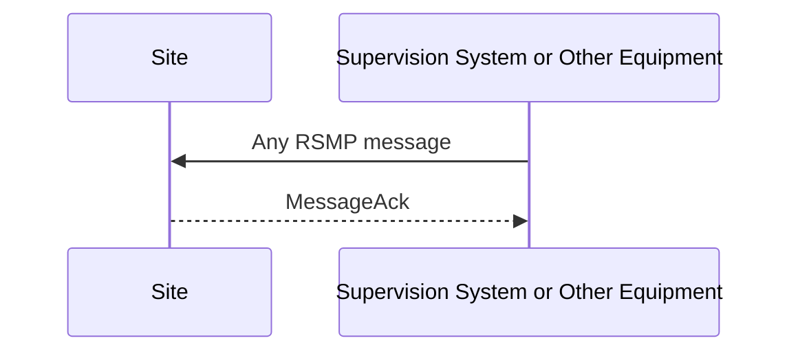

1. A message is sent from supervision system or other equipment
2. The site responds with a message acknowledgement

Site sends initial message:

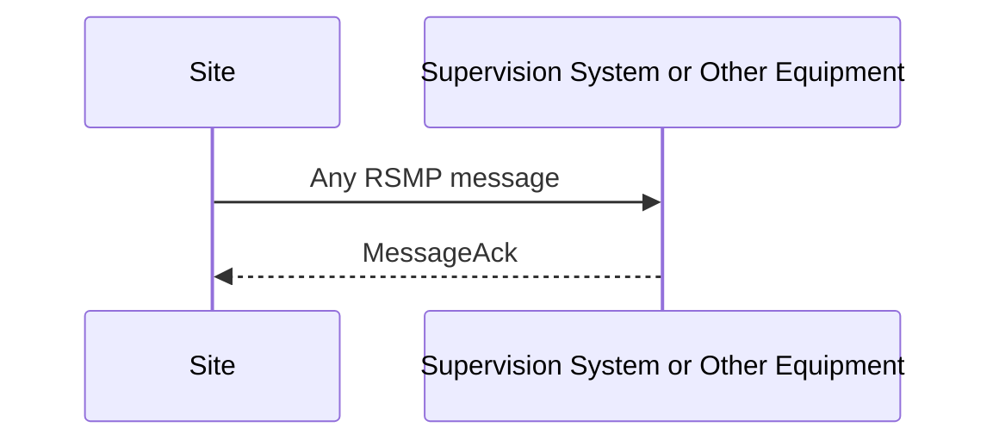

1. A message is sent from the site
2. The supervision system or other equipment responds with a message acknowledgement

## RSMP/SXL Version
{: #rsmpsxl-version}

RSMP/SXL Version is the initial message when establishing communication.

It contains:

- Site Id
- SXL revision
- All supported RSMP versions

The Site Id and SXL revision must match between the communicating parties.

If there is a mismatch or if there are no RSMP version that both
communicating parties support, see [Communication rejection]({{ '/3.3.0/transport-of-data/#communication-rejection' | relative_url }}).

The version message should be implemented in such a way that it should be
possible to add additional tags/variables (e.g. date) without affecting
existing implementations.

The principle of the message exchange is defined by the communication
establishment (see
[Communication establishment between sites and supervision system]({{ '/3.3.0/transport-of-data/#communication-establishment-between-sites-and-supervision-system' | relative_url }})
and [Communication establishment between sites]({{ '/3.3.0/transport-of-data/#communication-establishment-between-sites' | relative_url }})).

### Message structure

A version message has the structure according to the example below. In
the example below the system has support for RSMP version **3.1.1**,
**3.1.2** and SXL version **1.0.13** for site **O+14439=481WA001**.

```json
{
    "mType": "rSMsg",
    "type": "Version",
    "mId": "6f968141-4de5-42ff-8032-45f8093762c5",
    "RSMP": [
        {
            "vers": "3.1.1"
        },{
            "vers": "3.1.2"
        }
    ],
    "siteId": [
        {
            "sId": "O+14439=481WA001"
        }
    ],
    "SXL": "1.0.13"
}
```

The following table describes the variable content of the message which is
defined by the SXL.

| Element | Site config (Excel) | Site config (YAML) | Description |
|---------|--------------------|--------------------|-------------|
| sId | SiteId | | [Site id]({{ '/3.3.0/definitions/#site-id' | relative_url }}) |
| SXL | SXL revision | version | Revision of SXL. E.g. "1.3" |

It is possible to use more than one site id in a single RSMP connection.
Therefore the site ids that are used in the RSMP connection are sent
in the message using an array with `sId`.

| Element | Description |
|---------|-------------|
| vers | Version of RSMP. E.g. "3.1.2", "3.1.3" or "3.1.4". All the supported RSMP versions are sent in the message using an array (**RSMP**). |

## Watchdog
{: #watchdog}

The primary purpose of watchdog messages is to ensure that the
communication remains established and to detect any communication
disruptions between site and supervision system. For any subsystem
alarms are used instead.

The secondary purpose of watchdog messages is to provide a timestamp that can
be used for simple time synchronization.

- Time synchronization using the watchdog message should be configurable at the
  site (enabled/disabled)
- If time synchronization is enabled, the site should synchronize its clock
  using the timestamp from watchdog messages — at communication establishment and
  then at least once every 24 hours.
- The interval duration for sending watchdog messages should be
  configurable at both the site and the supervision system. The default
  setting should be once a minute.

Watchdog messages are sent in both directions, both from the site and
from the supervision system. At initial communication establishment
(after version message) the watchdog message should be sent.

### Message structure

A watchdog message has the structure according to the example below.

```json
{
    "mType": "rSMsg",
    "type": "Watchdog",
    "mId": "f48900bc-e6fb-431a-8ca4-05070016f64a",
    "wTs": "2015-06-08T12:01:39.654Z"
}
```

| Element | Value | Description |
|---------|-------|-------------|
| wTs | *(timestamp)* | Timestamp for the watchdog. See also the [data type]({{ '/3.3.0/data-types/' | relative_url }}) section. |

### Message exchange — watchdog

Message acknowledgement (see section [Message acknowledgement](#message-acknowledgement)) is
implicit in the following figures.

Site sends watchdog message:

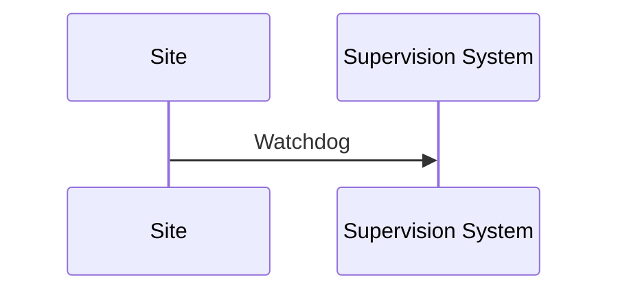

1. Watchdog message is sent from site

Supervision system/other equipment sends watchdog message:

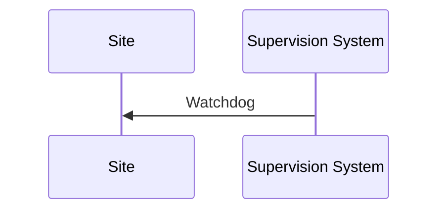

1. Watchdog message is sent from supervision system/other equipment
