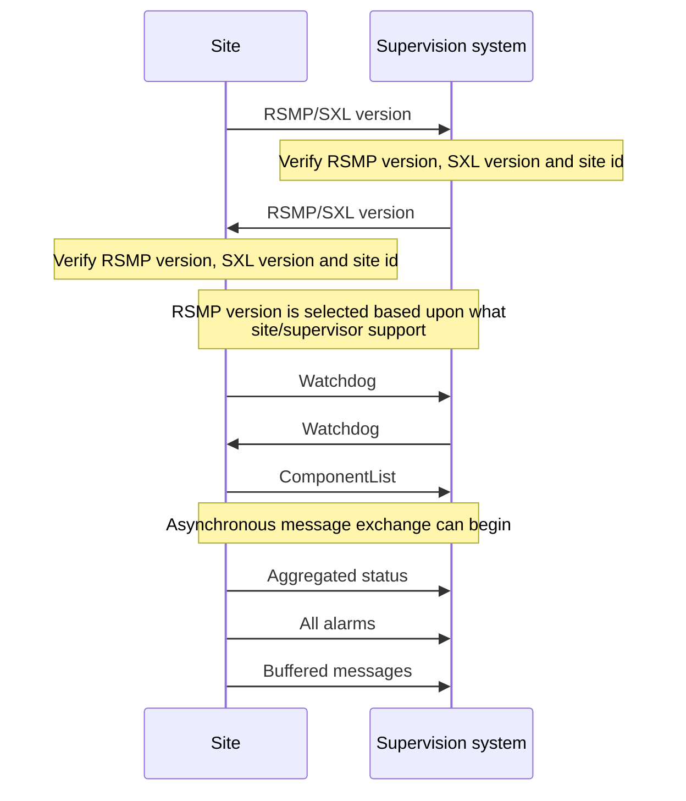
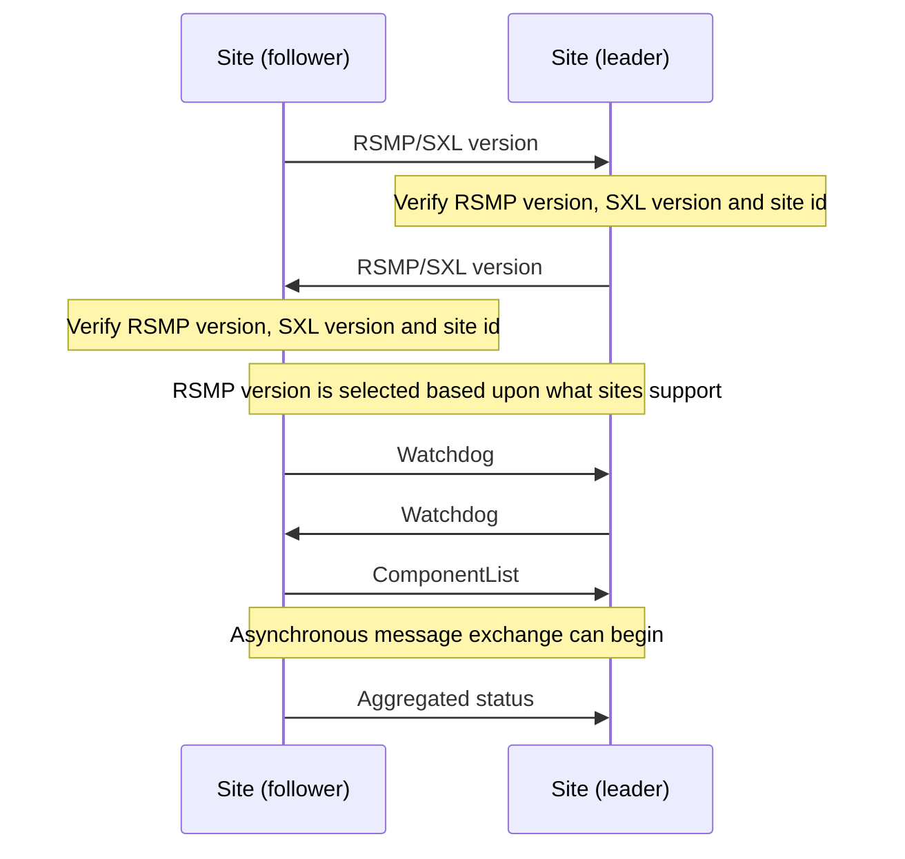
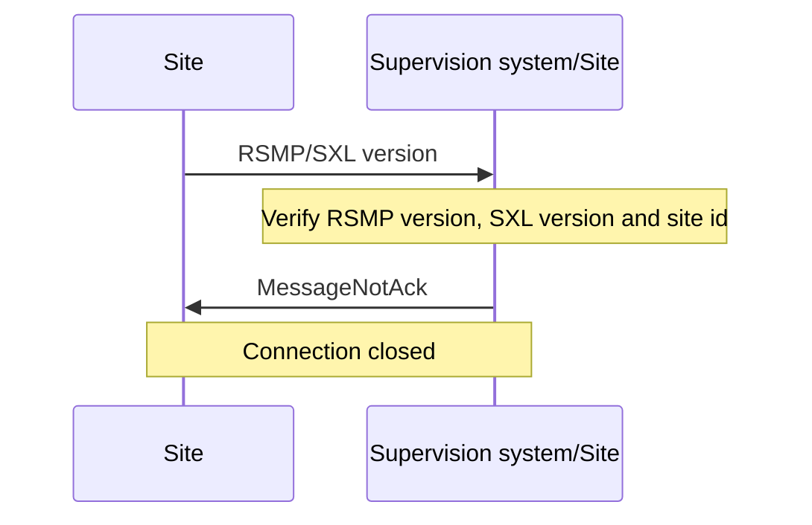

# Transport of data {#transport-of-data}

The message flow is different between different types of messages. Some message types are event driven and are sent without a request (push), while others are interaction driven, i.e. they sent in response to a request from a host system or other system (client-server).

To ensure that messages reach their destinations a message acknowledgment is sent for all messages. This gives the application a simple way to follow up on the message exchange.

To communicate between sites and supervision systems a pure TCP connection is used (TCP/IP), and the data sent is based on the JSon format, i.e. formatted text. The default port for RSMP is 12111.

Messages can be sent asynchronously, i.e. while the site or supervision system is waiting for an answer to a previously sent message it can can continue to send messages. The exception is during the first part of communication establishment (see section [Communication establishment between sites and supervision system]({{ '/3.3.0/transport-of-data/#communication-establishment-between-sites-and-supervision-system' | relative_url }}) and [Communication establishment between sites]({{ '/3.3.0/transport-of-data/#communication-establishment-between-sites' | relative_url }})).

RSMP connections can be established:

- Between site and supervision system. See [communication establishment between sites and supervision system]({{ '/3.3.0/transport-of-data/#communication-establishment-between-sites-and-supervision-system' | relative_url }}). The site needs to support multiple RSMP connections to different supervisors. See [Multiple supervisors]({{ '/3.3.0/transport-of-data/#multiple-supervisors' | relative_url }}).
- Directly between sites. See [communication establishment between sites]({{ '/3.3.0/transport-of-data/#communication-establishment-between-sites' | relative_url }}).

> Note
>
> Implementing support for communication between sites is not required unless otherwise stated in the [SXL]({{ '/3.3.0/definitions/#sxl' | relative_url }}).

## Multiple supervisors {#multiple-supervisors}

> Note
>
> Implementing support for multiple supervisors is not required unless stated in the [SXL]({{ '/3.3.0/definitions/#sxl' | relative_url }}).

Supervisor configuration:

- It must be possible to configure the list of supervisors as part of the RSMP configuration in the site. In the configuration, supervisors are identified by their IP addresses or domain names.
- It must be possible to configure whether to initiate the RSMP connection or to implement the socket server according to section [Transport between site and supervision system]({{ '/3.3.0/transport-of-data/#transport-between-site-and-supervision-system' | relative_url }}).

Message IDs:

- All messages must have unique message ids. Even when otherwise identical messages are sent to multiple supervisors, (e.g. an alarm or status update) different messages IDs must be used.

Message Acknowledgements:

- Message acknowledgements are send only to the supervisor that send the original message.

Connection:

- Connections to supervisor are handled in parallel, with messages processed in the order they arrive.
- Depending on how core/SXL version are set in Version messages, the connections to supervisor can use different core/SXL versions.

Aggregated status:

- Aggregated status is sent to all supervisors.

Status:

- All supervisors can request, subscribe to and receive statuses.
- Status subscriptions are handled separate per supervisor.
- A status response is sent only to the supervisor that sent the initiating status request.

Commands:

- All supervisors can send commands.
- Commands from multiple supervisors are served on a first-come basis, without any concept of priority.
- A command response is sent only to the supervisor that send the initiating command.

Alarms:

- Alarms are send to all supervisors, except those that set <span class="title-ref">receiveAlarms</span> to false in their Version message.
- All supervisors can acknowledge and suspend/resume alarms, even if they set <span class="title-ref">receiveAlarms</span> to false in their Version message.
- If an Alarm is blocked, suspended or acknowledged by one supervisor this affects all supervisors.

## Security {#transport-security}

RSMP Core does not provide communication security. A deployment can protect the TCP connection carrying RSMP by using an external mechanism such as TLS or a VPN. This protection does not change RSMP messages or protocol behaviour.

RSMP Core does not define requirements for selecting, configuring, or operating TLS, a VPN, or another external protection mechanism. See [Security considerations]({{ '/3.3.0/security-considerations/#security-considerations' | relative_url }}).

## Communication establishment between sites and supervision system {#communication-establishment-between-sites-and-supervision-system}

When establishing communication between sites and supervision system, messages are sent in the following order.

Message acknowledgement (see section [Message acknowledgement]({{ '/3.3.0/basic-structure/#message-acknowledgement' | relative_url }})) is implicit in the following figure.



1.  Site sends RSMP / SXL version (according to section [RSMP/SXL Version]({{ '/3.3.0/basic-structure/#rsmpsxl-version' | relative_url }})).
2.  The supervision system verifies the RSMP version, SXL version and site id. If there is a mismatch the sequence does not proceed. (see section [Communication rejection]({{ '/3.3.0/transport-of-data/#communication-rejection' | relative_url }}))
3.  The supervision system sends RSMP / SXL version (according to section [RSMP/SXL Version]({{ '/3.3.0/basic-structure/#rsmpsxl-version' | relative_url }})).
4.  The site verifies the RSMP version, SXL version and site id. If there is a mismatch the sequence does not proceed. (see section [Communication rejection]({{ '/3.3.0/transport-of-data/#communication-rejection' | relative_url }}))
5.  The latest version of RSMP that both communicating parties exchange in the RSMP/SXL Version is implicitly selected and used in any further RSMP communication.
6.  The site sends a Watchdog (according to section [Watchdog]({{ '/3.3.0/basic-structure/#watchdog' | relative_url }}))
7.  The system sends a Watchdog (according to section [Watchdog]({{ '/3.3.0/basic-structure/#watchdog' | relative_url }}))
8.  The site sends a ComponentList message (according to section [ComponentList]({{ '/3.3.0/basic-structure/#component-list' | relative_url }})).
9.  Asynchronous message exchange can begin. This means that commands and statuses are allowed to be sent
10. Aggregated status (according to section [Aggregated status message]({{ '/3.3.0/basic-structure/#aggregated-status-message' | relative_url }})). If no component for aggregated status is defined in the signal exchange list then no aggregated status message is sent.
11. All alarms (including active, inactive, suspended, unsuspended and acknowledged) are sent. (according to section [Alarm messages]({{ '/3.3.0/basic-structure/#alarm-messages' | relative_url }})).
12. Buffered messages in the equipment's outgoing communication buffer are sent, including alarms, aggregated status and status updates.

The reason for sending all alarms including inactive ones is because alarms might otherwise incorrectly remain active in the supervision system if the alarm is reset and not saved in communication buffer if the equipment is restarted or replaced.

The reason for sending buffered alarms is for the supervision system to receive all historical alarm events. The buffered alarms can be distinguished from the current ones based on their older alarm timestamps. Any buffered alarm events that contains the exact same alarm event and timestamp as sent when sending all alarms should not be sent again.

Since only one version of the signal exchange list is allowed to be used at the communication establishment (according to the version message), each connected site must either:

- Use the same version of the signal exchange list via the same RSMP connection
- Connect to separate supervision systems (e.g. using separate ports)
- Connect to a supervision system that can handle separate signal exchange lists depending on the RSMP / SXL version message from the site

## Communication establishment between sites {#communication-establishment-between-sites}

When establishing communication directly between sites, messages are sent in the following order.

One site acts as a leader and the other one as a follower.

When establishing communication between sites, messages are sent in the following order.

Message acknowledgement (see section [Message acknowledgement]({{ '/3.3.0/basic-structure/#message-acknowledgement' | relative_url }})) is implicit in the following figure.



1.  The follower site sends RSMP / SXL version (according to section [RSMP/SXL Version]({{ '/3.3.0/basic-structure/#rsmpsxl-version' | relative_url }})).
2.  The leader site verifies the RSMP version, SXL version and site id. If there is a mismatch the sequence does not proceed. (see section [Communication rejection]({{ '/3.3.0/transport-of-data/#communication-rejection' | relative_url }}))
3.  The leader site sends RSMP / SXL version (according to section [RSMP/SXL Version]({{ '/3.3.0/basic-structure/#rsmpsxl-version' | relative_url }})).
4.  The follower site verifies the RSMP version, SXL version and site id. If there is a mismatch the sequence does not proceed. (see section [Communication rejection]({{ '/3.3.0/transport-of-data/#communication-rejection' | relative_url }}))
5.  The latest version of RSMP that both communicating parties exchange in the RSMP/SXL Version is implicitly selected and used in any further RSMP communication.
6.  The follower site sends Watchdog (according to section [Watchdog]({{ '/3.3.0/basic-structure/#watchdog' | relative_url }}))
7.  The leader site sends Watchdog (according to section [Watchdog]({{ '/3.3.0/basic-structure/#watchdog' | relative_url }}))
8.  The follower site sends a ComponentList message (according to section [ComponentList]({{ '/3.3.0/basic-structure/#component-list' | relative_url }})).
9.  Asynchronous message exchange can begin. This means that commands and statuses are allowed to be sent
10. Aggregated status (according to section [Aggregated status message]({{ '/3.3.0/basic-structure/#aggregated-status-message' | relative_url }})) If no component for aggregated status is defined in the signal exchange list then no aggregated status message is sent.

For communication between sites the following applies:

- The SXL used is the SXL of the follower site
- The site id (siteId) which is sent in RSMP / SXL version is the follower site's site id
- If the site id does not match with the expected site id the connection should be terminated. The purpose is to reduce the risk of establishing connection with the wrong site
- The component id which is used in all messages is the follower site's component id
- Watchdog messages does not adjust the clock. See section [Watchdog]({{ '/3.3.0/basic-structure/#watchdog' | relative_url }}).
- Alarm messages are not sent
- No communication buffer exist

> Note
>
> Please note that it's the leader site that connects the the follower site, but it's also the leader site that requests commands and statuses. This is different to how the RSMP connection between sites and supervision system works.

## Communication rejection {#communication-rejection}

During RSMP/SXL Version exchange each communicating party needs to verify:

- RSMP version(s)
- SXL version
- Site id

If there is a mismatch of SXL, Site id or unsupported version(s) of RSMP then:

1.  The communication establishment sequence does not proceed
2.  The receiver of the RSMP/SXL version message sends a MessageNotAck with reason (<span class="title-ref">rea</span>) set to the cause of rejection. For instance, `RSMP versions [3.1.5] requested, but only [3.1.1,3.1.2,3.1.3,3.1.4] supported`
3.  The connection is closed



Is it not allowed to disconnect for any other circumstance other than mismatch during RSMP/SXL Version or [missing message acknowledgement]({{ '/3.3.0/basic-structure/#message-acknowledgement' | relative_url }}) unless there is a communication disruption.

## Communication disruption {#communication-disruption}

In the event of an communication disruption the following principles applies:

- If the equipment supports buffering of status messages, the status subscriptions remains active regardless of communication disruption and the status updates are stored in the equipment's outgoing communication buffer.
- Active subscriptions to status messages which does not support buffering ceases if communication disruption occurs.
- Active subscriptions to status messages ceases if the equipment restarts.
- Once communication is restored all the buffered messages are sent according to the communication establishment sequence.
- When sending buffered status messages, the `q` field should be set to `old`
- The communication buffer is stored and sent using the FIFO principle.
- In the event of communications failure or power outage the contents of the outgoing communication buffer must not be lost.
- The internal communication buffer of the device must at a minimum be sized to be able to store 10000 messages.

The following message types should be buffered in the equipment's outgoing communication buffer in the event of an communication disruption.

**Message types that should be buffered**

| Message type | Buffered during communication outage |
| --- | --- |
| Alarm messages | Yes |
| Aggregated status | Yes |
| Status messages | Configurable |
| Command messages | No |
| Version messages | No |
| Watchdog messages | No |
| MessageAck | No |

The following configuration options should exist at the site:

- It should be possible to configure which status messages that will be buffered during communication outage
- The site should try to reconnect to the supervision system/other site during communications failure (yes/no). This configuration option should be activated by default unless anything else is agreed upon.
- The reconnect interval should be configurable. The default value should be 10 seconds.

## Wrapping of packets {#wrapping-of-packets}

Both Json and XML packets can be tricky to decode unless one always know that the packet is complete. Json lacks an end tag and an XML end tag may be embedded in the text source. In order to reliably detect the end of a packet one must therefore make an own parser of perform tricks in the code, which is not very good.

Both Json and XML could contain tab characters (0x09), CR (0x0d) and LF (0x0a). If the packets are serialized using .NET those special characters does not exist. Therefore it is a good practice to use formfeed (0x0c), e.g. ’f’ in C/C++/C#. Formfeed won't be embedded in the packets so the parser only needs to search the incoming buffer for 0x0c and deal with every packet.

Example of wrapping of a packet:

<a id="json-wrapping"></a>

```
{
    "mType": "rSMsg",
    "type": "Alarm",
    "mId": "d2e9a9a1-a082-44f5-b4e0-6c9233-a204c",
    "ntsOId": "",
    "xNId": "",
    "cId": "AB+81102=881WA001",
    "aCId": "A001",
    "xACId": "Lamp error #14",
    "xNACId": "3052",
    "aSp": "acknowledge",
    "ack": "Acknowledged",
    "aS": "active",
    "sS", "notSuspended",
    "aTs": "2009-10-02T14:34:34.345Z",
    "cat": "D",
    "pri": "2",
    "rvs": [
     {
         "n": "color",
         "v": "red"
     }]
}<0x0c>
```

JSon code 1: An RSMP message with wrapping

The characters between \<\> is the bytes binary content in hex (ASCII code), ex \<0x0c\> is ASCII code 12, e.g. FF (formfeed).

The following principles applies:

- All packets must be ended with a FF (formeed). This includes message acknowledgement (see section [Message acknowledgement]({{ '/3.3.0/basic-structure/#message-acknowledgement' | relative_url }})). For example if NotAck is used as a consequence for signal exchange list mismatch during communication establishment
- Several consecutive FF (formeed) must not be sent, but must be handled
- FF (formeed) in the beginning of the data exchange (after connection establishment) must not be sent, but must be handled

## Transport between site and supervision system {#transport-between-site-and-supervision-system}

By default the following applies:

- The supervision system implements a socket server and waits for the site to connect
- The site initiates the connection to the supervision system
- If the communication were to fail it is the site’s responsibility to reconnect

Optionally the opposite can be used:

- The site implements a socket server and waits for the supervision system to connect
- The supervision system initiates the connection to the site
- If the communication were to fail it is the supervision system's responsibility to reconnect

In both cases it is the supervision system which has the ability to request commands, statuses (with optional subscription) and alarms.

> Note
>
> Regardless who implements the socket server and client, the message flow is unaffected

## Transport between sites {#transport-between-sites}

One site acts as leader and the other site(s) as followers. The leader can request commands, statuses (with optional subscription) and alarms to the follower site(s). It is the leader one who connects. This is different to how the RSMP connection between sites and supervision system works.

- The follower site(s) implements a socket server and waits for the leader site to connect
- The leader site initiates the connection to the follower site(s)
- The leader can request commands, statuses (with optional subscription)
- If the communication were to fail it is the leader site’s responsibility to reconnect
