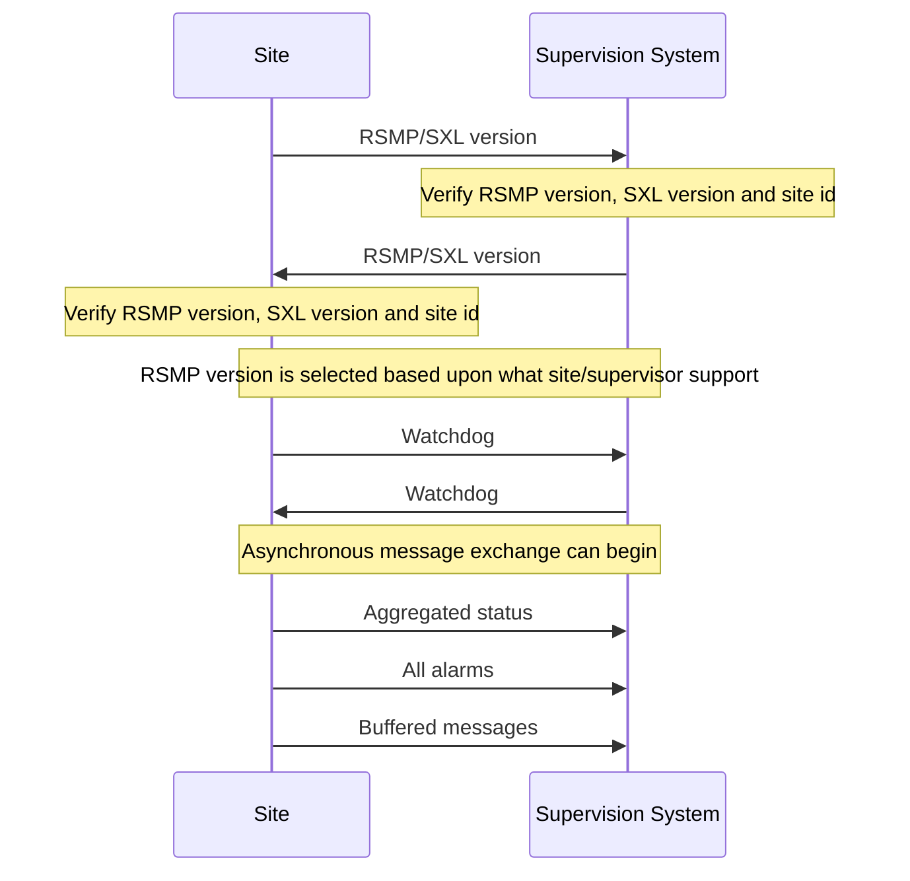
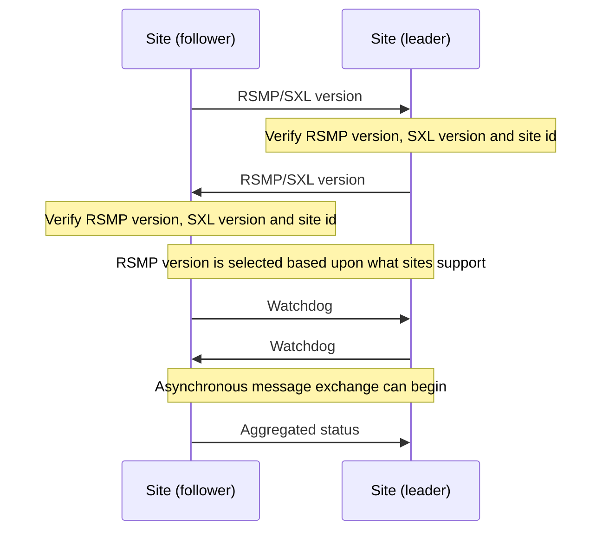
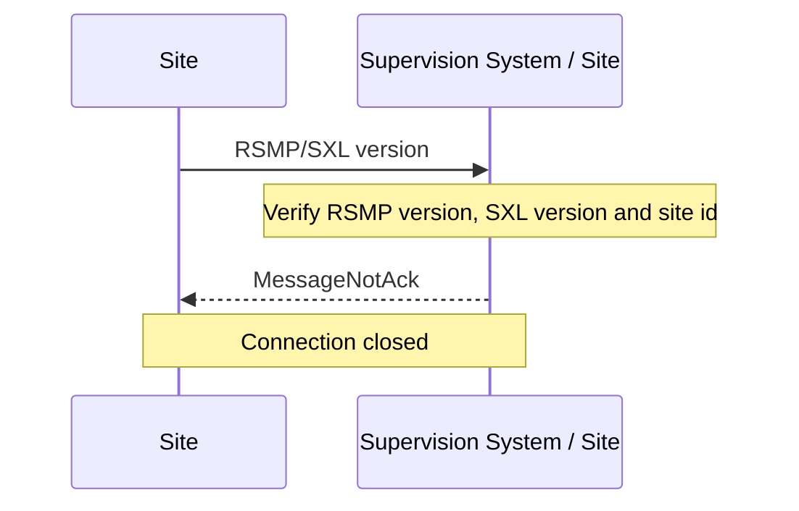

# Transport of Data

The message flow is different between different types of messages.
Some message types are event driven and are sent without a request (push),
while others are interaction driven, i.e. they are sent in response to a
request from a host system or other system (client-server).

To ensure that messages reach their destinations a message acknowledgment
is sent for all messages. This gives the application a simple way to
follow up on the message exchange.

To communicate between sites and supervision systems a pure TCP connection
is used (TCP/IP), and the data sent is based on the JSON format, i.e.
formatted text.

Messages can be sent asynchronously, i.e. while the site or supervision
system is waiting for an answer to a previously sent message it can
continue to send messages. The exception is during the first part of
communication establishment (see [Communication establishment between sites and supervision system](#communication-establishment-between-sites-and-supervision-system)
and [Communication establishment between sites](#communication-establishment-between-sites)).

RSMP connections can be established:

- Between site and supervision system.
  See [Communication establishment between sites and supervision system](#communication-establishment-between-sites-and-supervision-system).
  The site needs to support multiple RSMP connections to different
  supervisors. See [Multiple supervisors](#multiple-supervisors).

- Directly between sites.
  See [Communication establishment between sites](#communication-establishment-between-sites).

{: .note }
> Implementing support for communication between sites is not required unless
> otherwise stated in the [SXL]({{ '/3.3.0/definitions/#sxl' | relative_url }}).

## Multiple supervisors
{: #multiple-supervisors}

{: .note }
> Implementing support for multiple supervisors is not required unless
> otherwise stated in the [SXL]({{ '/3.3.0/definitions/#sxl' | relative_url }}).

Each site needs to support the following:

- It must be possible to configure the list of supervisors as part of the
  RSMP configuration in the site. In the configuration, supervisors are
  identified by their IP addresses.

- It must be possible to configure supervisors as primary or secondary.

- There can be multiple secondary supervisors, but only one primary.

- A secondary supervisor does not receive alarms.

- A secondary supervisor receives aggregated status and can request,
  subscribe and receive statuses.

- Watchdog messages from a secondary supervisor does not adjust the clock.
  See section [Watchdog]({{ '/3.3.0/basic-structure/#watchdog' | relative_url }}).

- Except from not sending alarms to secondary supervisors, a site must
  handle all types of message from all supervisors, including command requests,
  status requests and status subscriptions. Commands from multiple supervisors
  are served on a first-come basis, without any concept of priority.

- Supervisor connections are handled separately. When a supervisor sends a
  command or status request, the response is send only to that particular
  supervisor.

## Security

{: .note }
> Implementing support for encryption is not required unless otherwise stated.

If encryption is used then the following applies:

- Encryption settings needs to be configurable in both the supervision system as
  well as the site.
- For the encrypted communication, TLS 1.3 or later is used.
- Certificates should be used to verify the identities of equipments.
- Equipment which uses RSMP should contain a user interface for easy management
  of certificates.
- The issuing and renewal of certificates should be made in cooperation
  with the purchaser unless other arrangement is agreed upon.

## Communication establishment between sites and supervision system
{: #communication-establishment-between-sites-and-supervision-system}

When establishing communication between sites and supervision system,
messages are sent in the following order.

Message acknowledgement (see section [Message acknowledgement]({{ '/3.3.0/basic-structure/#message-acknowledgement' | relative_url }})) is
implicit in the following figure.



1. Site sends RSMP / SXL version (according to section [RSMP/SXL Version]({{ '/3.3.0/basic-structure/#rsmpsxl-version' | relative_url }})).

2. The supervision system verifies the RSMP version, SXL version and site id.
   If there is a mismatch the sequence does not proceed.
   (see section [Communication rejection](#communication-rejection))

3. The supervision system sends RSMP / SXL version (according to section
   [RSMP/SXL Version]({{ '/3.3.0/basic-structure/#rsmpsxl-version' | relative_url }})).

4. The site verifies the RSMP version, SXL version and site id.
   If there is a mismatch the sequence does not proceed.
   (see section [Communication rejection](#communication-rejection))

5. The latest version of RSMP that both communicating parties exchange in the
   RSMP/SXL Version is implicitly selected and used in any further RSMP
   communication.

6. The site sends a Watchdog (according to section [Watchdog]({{ '/3.3.0/basic-structure/#watchdog' | relative_url }}))

7. The system sends a Watchdog (according to section [Watchdog]({{ '/3.3.0/basic-structure/#watchdog' | relative_url }}))

8. Asynchronous message exchange can begin. This means that commands and
   statuses are allowed to be sent.

9. Aggregated status (according to section [Aggregated status message]({{ '/3.3.0/basic-structure/#aggregated-status-message' | relative_url }})).
   If no object for aggregated status is defined in the signal exchange list
   then no aggregated status message is sent.

10. All alarms (including active, inactive, suspended, unsuspended and acknowledged)
    are sent. (according to section [Alarm messages]({{ '/3.3.0/basic-structure/#alarm-messages' | relative_url }})).

11. Buffered messages in the equipment's outgoing communication buffer are sent,
    including alarms, aggregated status and status updates.

The reason for sending all alarms including inactive ones is because alarms
might otherwise incorrectly remain active in the supervision system if the alarm
is reset and not saved in communication buffer if the equipment is restarted or
replaced.

The reason for sending buffered alarms is for the supervision system to receive
all historical alarm events. The buffered alarms can be distinguished from the
current ones based on their older alarm timestamps. Any buffered alarm events
that contains the exact same alarm event and timestamp as sent when sending all
alarms should not be sent again.

Since only one version of the signal exchange list is allowed to be used
at the communication establishment (according to the version message),
each connected site must either:

- Use the same version of the signal exchange list via the same
  RSMP connection
- Connect to separate supervision systems (e.g. using separate ports)
- Connect to a supervision system that can handle separate signal exchange
  lists depending on the RSMP / SXL version message from the site

## Communication establishment between sites
{: #communication-establishment-between-sites}

When establishing communication directly between sites, messages are sent in
the following order.

One site acts as a leader and the other one as a follower.

Message acknowledgement (see section [Message acknowledgement]({{ '/3.3.0/basic-structure/#message-acknowledgement' | relative_url }})) is
implicit in the following figure.



1. The follower site sends RSMP / SXL version (according to section
   [RSMP/SXL Version]({{ '/3.3.0/basic-structure/#rsmpsxl-version' | relative_url }})).

2. The leader site verifies the RSMP version, SXL version and site id.
   If there is a mismatch the sequence does not proceed.
   (see section [Communication rejection](#communication-rejection))

3. The leader site sends RSMP / SXL version (according to section
   [RSMP/SXL Version]({{ '/3.3.0/basic-structure/#rsmpsxl-version' | relative_url }})).

4. The follower site verifies the RSMP version, SXL version and site id.
   If there is a mismatch the sequence does not proceed.
   (see section [Communication rejection](#communication-rejection))

5. The latest version of RSMP that both communicating parties exchange in the
   RSMP/SXL Version is implicitly selected and used in any further RSMP
   communication.

6. The follower site sends Watchdog (according to section [Watchdog]({{ '/3.3.0/basic-structure/#watchdog' | relative_url }}))

7. The leader site sends Watchdog (according to section [Watchdog]({{ '/3.3.0/basic-structure/#watchdog' | relative_url }}))

8. Asynchronous message exchange can begin. This means that commands and
   statuses are allowed to be sent.

9. Aggregated status (according to section [Aggregated status message]({{ '/3.3.0/basic-structure/#aggregated-status-message' | relative_url }})).
   If no object for aggregated status is defined in the signal exchange list
   then no aggregated status message is sent.

For communication between sites the following applies:

- The SXL used is the SXL of the follower site
- The site id (`siteId`) which is sent in RSMP / SXL version is the
  follower site's site id
- If the site id does not match with the expected site id the connection
  should be terminated. The purpose is to reduce the risk of establishing
  connection with the wrong site
- The component id which is used in all messages is the follower site's
  component id
- Watchdog messages does not adjust the clock. See section [Watchdog]({{ '/3.3.0/basic-structure/#watchdog' | relative_url }}).
- Alarm messages are not sent
- No communication buffer exist

{: .note }
> Please note that it's the leader site that connects to the follower site,
> but it's also the leader site that requests commands and statuses.
> This is different to how the RSMP connection between sites and supervision
> system works.

## Communication rejection
{: #communication-rejection}

During RSMP/SXL Version exchange each communicating party needs to verify:

- RSMP version(s)
- SXL version
- Site id

If there is a mismatch of SXL, Site id or unsupported version(s) of RSMP then:

1. The communication establishment sequence does not proceed
2. The receiver of the RSMP/SXL version message sends a MessageNotAck with
   reason (`rea`) set to the cause of rejection. For instance,
   `RSMP versions [3.1.5] requested, but only [3.1.1,3.1.2,3.1.3,3.1.4] supported`
3. The connection is closed



It is not allowed to disconnect for any other circumstance other than mismatch
during RSMP/SXL Version or [missing message acknowledgement]({{ '/3.3.0/basic-structure/#message-acknowledgement' | relative_url }})
unless there is a communication disruption.

## Communication disruption
{: #communication-disruption}

In the event of a communication disruption the following principles apply:

- If the equipment supports buffering of status messages, the status
  subscriptions remains active regardless of communication disruption and the
  status updates are stored in the equipment's outgoing communication buffer.
- Active subscriptions to status messages which does not support buffering
  ceases if communication disruption occurs.
- Active subscriptions to status messages ceases if the equipment restarts.
- Once communication is restored all the buffered messages are sent according to
  the communication establishment sequence.
- When sending buffered status messages, the `q` field should be set to `old`
- The communication buffer is stored and sent using the FIFO principle.
- In the event of communications failure or power outage the contents of the
  outgoing communication buffer must not be lost.
- The internal communication buffer of the device must at a minimum be
  sized to be able to store 10000 messages.

The following message types should be buffered in the equipment's outgoing
communication buffer in the event of a communication disruption.

| Message type | Buffered during communication outage |
|---|---|
| Alarm messages | Yes |
| Aggregated status | Yes |
| Status messages | Configurable |
| Command messages | No |
| Version messages | No |
| Watchdog messages | No |
| MessageAck | No |

The following configuration options should exist at the site:

- It should be possible to configure which status messages that will be buffered
  during communication outage
- The site should try to reconnect to the supervision system/other site
  during communications failure (yes/no). This configuration option should
  be activated by default unless anything else is agreed upon.
- The reconnect interval should be configurable. The default value should
  be 10 seconds.

## Wrapping of packets

Both JSON and XML packets can be tricky to decode unless one always knows that
the packet is complete. JSON lacks an end tag and an XML end tag may be
embedded in the text source. In order to reliably detect the end of a packet
one must therefore make an own parser or perform tricks in the code.

Both JSON and XML could contain tab characters (0x09), CR (0x0d) and LF (0x0a).
If the packets are serialized using .NET those special characters do not
exist. Therefore it is a good practice to use formfeed (0x0c), e.g. `\f`
in C/C++/C#. Formfeed won't be embedded in the packets so the parser only
needs to search the incoming buffer for 0x0c and deal with every packet.

Example of wrapping of a packet:

```json
{
    "mType": "rSMsg",
    "type": "Alarm",
    "mId": "d2e9a9a1-a082-44f5-b4e0-6c9233-a204c",
    "ntsOId": "AB+81102=881WA001",
    "xNId": "23055",
    "cId": "AB+81102=881WA001",
    "aCId": "A001",
    "xACId": "Lamp error #14",
    "xNACId": "3052",
    "aSp": "acknowledge",
    "ack": "Acknowledged",
    "aS": "active",
    "sS": "notSuspended",
    "aTs": "2009-10-02T14:34:34.345Z",
    "cat": "D",
    "pri": "2",
    "rvs": [
     {
         "n": "color",
         "v": "red"
     }]
}<FF>
```

The `<FF>` represents a formfeed byte (0x0c, ASCII code 12).

The following principles apply:

- All packets must be ended with a FF (formfeed). This includes message
  acknowledgement (see section [Message acknowledgement]({{ '/3.3.0/basic-structure/#message-acknowledgement' | relative_url }})).
  For example if NotAck is used as a consequence for signal exchange list
  mismatch during communication establishment.
- Several consecutive FF (formfeed) must not be sent, but must be handled.
- FF (formfeed) in the beginning of the data exchange (after connection
  establishment) must not be sent, but must be handled.

## Transport between site and supervision system

- The supervision system implements a socket server and waits for the site
  to connect
- The site initiates the connection to the supervision system
- The supervision system can request commands, statuses (with optional
  subscription) and alarms
- If the communication were to fail it is the site's responsibility to
  reconnect

## Transport between sites

One site acts as leader and the other site(s) as followers. The leader can
request commands, statuses (with optional subscription) and alarms to the
follower site(s). It is the leader who connects.

- The follower site(s) implements a socket server and waits for the leader
  site to connect
- The leader site initiates the connection to the follower site(s)
- The leader can request commands, statuses (with optional subscription)
- If the communication were to fail it is the leader site's responsibility
  to reconnect
