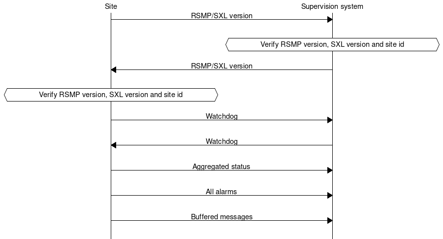
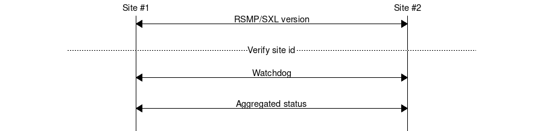
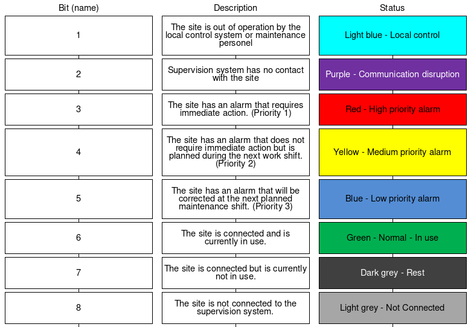

Contens
=======

* `Definitions`_
* `Introduction`_
* `Purpose`_
* `Applicability`_
* Applicability/`Scope`_
* Applicability/`Object-model`_
* Applicability/`Transport-of-data`_
* Applicability/`Basic-structure`_
* `Change-log`_
* Appendix/`Signal-exchange-list`_

RSMP Specification
==================

.. _definitions:

Definitions
===========

**SXL**
Signal exchange list

**NTS**
National Traffic management system. Replaces CTS

**Maximo**
STA’s support system for maintenance

**ITS site**
Road side equipment. Covers both field level and local level

**Site**
 See ITS site

**Local road side equipment**
 See ITS site

**Supervision system**
 Control and supervision system for regional and/or national
 level

**Object**
 An object is a abstract term which is used in control and
 supervision systems. An object can have on or more statuses
 that may change depending on changes of circumstance of the
 object or control of the object from external source.
 Communication with the object is made using exchange of
 signals, e.g. commands, status and alarms.

 An object can represent physical equipment or abstract concepts
 E.g. a camera, a control flow alorithm or a group of signs.

 An object is identified using the objects component id. *Please
 note that an object is not necessarily the same thing as an NTS
 object.*

**Aggregated object**
 An aggregated object consists of one or many other objects.
 E.g. Component group (CG)

**Object type**
 An object type is a classification of objects that controls the
 properties of all the objects of the same object type. The
 object type determines how the object is presented in
 supervision system, how it is grouped and which functional
 positions, alarm codes, commands and statuses that exists that
 object type.

**NTS Object**
 Used for objects in NTS

 All control and supervision related functions in NTS consist of
 NTS objects.

 An NTS object can represent on or many objects.

 An NTS objects is identified in the communication interface
 using “externalNtsId”. NTS can not use the format used in
 component-id.

 An object and NTS object and use the same component-id.

**NTS-Object type**
 A NTS object type is a classification of NTS objects.
 Determines among other things which functional positions that
 are possible for the NTS object.

**Component**
 A component is a object or NTS object.

 A component is identified using component-id.

**Component-ID**
 A component-id identifies components.

 The format used for the STA’s sites is specified in the STA
 publication TDOK 2012:1171, e.g. AA+BBCDD=EEEFFGGG.

**XML**
 eXtensible Markup Language

**JSON**
 JavaScript Object Notation

**TCP/IP**
 Transfer Control Protocol/Internet Protocol

**W3C**
 World Wide Web Consortium

**DATEX II**
 European standard for message exchange between traffic systems
 (www.datex2.eu)

**RSMP**
 Road Side Message Protocol

.. _introduction:

Introduction
============

This document presents a general protocol for communication between
supervision systems and road side equipment, and direct communication
between road side equipments. The aim is to offer a standardized protocol
that works the same way regardless of supplier or type of road side
equipment.

.. _purpose:

Purpose
=======

The purpose of this protocol is to create a standardized way to
communicate between systems at the local level and systems at the
regional level regardless of supplier and technology. The goal is to
be able to easily add and remove signals in new facilities and
applications without having to expand or change the standards and
guidelines. This means that the protocol, as opposed to many other
standards and protocols do not include detailed information about the
signal exchange but is focused on defining the types of signals which
are then described construction or items specifically. The goal is
that in the long term, based on installed systems and objects, is to
be able to produce signal exchange lists of type object that can be
reused in new contracts so that alarm messages, commands, etc. have
the same names regardless of facility or provider.

The purpose of the signal exchange is to provide information relating
to, for example, traffic control managers and administrators. E.g. the
information needed to monitor and control the road side equipment, as
well as the information that can be used for statistics and analysis
of traffic and equipment's status. For instance, alarms contains
sufficient information to be able to create a work order in Maximo
which is then sent to the operating contractor, ie. sufficient
information about the type of skills and equipment necessary to
correct the error. Additional detailed information about an alarm
(e.g. which I/O card has broken, the LED chain that is out of order,
etc.) can read on site via vendor-specific web interface or operator
panel.

Identified requirements
-----------------------

In order to provide an information exchange that is not dependent of
technology area or vendor specific information - four message types
have been identified that cover all types of information that the
Swedish Transport Administration needs. The information in each
message is dynamic and is defined by technical are or specific
equipment using a specific signal exchange list (SXL). The SXL also
represents the interface between the supervision system / other
facilities and equipment. The four message types are:

- **Alarm**. System, traffic- or monitoring alarms that require action
  by the traffic operator or traffic engineer. Usually sent from the
  equipment to the monitoring system when they occur.

- **Aggregated status**. An aggregated status that gives an overview
  glance of the status of the road side equipment. Usually sent from
  the equipment as soon as it changes to the monitoring system.

- **Status**. Status changes, indications and detailed information
  should be logged or made visible at the monitoring system. Sent upon
  request from the supervision system / other facility or using
  subscription (either at status change or at set time interval).

- **Command**. Commands sent from a supervision system or other
  facility to alter the equipment / object status or control
  principle.

.. _applicability:

Applicability
=============

.. _scope:

Scope
-----

This document is a generic protocol specification for RSMP interface
that describes the protocol transfer mechanisms and function. The
document is a specification that allows for many use cases within and
outside the Swedish Transport Administration. The document is
provided for those who need to implement a RSMP interface.

Responsibility
^^^^^^^^^^^^^^

The Swedish Transport Administration (STA) is providing this interface
specification as information only. The STA is not responsible for any
consequences that implementation of the specification can lead to for
the supplier or any third party.

.. _object-model:

Object model
------------

This protocol uses the Datex II (datex2.eu) meta-model for its
object model. Meta model consists of a set of rules that describe how
classes and objects are defined. The reason why the Datex II meta-
model has been adopted is that it will eventually provide the
possibility for this protocol to become an international standard that
can later be included with the object model for Datex II.

The object model is technology independent, ie can be implemented in
various ways such as using **ASN.1**, **JSON** or **XML**. However, the
communication between the site and supervision systems / other sites
uses **JSON** format.

.. _transport-of-data:

Transport of data
-----------------

The message flow is different between different types of messages.
Some message types are event driven and are sent without a request (push),
while others are interaction driven, i.e. they sent in response to a
request from a host system or other system (client-server).

To ensure that messages reach their destinations a message acknowledgment
is sent for all messages. This gives the application a simple way to
follow up on the message exchange.

To communicate between sites and supervision systems a pure TCP connection
is used (TCP/IP), and the data sent is based on the JSon format, i.e.
formatted text.

Messages can be sent asynchronously, i.e. while the site or supervision
system is waiting for an answer to a previously sent message it can
can continue to send messages. The exception in the RSMP / SXL version message
(see section rsmpsxl-version_).

Security
^^^^^^^^

Implementing encryption is not required unless otherwise stated. However, if
encryption is used than the following applies:

* Encryption settings needs to be configurable in both the supervision system as
  well as the site.
* For the encrypted communication, SSL 3.0/TLS 1.0 or later is used.
* Certificates should be used to verify the identities of equipments.
* Equipment which uses RSMP should contain a user interface for easy management
  of certificates.
* The issuing and renewal of certificates should should be made in cooperation
  with the purchaser unless other arrangement is agreed upon.

.. _communication-establishment-between-sites-and-supervision-system:

Communication establishment between sites and supervision system
^^^^^^^^^^^^^^^^^^^^^^^^^^^^^^^^^^^^^^^^^^^^^^^^^^^^^^^^^^^^^^^^

When establishing communication between sites and supervision system,
messages are sent in the following order.

Message acknowledgement (see section message-acknowledgement_) is
implicit in the following figure.

1. Site sends RSMP / SXL version (according to section rsmpsxl-version_).

2. The supervision system verifies the RSMP version, SXL version and site id.
   If there is a mismatch the sequence does not proceed. The system responds
   with a MessageNotAck and closes the connection
   (see section message-acknowledgement_)

3. The supervision system sends RSMP / SXL version (according to section
   rsmpsxl-version_).

4. The site verifies the RSMP version, SXL version and site id.
   If there is a mismatch the sequence does not proceed. The site responds
   with a MessageNotAck and closes the connection.
   (see section message-acknowledgement_)

5. The site sends a Watchdog (according to section watchdog_)

6. The system sends a Watchdog (according to section watchdog_)

7. Aggregated status (according to section aggregated-status-message_).
   If no object for aggregated status is defined in the signal exchange list
   then no aggregated status message is sent.

8. All alarms (incl. active, inactive, suspended, unsuspended and acknowledged)
   are sent. (according to section alarm-messages_).

9. Buffered messages in the equipment's outgoing communication buffer are sent,
   incl. alarms, aggregated status and status updates.

The reason for sending all alarms including inactive ones is because alarms
might otherwise incorrectly remain active in the supervision system if the alarm
is reset and not saved in communication buffer if the equipment is restarted or
replaced.

The reason for sending buffered alarms is for the supervision system to receive
all historical alarm events. The buffered alarms can be distinguished from the
current ones based on their older alarm timestamps. Any buffered alarm events
that contains the exact same alarm event and timestamp as sent when sending all
alarms should not be sent again.

Since only one version of the signal exchange list is allowed to be used
at the communication establishment (according to the version message),
each connected site must either:

* Use the same version of the signal exchange list via the same
  RSMP connection
* Connect to separate supervision systems (e.g. using separate ports)
* Connect to a supervision system that can handle separate signal exchange
  lists depending on the RSMP / SXL version message from the site

.. _communication-establishment-between-sites:

Communication establishment between sites
^^^^^^^^^^^^^^^^^^^^^^^^^^^^^^^^^^^^^^^^^

Implementing support for communication between sites is not required unless
otherwise stated. However, if communication between sites is used than the
following applies.

One site acts as a leader and the other one as a follower.

When establishing communication between sites, messages are sent in the
following order.

Message acknowledgement (see section message-acknowledgement_) is
implicit in the following figure.

1. The follower site sends RSMP / SXL version (according to section
   rsmpsxl-version_).

2. The leader site verifies the RSMP version, SXL version and site id.
   If there is a mismatch the sequence does not proceed. The leader site
   responds with a MessageNotAck and closes the connection.
   (see section message-acknowledgement_)

3. The leader site sends RSMP / SXL version (according to section
   rsmpsxl-version_).

4. The follower site verifies the RSMP version, SXL version and site id.
   If there is a mismatch the sequence does not proceed. The follower site
   responds with a MessageNotAck and closes the connection.
   (see section message-acknowledgement_)

5. The follower site sends Watchdog (according to section watchdog_)

6. The leader site sends Watchdog (according to section watchdog_)

7. Aggregated status (according to section aggregated-status-message_)
   If no object for aggregated status is defined in the signal exchange list
   then no aggregated status message is sent.

For communication between sites the following applies:

* The SXL used is the SXL of the follower site
* The site id (siteId) which is sent in RSMP / SXL version is the
  follower site's site id
* If the site id does not match with the expected site id the connection
  should be terminated. The purpose is to reduce the risk of establishing
  connection with the wrong site
* The component id which is used in all messages is the follower site's
  component id
* Watchdog messages does not adjust the clock
* Alarm messages are not sent
* No communication buffer exist

.. _communication-disruption:

Communication disruption
^^^^^^^^^^^^^^^^^^^^^^^^

In the event of an communication disruption the following principles applies:

* If the equipment supports buffering of status messages, the status
  subscriptions remains active regardless of communication disruption and the
  status updates are stored in the equipment's outgoing communication buffer.
* Active subscriptions to status messages which does does not support buffering
  ceases if the communication disruption occurs.
* Once communication is restored all the buffered messages are sent according to
  the communication establishment sequence.
* The communication buffer is stored and sent using the FIFO principle.
* In the event of communications failure or power outage the contens of the
  outgoing communication buffer must not be lost.
* The internal communication buffer of the device must at a minimum be
  sized to be able to store 10000 messages.

The following message types should be buffered in the equipment's outgoing
communication buffer in the event of an communication disruption.

.. _message-types-buffered:

================= ====================================
Message type      Buffered during communication outage
================= ====================================
Alarm messages    Yes
Aggregated status Yes
Status messages   Configurable
Command messages  No
Version messages  No
Watchdog messages No
MessageAck        No
================= ====================================

The following configuration options should exist at the site:

* It should be possible configure which status messages that will be buffered
  during communication outage
* The site should try to reconnect to the supervision system/other site
  during communications failure (yes/no). This configuration option should
  be activated by default unless anything else is agreed upon.
* The reconnect interval should be configurable. The default value should
  be 10 seconds.

Wrapping of packets
^^^^^^^^^^^^^^^^^^^

Both Json and XML packets can be tricky to decode unless one always know that
the packet is complete. Json lacks an end tag and an XML end tag may be
embedded in the text source. In order to reliably detect the end of a packet
one must therefore make an own parser of perform tricks in the code, which is
not very good.

Both Json and XML could contain tab characters (0x09), CR (0x0d) and LF (0x0a).
If the packets are serialized using .NET those special characters does not
exist. Therefore it is a good practice to use formfeed (0x0c), e.g. ’\f’
in C/C++/C#. Formfeed won't be embedded in in the packets so the parser only
needs to search the incoming buffer for 0x0c and deal with every packet.

Example of wrapping of a packet:

.. code::
   :name: json-wrapping

    {
        "mType": "rSMsg",
        "type": "Alarm",
        "mId": "d2e9a9a1-a082-44f5-b4e0-6c9233-a204c",
        "ntsOId": "AB+81102=881WA001",
        "xNId": "23055",
        "cId": "AB+81102=881WA001",
        "aCId": "A001",
        "xACId": "Lamp error #14",
        "xNACId": "3052",
        "aSp": "acknowledge",
        "ack": "Acknowledged",
        "aS": "active",
        "sS", "notSuspended",
        "aTs": "2009-10-02T14:34:34.345Z",
        "cat": "b",
        "pri": "2",
        "rvs": [
         {
             "n": "color",
             "v": "red"
         }]
    }<0x0c>

JSon code 1: An RSMP message with wrapping

The characters between <> is the bytes binary content in hex (ASCII code),
ex <0x0c> is ASCII code 12, e.g. FF (formfeed).

The following principles applies:

* All packets must be ended with a FF (formeed). This includes message
  acknowledgement (see section message-acknowledgement_).
  For example if NotAck is used as a consequence for signal exchange list
  mismatch during communication establishment
* Several consecutive FF (formeed) must not be sent, but must be handled
* FF (formeed) in the beginning of the data exchange (after connection
  establishment) must not be sent, but must be handled

Transport between site and supervision system
^^^^^^^^^^^^^^^^^^^^^^^^^^^^^^^^^^^^^^^^^^^^^

Supervision system acts a socket server and waits for the site to
connect. If the communication were to fail it is the site’s
responsibility to reconnect.

Transport between sites
^^^^^^^^^^^^^^^^^^^^^^^

One site acts as leader and the other one as a follower.

* The leader site initiates the connection to the following site.
* The follower sites implements a socket server and waits for the leader site
  to connect.
* If the communication were to fail it is the follower site’s responsibility
  to reconnect.

.. _basic-structure:

Basic structure
---------------

Unicode (ISO 10646) and UTF-8 are used for all messages. Please note that
the JSon elements are formatted as JSon string elements and not as JSon
number elements or as JSon boolean elements, with the exception of the
message type "aggregated status" where JSon boolean elements are used.

The reason why JSon string elements are heavily used is to simplify
deserialisation of values where the data type in unknown before casting is
performed, for instance for the values in "return values". Parsing is
recommended to be performed case insensitive.

Empty values are sent as **""** for simple values and as **[]** for arrays.
Optional values can be omitted, but can not be sent as **null** unless
otherwise stated.

In the following example the message type is an alarm message.

.. code-block:: json
   :name: json-basic

   {
       "mType": "rSMsg",
       "type": "Alarm",
       "mId": "E68A0010-C336-41ac-BD58-5C80A72C7092",
       "ntsOId": "F+40100=416CG100",
       "xNId": "23055",
       "cId": "AB+84001=860SG001",
       "aCId": "A001",
       "xACId": "Serious lamp error",
       "xNACId": "3143",
       "aSp": "Issue",
       "ack": "notAcknowledged",
       "aS": "active",
       "sS": "notSuspended",
       "aTs": "2009-10-01T11:59:31.571Z",
       "cat": "D",
       "pri": "2",
       "rvs": [
           {
               "n": "color",
               "v": "red"
           }
       ]
   }

JSon code 2: An RSMP message

The following table is describing the variable content of all message types.

.. _table-variable-content:

+---------+-------------------+---------------------------------------+
| Element | Value             | Description                           |
+=========+===================+=======================================+
| mType   | rSMsg             | RSMP identifier                       |
+---------+-------------------+---------------------------------------+
| type    | Alarm             | Alarm message                         |
|         +-------------------+---------------------------------------+
|         | AggregatedStatus  | Aggregated status message             |
|         +-------------------+---------------------------------------+
|         | StatusRequest     | Status message. Request status        |
|         +-------------------+---------------------------------------+
|         | StatusResponse    | Status message. Status response       |
|         +-------------------+---------------------------------------+
|         | StatusSubscribe   | Status message. Start subscription    |
|         +-------------------+---------------------------------------+
|         | StatusUpdate      | Status message. Update of status      |
|         +-------------------+---------------------------------------+
|         | StatusUnsubscribe | Status message. End subscription      |
|         +-------------------+---------------------------------------+
|         | CommandRequest    | Command message. Request command      |
|         +-------------------+---------------------------------------+
|         | CommandResponse   | Command message. Response of command  |
|         +-------------------+---------------------------------------+
|         | MessageAck        | Message acknowledegment. Successful   |
|         +-------------------+---------------------------------------+
|         | MessageNotAck     | Message acknowledegment. Unsuccessful |
|         +-------------------+---------------------------------------+
|         | Version           | RSMP / SXL version message            |
|         +-------------------+---------------------------------------+
|         | Watchdog          | Watchdog message                      |
+---------+-------------------+---------------------------------------+
| mId     | *(GUID)*          | Message identity. Generated as a GUID |
| *(or)*  |                   | (Globally unique identifier) in the   |
| oMId    |                   | equipment that sent the message. Only |
|         |                   | version 4 of Leach-Salz UUID is used. |
|         |                   |                                       |
|         |                   | * **mId** is used i all messages as a |
|         |                   |   reference for the message ack       |
|         |                   | * **oMId** is used in the message ack |
|         |                   |   to refer to the message which is    |
|         |                   |   being acked                         |
+---------+-------------------+---------------------------------------+

The following table describes the variable content in all message types
which is defined by the signal exchange list (SXL), except version
messages, message acknowledgement messages and watchdog messages.

The *SXL element* column describes the correlation between the JSon
elements and the titles in the SXL.

.. _table-variable-content-sxl:

============ ============== ===================
Element      SXL element    Description
============ ============== ===================
ntsOId       NTSObjectId    Component id for the NTS object which the  message is referring to.
xNId         externalNtsId  Identity for the NTS object in communcation between NTS and other systems. The format is 5 integers. Defined in cooperation with representatives from NTS. Unique for the site.
cId          componentId    Component id for the object which the message is referring to.
============ ============== ===================

.. _alarm-messages:

Alarm messages
^^^^^^^^^^^^^^

An alarm message is sent to the supervision system when:

- An alarm becomes active / inactive
- An alarm is acknowledged
- An alarm is being suspended / un-suspended

An acknowledgment of an alarm does not cause a single alarm event to
be acknowledged but all alarm events for the specific object with the
associated alarm code id. This approach simplifies both in
implementation but also in handling - if many alarms occur on the same
equipment with short time intervals.

A suspend of an alarm causes all alarms from the specific object with
the associated alarm code id to be suspended. This means that alarm messages
stops being sent from the site as long as the suspension is active. As soon
as the suspension is inactivated alarms can be sent again.

Suspending alarms does not affect alarm acknowledgment. This means that
when unsuspending an alarm an alarm can be inactive and not acknowledged.

Alarm messages are event driven and sent to the supervision system
when the alarm occurs. Acknowledgement of alarms and alarm suspend
messages are interaction driven.

Alarm events are referring to 'active' (aSp:Issue), 'suspended' (aSp:Suspend)
and 'acknowledged' (aSp:Acknowledged).

The timestamp (aTs) reflects the individual event according to the
element 'aSp'.

Message structure
"""""""""""""""""

.. _structure-for-an-alarm-message:

Structure for an alarm message
~~~~~~~~~~~~~~~~~~~~~~~~~~~~~~

An alarm message has the structure according to the example below.

.. code-block:: json
   :name: json-alarm-issue

   {
       "mType": "rSMsg",
       "type": "Alarm",
       "mId": "E68A0010-C336-41ac-BD58-5C80A72C7092",
       "ntsOId": "F+40100=416CG100",
       "xNId": "23055",
       "cId": "AB+84001=860SG001",
       "aCId": "A001",
       "xACId": "Serious lamp error",
       "xNACId": "3143",
       "aSp": "Issue",
       "ack": "notAcknowledged",
       "aS": "active",
       "sS": "notSuspended",
       "aTs": "2009-10-01T11:59:31.571Z",
       "cat": "D",
       "pri": "2",
       "rvs": [
           {
               "n": "color",
               "v": "red"
           }
       ]
   }

JSon code 3: An alarm message

The following table describes the variable content of the message which is
defined by the SXL.

The *SXL element* column describes the correlation between the JSon
elements and the titles in the signal exchange list (SXL).

.. _table-alarm:

============ ====================== =============
Element      SXL element            Description
============ ====================== =============
aCId         alarmCodeId            Alarm suffix with in combination with the component id identifies an alarm. The examples in this document are defined according to the following format: *Ayyy*, where *yyy* is a unique number.
xACId        externalAlarmCodeId    Manufacturer specific alarm code and alarm description. Manufacturer, model, alarm code och additional alarm description.
xNACId       externalNtsAlarmCodeId Alarm code in order to identify alarm type during communication with NTS
============ ====================== =============

The following table describes additional variable content of the message.

.. _table-alarm-status-change:

+--------------+--------------------+--------------------+----------------------------------------------+
| Element      | Value              | Origin             | Description                                  |
+==============+====================+====================+==============================================+
| aSp          | Issue              | Site               | An alarm becomes active/inactive.            |
|              +--------------------+--------------------+----------------------------------------------+
|              | Acknowledge        | Supervision system | Acknowledge an alarm                         |
|              |                    +--------------------+----------------------------------------------+
|              |                    | Site               | An alarm becomes acknowledged.               |
|              +--------------------+--------------------+----------------------------------------------+
|              | Suspend            | Supervision system | Suspend an alarm                             |
|              |                    +--------------------+----------------------------------------------+
|              |                    | Site               | An alarm becomes suspended/unsuspended       |
|              +--------------------+--------------------+----------------------------------------------+
|              | Resume             | Supervision system | Unsuspend an alarm                           |
+--------------+--------------------+--------------------+----------------------------------------------+

.. _alarm-status:

Alarm status
~~~~~~~~~~~~

Alarm status are only used by alarm messages (not by alarm acknowledgement
or alarm suspend messages).

.. _table-alarm-status:

+-------------------+--------------------+------------------------------------------------------------------------------------+
| Element           | Value              | Description                                                                        |
+===================+====================+====================================================================================+
| ack               | Acknowledged       | The alarm is acknowledged                                                          |
|                   +--------------------+------------------------------------------------------------------------------------+
|                   | notAcknowledged    | The alarm is not acknowledged                                                      |
+-------------------+--------------------+------------------------------------------------------------------------------------+
| aS                | inActive           | The alarm is inactive                                                              |
|                   +--------------------+------------------------------------------------------------------------------------+
|                   | Active             | The alarm is active                                                                |
+-------------------+--------------------+------------------------------------------------------------------------------------+
| sS                | suspended          | The alarm is suspended                                                             |
|                   +--------------------+------------------------------------------------------------------------------------+
|                   | notSuspended       | The alarm is not suspended                                                         |
+-------------------+--------------------+------------------------------------------------------------------------------------+
| aTs               | *(timestamp)*      | Timestamp for when the alarm changes status.                                       |
|                   |                    | See the contents of aSp to determine which type of timetamp is used                |
|                   |                    |                                                                                    |
|                   |                    | | - aSp: Issue: Timestamp for when the alarm gets **active** or **inactive**       |
|                   |                    | | - aSp: Acknowledge: Timestamp for when the alarm gets **acknowledged** or        |
|                   |                    |   **not acknowledged**                                                             |
|                   |                    | | - aSp: Suspend: Timestamp for when the alarm gets **suspended** or               |
|                   |                    |   **not suspended**                                                                |
|                   |                    |                                                                                    |
|                   |                    | The timestamp uses the W3C XML **dateTime** definition with 3 decimal places.      |
|                   |                    | All timestamps are set at the local level (and not in the supervision system) when |
|                   |                    | the alarm occurs (and not when the message is sent). All timestamps uses UTC.      |
+-------------------+--------------------+------------------------------------------------------------------------------------+

The following table describes the variable content of the message which is
defined by the SXL.

The *SXL element* column describes the correlation between the JSon
elements and the titles in the signal exchange list (SXL).

.. _table-alarm-status-details-sxl:

+-------------------+--------------------+------------------------------------------------------------------------------------+
| Element           | SXL element        | Description                                                                        |
+===================+====================+====================================================================================+
| cat               | category           | A character, either **T** or **D**.                                                |
|                   |                    |                                                                                    |
|                   |                    | | An alarm belongs to one of these categories:                                     |
|                   |                    | | - T. Traffic alarm                                                               |
|                   |                    | | - D. Technical alarm                                                             |
|                   |                    |                                                                                    |
|                   |                    | **Traffic alarm:**                                                                 |
|                   |                    | Traffic alarms indicate events in the traffic related functions or the technical   |
|                   |                    | processes that effects traffic.                                                    |
|                   |                    |                                                                                    |
|                   |                    | | A couple of examples from a tunnel:                                              |
|                   |                    | | - Stopped vehicle                                                                |
|                   |                    | | - Fire alarm                                                                     |
|                   |                    | | - Error which affects message to motorists                                       |
|                   |                    | | - High level of CO2 in traffic room                                              |
|                   |                    | | - Etc.                                                                           |
|                   |                    |                                                                                    |
|                   |                    | **Technical alarm:**                                                               |
|                   |                    | Technical alarms are alarms that do not directly affect the traffic. One example   |
|                   |                    | of a technical alarm is when an impulse fan stops working.                         |
+-------------------+--------------------+------------------------------------------------------------------------------------+
| *(not sent)*      | description        | Description of the alarm. Defined in SXL but is never actually sent.               |
|                   |                    | The format of the description is free of choice but has the following              |
|                   |                    | requirements:                                                                      |
|                   |                    |                                                                                    |
|                   |                    | - The text is unique for the object type                                           |
|                   |                    | - The text is defined in cooperation with the Purchaser before use                 |
+-------------------+--------------------+------------------------------------------------------------------------------------+
| pri               | priority           | The priority of the alarm.                                                         |
|                   |                    | The following values are defined:                                                  |
|                   |                    |                                                                                    |
|                   |                    | 1. Alarm that requires immediate action.                                           |
|                   |                    | 2. Alarm that does not require immediate action, but action is planned during      |
|                   |                    |    the next work shift.                                                            |
|                   |                    | 3. Alarm that will be corrected during the next planned maintenance shift.         |
+-------------------+--------------------+------------------------------------------------------------------------------------+

.. _return-values:

Return values
~~~~~~~~~~~~~

Return values ("rvs") are used by alarm messages (but not by alarm
acknowledgment or alarm suspend messages) and is always sent but can
be empty (i.e. **[]**) if no return values are defined.

.. _table-alarm-return:

======= ========== ===========
Element Value      Description
======= ========== ===========
rvs     *(array)*  Return values. Contains the element **n** and **v** in an array
======= ========== ===========

The following table describes the content for each return value which is
defined by the signal exchange list (SXL).

The *SXL element* column describes the correlation between the JSon
elements and the titles in the SXL.

.. _table-alarm-return-values:

+-----------------+--------------------+-----------------------------------------------+
| Element         | SXL element        | Description                                   |
+=================+====================+===============================================+
| n               | name               | Unique reference of the value                 |
+-----------------+--------------------+-----------------------------------------------+
| *(not sent)*    | type               | The data type of the value.                   |
|                 |                    | Defined in the SXL but is not actually sent   |
|                 |                    |                                               |
|                 |                    | | General definition:                         |
|                 |                    | | **string**: Text information                |
|                 |                    | | **integer**: Numerical value                |
|                 |                    |   (16-bit signed integer), [-32768 – 32767]   |
|                 |                    | | **long**: Numerical value                   |
|                 |                    |   (32-bit signed long)                        |
|                 |                    | | **real**: Float                             |
|                 |                    |   (64-bit double precision floating point)    |
|                 |                    | | **boolean**: Boolean data type              |
|                 |                    | | **base64**: Binary data expressed in        |
|                 |                    |   base64 format according to RFC-4648         |
|                 |                    |                                               |
|                 |                    | Point (".") is always used as decimal mark    |
+-----------------+--------------------+-----------------------------------------------+
| v               | value              | Value from equipment                          |
+-----------------+--------------------+-----------------------------------------------+

.. _alarmmessages-ack:

Structure for alarm acknowledgement message
~~~~~~~~~~~~~~~~~~~~~~~~~~~~~~~~~~~~~~~~~~~

An alarm acknowledgement message has the structure according to the example
below.

.. code-block:: json
   :name: json-alarm-ack
   
   {
        "mType": "rSMsg",
        "type": "Alarm",
        "mId": "3d2a0097-f91c-4249-956b-dac702545b8f",
        "ntsOId": "",
        "xNId": "",
        "cId": "AB+84001=860VA001",
        "aCId": "A004",
        "xACId": "",
        "xNACId": "",
        "aSp": "Acknowledge"
   }

JSon code 4: An alarm acknowledgement message which acknowledges an alarm

An alarm acknowledgement response message has the structure according to the
example below.

.. code-block:: json
   :name: json-alarm-ack-resp

   {
        "mType": "rSMsg",
        "type": "Alarm",
        "mId": "f6843ac0-40a0-424e-8ddf-d109f4cfe487",
        "ntsOId": "",
        "xNId": "",
        "cId": "AB+84001=860VA001",
        "aCId": "A004",
        "xACId": "",
        "xNACId": "",
        "aSp": "Acknowledge",
        "ack": "Acknowledged",
        "aS": "Active",
        "sS": "notSuspended",
        "aTs": "2015-05-29T08:55:04.691Z",
        "cat": "b",
        "pri": "3",
        "rvs": [
            {
                "n": "Temp",
                "v": "-18.5"
            }
        ]
   }

JSon code 5: Response of an alarm acknowledgement message

.. _alarmmessages-suspend:

Structure for alarm suspend message
~~~~~~~~~~~~~~~~~~~~~~~~~~~~~~~~~~~

An alarm suspend message has the structure according to the example below.

.. code-block:: json
   :name: json-alarm-suspend

   {
        "mType": "rSMsg",
        "type": "Alarm",
        "mId": "b6579d6d-3a9d-4169-b777-f094946a863e",
        "ntsOId": "",
        "xNId": "",
        "cId": "AB+84001=860VA001",
        "aCId": "A004",
        "xACId": "",
        "xNACId": "",
        "aSp": "Suspend"
   }

JSon code 6: Suspending an alarm using an alarm suspend message

.. code-block:: json
   :name: json-alarm-suspend-response

   {
        "mType": "rSMsg",
        "type": "Alarm",
        "mId": "2ea7edfc-8e3a-4765-85e7-db844c4702a0",
        "ntsOId": "",
        "xNId": "",
        "cId": "AB+84001=860VA001",
        "aCId": "A004",
        "xACId": "",
        "xNACId": "",
        "aSp": "Suspend",
        "ack": "Acknowledged",
        "aS": "Active",
        "sS": "Suspended",
        "aTs": "2015-05-29T08:56:25.390Z",
        "cat": "b",
        "pri": "3",
        "rvs": [
            {
                "n": "Temp",
                "v": "-18.5"
            }
        ]
   }

JSon code 7: Response of alarm suspend message

.. code-block:: json
   :name: json-alarm-resume

   {
        "mType": "rSMsg",
	"type": "Alarm",
	"mId": "2a744145-403a-423f-ba80-f38e283a778e",
	"ntsOId": "",
	"xNId": "",
	"cId": "AB+84001=860VA001",
	"aCId": "A004",
	"xACId": "",
	"xNACId": "",
	"aSp": "Resume"
   }

JSon code 8: Resuming an alarm using an alarm suspend message

.. code-block:: json
   :name: json-alarm-resume-response

   {
        "mType": "rSMsg",
        "type": "Alarm",
        "mId": "3313526e-b744-434a-b4dd-0cfa956512e0",
        "ntsOId": "",
        "xNId": "",
        "cId": "AB+84001=860VA001",
        "aCId": "A004",
        "xACId": "",
        "xNACId": "",
        "aSp": "Suspend",
        "ack": "Acknowledged",
        "aS": "Active",
        "sS": "notSuspended",
        "aTs": "2015-05-29T08:58:28.166Z",
        "cat": "b",
        "pri": "3",
        "rvs": [
            {
                "n": "Temp",
                "v": "-18.5"
            }
        ]
   }

JSon code 9: Response of a resume message

Allowed content in alarm suspend message is the same as for alarm messages
(See structure-for-an-alarm-message_) with the exception for alarm status
(See alarm-status_) and (See return-values_).

Message exchange between site and supervision system
""""""""""""""""""""""""""""""""""""""""""""""""""""

Message acknowledgement (see section message-acknowledgement_) is
implicit in the following figures.

**An alarm is active/inactive**

.. image:: img/alarm_active_inactive.png
   :align: center

1. An alarm message is sent to supervision system with the status of the alarm (the alarm is active/inactive)

**An alarm is acknowledged at the supervision system**

.. image:: img/alarm_ack_system.png
   :align: center

1. An alarm acknowledgement message is sent to the site
2. An alarm message is sent to the supervision system (that the alarm is acknowledged)

**An alarm is acknowledged at the site**

.. image:: img/alarm_ack_site.png
   :align: center

1. An alarm message is being sent to the supervision system with the status of the alarm (that the alarm is acknowledged)

**An alarm is suspended/unsuspended from the supervision system**

.. image:: img/alarm_suspend_system.png
   :align: center

1. An alarm suspend message is being sent to the site
2. An alarm message is sent to the supervision system with the status of the alarm (that the suspension is activated/deactivated)

**An alarm is suspended/unsuspended from the site**

.. image:: img/alarm_suspend_site.png
   :align: center

1. An alarm message is sent to the supervision system with the status of the alarm (that suspension is activated/deactivated)

.. _aggregated-status-message:

Aggregated status message
^^^^^^^^^^^^^^^^^^^^^^^^^

This type of message is sent to the supervision system to inform about the
status of the site. The aggregated status applies to the object which is
defined by **ObjectType** in the signal exchange list. If no object is defined
then no aggregated status message is sent.

Aggregated status message are interaction driven and are sent if state
bits, functional position or functional status are changed at the site.

Message structure
"""""""""""""""""

An aggregated status message has the structure according to the example
below.

.. code-block:: json
   :name: json-agg-status

   {
        "mType": "rSMsg",
	"type": "AggregatedStatus",
	"mId": "be12ab9a-800c-4c19-8c50-adf832f22420",
	"ntsOId": "O+14439=481WA001",
	"xNId": "",
	"cId": "O+14439=481WA001",
	"aSTS": "2015-06-08T08:05:06.584Z",
	"fP": null,
	"fS": null,
	"se": [
                true,false,false,false,false,false,false,false
              ]
   }

JSon code 10: An aggregated status message

The following tables are describing the variable content of the message:

.. _table-agg-basic:

================== ============= ==========================================
Element            Value         Description
================== ============= ==========================================
aSTS               *(timestamp)* The timestamp uses the W3C XML dateTime
                                 definition with a 3 decimal places. All
                                 timestamps are set at the local level
                                 (and not in the supervision system) when
                                 the event occurs (and not when the
                                 message is sent). All timestamps uses UTC.
================== ============= ==========================================

The following table describes the variable content defined by the signal
exchange list (SXL). The *SXL element* column describes the correlation
between the JSon elements and the titles in the SXL.

.. _table-agg-specialisation:

+--------------------+--------------------+----------------------------------------------------------------+
| Element            | SXL element        | Description                                                    |
+====================+====================+================================================================+
| fP                 | functionalPosition | Functional position. Is **null** if no value is defined in SXL.|
+--------------------+--------------------+----------------------------------------------------------------+
| fS                 | functionalState    | Functional state. Is **null** if no value is defined in SXL.   |
+--------------------+--------------------+----------------------------------------------------------------+
| se                 | State              | Status bits. 8 bit status bit array, where each element is     |
|                    |                    | defined as either **true** or **false**.                       |
|                    |                    | This status bit array defines the status of the site to NTS    |
+--------------------+--------------------+----------------------------------------------------------------+

Status bits (state)
~~~~~~~~~~~~~~~~~~~

The principle of aggregating of statuses for each bit is defined by the
associated comments in the signal exchange list (SXL). A generic
description of each bit is presented in the figure below

Message exchange between site and supervision system
""""""""""""""""""""""""""""""""""""""""""""""""""""

Message acknowledgement (see section message-acknowledgement_) is
implicit in the following figures.

.. image:: img/aggregated_status.png
   :align: center

**(Functional state, functional position or status bits changes at the
site)**

1. An aggregated status message is sent to the supervision system.

Status Messages
^^^^^^^^^^^^^^^

The status message is a type of message that is sent to the
supervision system or other equipment with the status of one or more
requested objects.

The status message can both be interaction driven or event driver and
can be sent during the following prerequisites:

- When status is requested from the supervision system or other equipment.
- According to subscription – either by using a fixed time interval or
  when the status changes.

Message structure
"""""""""""""""""

Structure for a request of a status of one or several objects
~~~~~~~~~~~~~~~~~~~~~~~~~~~~~~~~~~~~~~~~~~~~~~~~~~~~~~~~~~~~~

A status request message has the structure according to the example
below.

.. code-block:: json
   :name: json-status-req

   {
        "mType": "rSMsg",
	"type": "StatusRequest",
	"mId": "f1a13213-b90a-4abc-8953-2b8142923c55",
	"ntsOId": "O+14439=481WA001",
	"xNId": "",
	"cId": "O+14439=481WA001",
	"sS": [
            {
                "sCI": "S0003",
                "n": "inputstatus"
            },{
                "sCI": "S0003",
	        "n": "extendedinputstatus"
            }
        ]
   }

JSon code 11: A status request message

The status code id (**sCI**) and name (**n**) are placed in an array
(**sS**) in order to enable support for requesting multiple status at once.
The following table is describing the variable content of the message.

The *SXL element* column describes the correlation between the JSon
elements and the titles in the SXL.

.. _table-statusrequest:

============ ============ ===================
Element      SXL element  Description
============ ============ ===================
sCI          statusCodeId The Status code id. The examples is this document are defined according to the following format: *Syyy*, where *yyy* is a unique number.
n            name         Unique reference of the value
============ ============ ===================

Structure for a message with status of one or several objects
~~~~~~~~~~~~~~~~~~~~~~~~~~~~~~~~~~~~~~~~~~~~~~~~~~~~~~~~~~~~~

A message with status of one or several objects has the structure
according to the example below.

If the component (**cId**) is not known, then the site must not disconnect but
instead answer with this type of message where **q** is set to **undefined**.

.. code-block:: json
   :name: json-status-response

   {
        "mType": "rSMsg",
        "type": "StatusResponse",
        "mId": "0a95e463-192a-4dd7-8b57-d2c2da636584",
        "ntsOId": "O+14439=481WA001",
        "xNId": "",
        "cId": "O+14439=481WA001",
        "sTs": "2015-06-08T09:15:18.266Z",
        "sS": [
            {
                "sCI": "S0003",
                "n": "inputstatus",
                "s": "100101",
                "q": "recent"
            },{
                "sCI": "S0003",
                "n": "extendedinputstatus",
                "s": "100100101",
                "q": "recent"
            }
       ]
   }

JSon code 12: A status response message

The following table is describing the variable content of the message:

.. _table-statusresponse:

+-----------------+--------------------+--------------------------------------------+
| Element         | Value              | Description                                |
+=================+====================+============================================+
| sTs             | *(timestamp)*      | Timestamp for the status. The timestamp    |
|                 |                    | uses the W3C XML dateTime                  |
|                 |                    | definition with a 3 decimal places. All    |
|                 |                    | timestamps are set at the site (and not in |
|                 |                    | the supervision system) when the status is |
|                 |                    | fetched (and not when the message is sent) |
|                 |                    | All timestamps uses UTC.                   |
+-----------------+--------------------+--------------------------------------------+

Return values (returnvalue)
~~~~~~~~~~~~~~~~~~~~~~~~~~~

Return values ("sS") are always sent but can be empty if no return values exists.

.. _table-statusresponse-returnvalues-sS:

========== ========== ===================
Element    Value      Description
========== ========== ===================
sS         *(array)*  Return values. Contains the elements "sCI", "s", "n" and "q" in an array.
========== ========== ===================

.. _table-statusresponse-returnvalues:

+-----------------+--------------------+-----------------------------------------------+
| Element         | SXL element        | Description                                   |
+=================+====================+===============================================+
| sCI             | statusCodeId       | The Status code id.                           |
|                 |                    | The examples in this document are defined     |
|                 |                    | according to the following format: *Syyy*,    |
|                 |                    | where *yyy* is a unique number.               |
+-----------------+--------------------+-----------------------------------------------+
| n               | Name               | Unique reference of the value                 |
+-----------------+--------------------+-----------------------------------------------+
| *(not sent)*    | Type               | The data type of the value.                   |
|                 |                    | Defined in the SXL but is not actually sent   |
|                 |                    |                                               |
|                 |                    | | General definition:                         |
|                 |                    | | **string**: Text information                |
|                 |                    | | **integer**: Numerical value                |
|                 |                    |   (16-bit signed integer), [-32768 – 32767]   |
|                 |                    | | **long**: Numerical value                   |
|                 |                    |   (32-bit signed long)                        |
|                 |                    | | **real**: Float                             |
|                 |                    |   (64-bit double precision floating point)    |
|                 |                    | | **boolean**: Boolean data type              |
|                 |                    | | **base64**: Binary data expressed in        |
|                 |                    |   base64 format according to RFC-4648         |
+-----------------+--------------------+-----------------------------------------------+
| s               | Value              | Value                                         |
+-----------------+--------------------+-----------------------------------------------+
| *(not sent)*    | Comment            | Description for the status request.           |
|                 |                    | Defined in the SXL but is not actually        |
|                 |                    | sent.                                         |
+-----------------+--------------------+-----------------------------------------------+

The following table describes additional variable content of the message.

.. _table-statusresponse-returnvalues-qualtiy:

+-----------------+--------------------+-----------------------------------------------+
| Element         | Value              | Description                                   |
+=================+====================+===============================================+
| q               | recent             | The value is up to date                       |
|                 +--------------------+-----------------------------------------------+
|                 | old                | The value is not up to date                   |
|                 +--------------------+-----------------------------------------------+
|                 | undefined          | The component does not exist and no           |
|                 |                    | subscription will be performed.               |
|                 |                    | **s** should be set to **null**.              |
|                 +--------------------+-----------------------------------------------+
|                 | unknown            | The value is unknown and no subscription will |
|                 |                    | be performed.                                 |
|                 |                    | **s** should be set to **null**.              |
+-----------------+--------------------+-----------------------------------------------+

Structure for a status subscription request message on one or several objects
~~~~~~~~~~~~~~~~~~~~~~~~~~~~~~~~~~~~~~~~~~~~~~~~~~~~~~~~~~~~~~~~~~~~~~~~~~~~~

A message with the request of subscription to a status has the
structure according to the example below. The message is used for
constructing a list of subscriptions of statuses, digital and analogue
values and events that are desirable to send to supervision system,
e.g. temperature, wind speed, power consumption, manual control.

.. code-block:: json
   :name: json-status-subscribe

   {
        "mType": "rSMsg",
        "type": "StatusSubscribe",
        "mId": "d6d97f8b-e9db-4572-8084-70b55e312584",
        "ntsOId": "O+14439=481WA001",
        "xNId": "",
        "cId": "O+14439=481WA001",
        "sS": [
            {
                "sCI": "S0001",
                "n": "signalgroupstatus",
                "uRt": "0"
            },{
                "sCI": "S0001",
                "n": "cyclecounter",
                "uRt": "0"
            },{
                "sCI": "S0001",
                "n": "basecyclecounter",
                "uRt": "0"
            },{
                "sCI": "S0001",
                "n": "stage",
                "uRt": "0"
            }
        ]
   }

JSon code 13: A status subscribe message

The following table is describing the variable content of the message:

.. _table-statusrequest-basic:

+------------+------------+--------------------------------------------------------+
| Element    | Value      | Description                                            |
+============+============+========================================================+
| uRt        | *(string)* | updateRate. Determines the interval of which the       |
|            |            | message should be sent.                                |
|            |            | Defined in seconds with decimals, e.g. ”2.5” for       |
|            |            | 2.5 seconds. Dot (.) is used as decimal point. If “0”  |
|            |            | means that the value should be sent when changed.      |
+------------+------------+--------------------------------------------------------+

Structure for a response message with answer to a request for status subscription for one or several objects
~~~~~~~~~~~~~~~~~~~~~~~~~~~~~~~~~~~~~~~~~~~~~~~~~~~~~~~~~~~~~~~~~~~~~~~~~~~~~~~~~~~~~~~~~~~~~~~~~~~~~~~~~~~~

A response message with answer to a request for status subscription
has the structure according to the example below. This response is
always sent immediately after request for subscription regardless if
the value recently changed or as an effect of the interval for the
subscription. The reason for sending the response immediately is
because subscriptions usually are established shortly after RSMP
connection establishment and the supervision system needs to update
with the current statuses and events.
If an subscription is already active then the site must not establish
a new subscription but use the existing one. This message type should
not be sent if the subscription already exist.
If the object is not known then the site must not disconnect
but instead answer with this type of message where **q** is set to
**undefined**.

.. code-block:: json
   :name: json-status-update

   {
        "mType": "rSMsg",
        "type": "StatusUpdate",
        "mId": "dabb67f9-2601-4db9-bb8a-c7c47f57e100",
        "ntsOId": "O+14439=481WA001",
        "xNId": "",
        "cId": "O+14439=481WA001",
        "sTs": "2015-06-08T09:33:04.735Z",
        "sS": [
            {
                "sCI": "S0001",
                "n": "signalgroupstatus",
                "s": "A021BC01",
                "q": "recent"
            },{
                "sCI": "S0001",
                "n": "cyclecounter",
                "s": "20",
                "q": "recent"
            },{
                "sCI": "S0001",
                "n": "basecyclecounter",
                "s": "10",
                "q": "recent"
            },{
                "sCI": "S0001",
                "n": "stage",
                "s": "1",
                "q": "recent"
            }
        ]
   }

JSon code 14: A status update message

The allowed content is described in Table table-statusresponse_ and
table-statusresponse-returnvalues_.

Since different UpdateRate can be defined for different objects it means that partial StatusUpdates can be sent

.. code-block:: json
   :name: json-status-request-partial

   {
        "mType": "rSMsg",
        "type": "StatusSubscribe",
        "mId": "6bbcb26e-78fe-4517-9e3d-8bb4f972c076",
        "ntsOId": "",
        "xNId": "",
        "cId": "O+14439=481WA001",
        "sS": [
            {
                "sCI": "S096",
                "n": "hour",
                "uRt": "120"
            },{
                "sCI": "S096",
                "n": "minute",
                "uRt": "60"
            }
        ]
   }

JSon code 15: A subscription request to subscribe to statues with different update rates

.. code-block:: json
   :name: json-status-request-partial-resp

   {
        "mType": "rSMsg",
        "type": "StatusUpdate",
        "mId": "b6bd7c96-f150-4756-9752-47a661e116db",
        "ntsOId": "",
        "xNId": "",
        "cId": "O+14439=481WA001",
        "sTs": "2015-05-29T13:47:56.740Z",
        "sS": [
            {
                "sCI": "S096",
                "n": "minute",
                "s": "47",
                "q": "recent"
            }
        ]
   }

JSon code 16: A partial status update. Only a single status is updated

Structure for a status unsubscription message on one or several objects
~~~~~~~~~~~~~~~~~~~~~~~~~~~~~~~~~~~~~~~~~~~~~~~~~~~~~~~~~~~~~~~~~~~~~~~

A message with the request of unsubscription to a status has the structure
according to the example below. The request unsubscribes on one or several
objects. No particular answer is sent for this request, other than the
usual message acknowledgement.

.. code-block:: json
   :name: json-status-unsubscribe

   {
        "mType": "rSMsg",
        "type": "StatusUnsubscribe",
        "mId": "5ff528c5-f2f0-4bc4-a335-280c52b6e6d8",
        "ntsOId": "O+14439=481WA001",
        "xNId": "",
        "cId": "O+14439=481WA001",
        "sS": [
            {
                "sCI": "S0001",
                "n": "signalgroupstatus"
            },{
                "sCI": "S0001",
                "n": "cyclecounter"
            },{
                "sCI": "S0001",
                "n": "basecyclecounter"
            },{
                "sCI": "S0001",
                "n": "stage"
            }
        ]
   }

JSon code 17: A status unsubscribe message

The allowed content is described in Table table-statusrequest_

Message exchange between site and supervision system/other equipment - request
""""""""""""""""""""""""""""""""""""""""""""""""""""""""""""""""""""""""""""""

Message acknowledgement (see section message-acknowledgement_) is
implicit in the following figure.

.. image:: img/status_request_response.png
   :align: center

1. Request of status for an object
2. Response with status of an object

Message exchange between site and supervision system/other equipment - subscription
"""""""""""""""""""""""""""""""""""""""""""""""""""""""""""""""""""""""""""""""""""

Message acknowledgement (see section message-acknowledgement_) is
implicit in the following figure.

.. image:: img/status_update.png
   :align: center

Example of message exchange with subscription, status updates and unsubscription.

Command messages
^^^^^^^^^^^^^^^^

Command messages are used to give order to do something at the site.
The site responds with a command acknowledgement.

Command messages are interaction driven and are sent when command are
requested on any given object by the supervision system or other equipment

Message structure
"""""""""""""""""

Structure of a command message request

A command request message has the structure according to the example
below. A command request message with the intent to change a value of the
requested object

.. code-block:: json
   :name: json-command-req

   {
        "mType": "rSMsg",
        "type": "CommandRequest",
        "mId": "cf76365e-9c7b-44a4-86bd-d107cdfc3fcf",
        "ntsOId": "O+14439=481WA001",
        "xNId": "",
        "cId": "O+14439=481WA001",
        "arg": [
            {
                "cCI": "M0001",
                "n": "status",
                "cO": "setValue",
                "v": "YellowFlash"
            },{
                "cCI": "M0001",
                "n": "securityCode",
                "cO": "setValue",
                "v": "123"
            },{
                "cCI": "M0001",
                "n": "timeout",
                "cO": "setValue",
                "v": "30"
            },{
                "cCI": "M0001",
                "n": "intersection",
                "cO": "setValue",
                "v": "1"
            }
        ]
   }

JSon code 18: A command request message

The following table is describing the variable content of the message:

Values to send with the command (arguments)

.. _table-commands-argument:

============ ============ =============
Element      Value        Description
============ ============ =============
arg          *(array)*    Argument. Contains the element **cCI**, **n**, **cO**, **v** in an array
============ ============ =============
The following table describes the variable content of the message which is
defined by the SXL.

The *SXL element* column describes the correlation between the JSon
elements and the titles in the signal exchange list (SXL).

.. _table-command-arguments-sxl:

+-----------------+--------------------+-----------------------------------------------+
| Element         | SXL element        | Description                                   |
+=================+====================+===============================================+
| cCI             | commandCodeId      | The uniqe code of a command request.          |
|                 |                    | The examples in this document are defined     |
|                 |                    | according to the following format: *Myyy*,    |
|                 |                    | where *yyy* is a unique number.               |
+-----------------+--------------------+-----------------------------------------------+
| *(not sent)*    | Description        | Description for the command request.          |
|                 |                    | Defined in the SXL but is not actually        |
|                 |                    | sent.                                         |
+-----------------+--------------------+-----------------------------------------------+
| n               | Name               | Unique reference of the value                 |
+-----------------+--------------------+-----------------------------------------------+
| cO              | Command            | Command                                       |
+-----------------+--------------------+-----------------------------------------------+
| *(not sent)*    | Type               | The data type of the value.                   |
|                 |                    | Defined in the SXL but is not actually sent   |
|                 |                    |                                               |
|                 |                    | | General definition:                         |
|                 |                    | | **string**: Text information                |
|                 |                    | | **integer**: Numerical value                |
|                 |                    |   (16-bit signed integer), [-32768 – 32767]   |
|                 |                    | | **long**: Numerical value                   |
|                 |                    |   (32-bit signed long)                        |
|                 |                    | | **real**: Float                             |
|                 |                    |   (64-bit double precision floating point)    |
|                 |                    | | **boolean**: Boolean data type              |
|                 |                    | | **base64**: Binary data expressed in        |
|                 |                    |   base64 format according to RFC-4648         |
+-----------------+--------------------+-----------------------------------------------+
| v               | Value              | Value                                         |
+-----------------+--------------------+-----------------------------------------------+

Structure of command response message
~~~~~~~~~~~~~~~~~~~~~~~~~~~~~~~~~~~~~

A command response message has the structure according to the example
below. A command response message informs about the updated value of the
requested object.
If the object is not known then the site must not disconnect
but instead answer with this type of message where **age** is set to
**undefined**.

.. code-block:: json
   :name: json-command-response

   {
        "mType": "rSMsg",
        "type": "CommandResponse",
        "mId": "0fd63726-be19-4c09-8553-48451735cb0b",
        "ntsOId": "O+14439=481WA001",
        "xNId": "",
        "cId": "O+14439=481WA001",
        "cTS": "2015-06-08T11:49:03.293Z",
        "rvs": [
             {
                "cCI": "M0001",
                "n": "status",
                "v": "YellowFlash",
                "age": "recent"
             },{
                "cCI": "M0001",
                "n": "securityCode",
                "v": "123",
                "age": "recent"
             },{
                "cCI": "M0001",
                "n": "timeout",
                "v": "30",
                "age": "recent"
             },{
                "cCI": "M0001",
                "n": "intersection",
                "v": "1",
                "age": "recent"
             }
        ]
   }

JSon code 19: A command response message

The following table is describing the variable content of the message:

.. _table-command-response:

+------------------+--------------------+------------------------------------------------------------------------------------+
| Element          | Value              | Description                                                                        |
+==================+====================+====================================================================================+
| cTS              | *(timestamp)*      | The timestamp uses the W3C XML dateTime definition with a 3 decimal places.        |
|                  |                    | All timestamps are set at the local level (and not in the supervision system) when |
|                  |                    | the alarm occurs (and not when the message is sent). All timestamps uses UTC.      |
+------------------+--------------------+------------------------------------------------------------------------------------+

Return values (returnvalue)
~~~~~~~~~~~~~~~~~~~~~~~~~~~

Return values (**rvs**) is always sent but can
be empty if not return values are defined.

.. _table-command-returnvalues-rvs:

========= ========= =============
Element   Value     Description
========= ========= =============
rvs       *(array)* Return values. Contains the elements **cCI**, **v**, **n** and **q** in an array.
========= ========= =============

The following table describes the variable content defined by the signal
exchange list (SXL). The *SXL element* column describes the correlation
between the JSon elements and the titles in the SXL.

.. _table-command-returnvalue-sxl:

+-----------------+--------------------+-----------------------------------------------+
| Element         | SXL element        | Description                                   |
+=================+====================+===============================================+
| cCI             | commandCodeId      | The uniqe code of a command.                  |
|                 |                    | The examples in this document are defined     |
|                 |                    | according to the following format: *Myyy*,    |
|                 |                    | where *yyy* is a unique number.               |
+-----------------+--------------------+-----------------------------------------------+
| n               | Name               | Unique reference of the value                 |
+-----------------+--------------------+-----------------------------------------------+
| *(not sent)*    | Type               | The data type of the value.                   |
|                 |                    | Defined in the SXL but is not actually sent   |
|                 |                    |                                               |
|                 |                    | | General definition:                         |
|                 |                    | | **string**: Text information                |
|                 |                    | | **integer**: Numerical value                |
|                 |                    |   (16-bit signed integer), [-32768 – 32767]   |
|                 |                    | | **long**: Numerical value                   |
|                 |                    |   (32-bit signed long)                        |
|                 |                    | | **real**: Float                             |
|                 |                    |   (64-bit double precision floating point)    |
|                 |                    | | **boolean**: Boolean data type              |
|                 |                    | | **base64**: Binary data expressed in        |
|                 |                    |   base64 format according to RFC-4648         |
+-----------------+--------------------+-----------------------------------------------+
| v               | Value              | Value                                         |
+-----------------+--------------------+-----------------------------------------------+

The following table describes additional variable content of the message.

.. _table-command-returnvalue:

+-----------------+--------------------+-----------------------------------------------+
| Element         | Value              | Description                                   |
+=================+====================+===============================================+
| age             | recent             | The value is up to date                       |
|                 +--------------------+-----------------------------------------------+
|                 | old                | The value is not up to date                   |
|                 +--------------------+-----------------------------------------------+
|                 | undefined          | The component does not exist.                 |
|                 |                    | **v** should be set to **null**.              |
|                 +--------------------+-----------------------------------------------+
|                 | unknown            | The value is unknown.                         |
|                 |                    | **v** should be set to **null**.              |
+-----------------+--------------------+-----------------------------------------------+

Message exchange between site and supervision system/other equipment
"""""""""""""""""""""""""""""""""""""""""""""""""""""""""""""""""""""

Message acknowledgement (see section message-acknowledgement_) is
implicit in the following figure.

.. image:: img/command_request_response.png
   :align: center

1. Command request for an object
2. Command response of an object

.. _message-acknowledgement:

Message acknowledgement
^^^^^^^^^^^^^^^^^^^^^^^

Message acknowledgement is sent as an initial answer to all other
messages. This type of message should not be mixed up with alarm
acknowledgement, which has a different function. The purpose of
message acknowledgement is to detect communication disruptions,
function as an acknowledgment that the message has reached its
destination and to verify that the message was understood.

There are two types of message acknowledgement – **Message
acknowledgment** (MessageAck) which confirms that the message was understood and
**Message not acknowledged** (MessageNotAck) which indicates that the message
was not understood.

* Each communicating party should consider the communication to be lost
  (See communication-disruption_) if the following criterias has been met:

  * Message is sent but no message acknowledgement is received within a
    predefined time

  * No other messages are received within a predefined time

* The default timeout value should be 30 seconds.

* If the version messages has not been exchanged according to communication
  establishment sequence
  (See communication-establishment-between-sites-and-supervision-system_
  and communication-establishment-between-sites_) then
  message acknowledgement (MessageAck/MessageNotAck) should not be sent as a
  response to any other messages other than the version message
  (See rsmpsxl-version_). The lack of acknowledgement forces the other
  communicating party to treat it as communication disruption and disconnect
  and reconnect, ensuring that the connection restarts with communication
  establishment sequence.

The acknowledgement messages are interaction driven and are sent when
any other type message are received.

Message structure – Message acknowledgement
"""""""""""""""""""""""""""""""""""""""""""

An acknowledgement message has the structure according to the example
below.

.. code-block:: json
   :name: json-ack

   {
        "mType": "rSMsg",
        "type": "MessageAck",
        "oMId": "49c6c824-d593-4c16-b335-f04feda16986"
   }

JSon code 20: An acknowledgement message

Message structure – Message not acknowledged
""""""""""""""""""""""""""""""""""""""""""""

A "not acknowledgement" message has the structure according to the example
below.

.. code-block:: json
   :name: json-notack

   {
        "mType": "rSMsg",
        "type": "MessageNotAck",
        "oMId": "554dff0-9cc5-4232-97a9-018d5796e86a",
        "rea": "Unknown packet type: Watchdddog"
   }

JSon code 21: A not acknowledgement message

The following table is describing the variable content of the message:

.. _table-messagenoteack-basic:

======== ============ ===============
Element  Value        Description
======== ============ ===============
rea      *(optional)* Error message where all relevant information about the nature of the error can be provided.
======== ============ ===============

Message exchange between site and supervision system/other equipment
""""""""""""""""""""""""""""""""""""""""""""""""""""""""""""""""""""

Supervision system sends initial message

.. image:: img/message_ack_system.png
   :align: center

1. A message is sent from supervision system or other equipment
2. The site responds with an message acknowledgement

Site sends initial message

.. image:: img/message_ack_site.png
   :align: center

1. A message is sent from the site
2. The supervision system or other equipment responds with an message acknowledgement

.. _rsmpsxl-version:

RSMP/SXL Version
^^^^^^^^^^^^^^^^

Version of RSMP and revision of SXL are always sent directly after
establishing communication. Both communicating systems send this as
their first message and waits for message response until any other
messages are sent. Information regarding all supported RSMP versions
should be included in the version message. The version message should
be implemented in such a way that is should be possible to add
additional tags/variables (e.g. date) without affecting existing
implementations.

If any discrepancies with the version numbers are detected between the
two communicating systems this should be set using a MessageNotAck.
The communication is terminated after that and an internal alarm is
activated in both communicating system. If both communicating systems
support several RSMP versions it is always the latest version that
should be used.

The principle of the message exchange is defined by the communication
establishment (See
communication-establishment-between-sites-and-supervision-system_
and communication-establishment-between-sites_).

Message structure
"""""""""""""""""

A version message has the structure according to the example below. In
the example below the system has support for RSMP version **3.1.1**,
**3.1.2** and SXL version **1.0.13** for site **O+14439=481WA001**.

.. code-block:: json
   :name: json-version

   {
        "mType": "rSMsg",
        "type": "Version",
        "mId": "6f968141-4de5-42ff-8032-45f8093762c5",
        "RSMP": [
            {
                "vers": "3.1.1"
            },{
                "vers": "3.1.2"
            }
        ],
        "siteId": [
            {
                "sId": "O+14439=481WA001"
            }
        ],
        "SXL": "1.0.13"
   }

JSon code 22: A RSMP / SXL message

The following table describes the variable content of the message which is
defined by the SXL.

The *SXL element* column describes the correlation between the JSon
elements and the titles in the signal exchange list (SXL).

.. _table-version-basic-sxl:

+-------------+--------------------+--------------------------------------------------------------------+
| Element     | SXL element        | Description                                                        |
+=============+====================+====================================================================+
| sId         | SiteId             | Site identity. Used in order to refer to a “logical” identity of a |
|             |                    | site.                                                              |
|             |                    |                                                                    |
|             |                    | At the STA, the following formats can be used:                     |
|             |                    |                                                                    |
|             |                    | - The site id from the STAs component id standard TDOK 2012:1171   |
|             |                    |   e.g. ”40100”.                                                    |
|             |                    | - It is also possible to use the full component id (TDOK 2012:1171)|
|             |                    |   of the grouped object in the site in case the site id part of    |
|             |                    |   the component id is insufficient in order to uniquely identify a |
|             |                    |   site.                                                            |
|             |                    |                                                                    |
|             |                    | All the site ids that are used in the RSMP connection are sent     |
|             |                    | in the message using an array (**siteId**)                         |
+-------------+--------------------+--------------------------------------------------------------------+
| SXL         | SXL revision       | Revision of SXL. E.g ”1.3”                                         |
+-------------+--------------------+--------------------------------------------------------------------+

The following table describes additional variable content of the message.

.. _table-version-basic:

========= ===============
Element   Description
========= ===============
vers      Version of RSMP. E.g. ”3.1.2”, ”3.1.3” or ”3.1.4”. All the supported RSMP versions are sent in the message using an array (**RSMP**).
========= ===============

.. _watchdog:

Watchdog
^^^^^^^^

The primary purpose of watchdog messages is to ensure that the
communication remains established and to detect any communication
disruptions between site and supervision system. For any subsystem
alarms are used instead.

The secondary purpose of watchdog messages is to provide a timestamp that can
be used for simple time synchronization.

* Time synchronization using the watchdog message should be configurable at the
  site (enabled/disabled)
* If time synchronization is enabled, the site should synchronize its clock
  using the timestamp from watchdog messages – at communication establishment and
  then at least once every 24 hours.
* The interval duration for sending watchdog messages should be
  configurable at both the site and the supervision system. The default
  setting should be (1) once a minute.

Watchdog messages are sent in both directions, both from the site and
from the supervision system. At initial communication establishment
(after version message) the watchdog message should be sent.

Message structure
"""""""""""""""""

A watchdog message has the structure according to the example below.

.. code-block:: json
   :name: json-watchdog

   {
        "mType": "rSMsg",
        "type": "Watchdog",
        "mId": "f48900bc-e6fb-431a-8ca4-05070016f64a",
        "wTs": "2015-06-08T12:01:39.654Z"
   }

JSon code 23: A watchdog message

The following table is describing the variable content of the message:

.. _table-watchdog-basic:

================== ============= ==========================================
Element            Value         Description
================== ============= ==========================================
wTs                *(timestamp)* Watchdog timestamp.
                                 The timestamp uses the W3C XML dateTime
                                 definition with a 3 decimal places. All
                                 timestamps are set at the local level
                                 (and not in the supervision system) when
                                 the event occurs (and not when the
                                 message is sent). All timestamps uses UTC.
================== ============= ==========================================

Message exchange between site and supervision system/other equipment
""""""""""""""""""""""""""""""""""""""""""""""""""""""""""""""""""""

Message acknowledgement (see section message-acknowledgement_) is
implicit in the following figures.

Site sends watchdog message

.. image:: img/watchdog_site.png

1. Watchdog message is sent from site

Supervision system/other equipment sends watchdog message

.. image:: img/watchdog_system.png

1. Watchdog message is sent from supervision system/other equipment

.. _change-log:

Change log
==========

.. _table-changelog:

=========== ========== ============================================================= ===============
Version     Date       Change                                                        Name (initials)
=========== ========== ============================================================= ===============
1.0         2011-05-20 Protocol clarified and watchdog revised                       DO
3.0         2011-11-04 Protocol revised                                              DO
3.1.1       2011-12-23 Minor revision                                                DO
3.1.2       2012-02-29 Minor revision                                                DO
3.1.3       2014-11-24 Minor revision                                                DO
3.1.4       2017-11-03 Protocol revised                                              DO
=========== ========== ============================================================= ===============

.. _signal-exchange-list:

Signal Exchange List
====================

Purpose
-------
The purpose with this appendix is to define the format and function of the
signal exchange list. This appendix works as a 'best practice' and does not
define requirements.

Scope
-----
The scope of this appendix is signal exchange list (SXL) which plays a
central role for the function of RSMP. It is recommended to read this
document to get a deeper understanding of for instance implementation
of the RSMP and when designing a new SXL.

Definitions
-----------
All definitions are defined in the RSMP specification.

Responsibility
--------------
The STA provides this interface specification only as information. The
STA does not take responsibility for any consequences which implementation
of the specification can cause manufacturers or third parties.

Signal exchange list
--------------------
The signal exchange list an important functional part of RSMP. The
specification of RSMP is defined in the main document. A template
of the signal exchange list is available on request.

Since the information in every message which is sent with the
communication protocol is dynamic is a predefined signal exchange list
is prerequisite to be able to establish communication. The signal
exchange list defines which message types (signals) which is possible
to send to a specific equipment or object. It is formatted according to
predefined principles which is defined below.

Structure
^^^^^^^^^
The following sections presents the format and contens of the SXL. Each
section corresponds to the names of each sheet in the SXL.

First page
""""""""""
The sheet "First page" defines site(s), revision and date of the SXL.

Object types and object
"""""""""""""""""""""""
The "object types" sheet defines the types of object that can exist in a
site, i.e. "LED".

The object sheet defines the number of each type of object that exists in
the site. If more that one site is defined in the SXL; then one object
sheet needs to be defined for each site.

If more that one site is defined in the same SXL; then the object sheet
is renamed to the name of the site.

The status for an object is suitable to be transmitted to NTS if the
NTS identity (externalNtsId) is defined.

Object definitions
""""""""""""""""""
Depending on applicability, each object type can either have it's own
series or common series of alarm suffix (alarmCodeId), status codes
(statusCodeId) and command codes (commandCodeId).

Single and grouped objects
""""""""""""""""""""""""""
An object can either be categorized as a **single object** or **grouped
object**.

An object is defined under the title **group object** if the object is a
component group according to TDOK 2012:1171. Other objects are defined
under **single object**.

If the **externalNtsId** field is used; it means that the object is adapted
to be sent to NTS.

Other sheets
""""""""""""
The sheets **Alarm**, **Aggregated status**, **Status** and **Command**
corresponds to the respective message type which is defined in the RSMP
specification.

- Italic text which is used as title in columns is not part of the
  protocol, but is only used as a guiding explanation text.
- Return values and argument are optional and there is no limitation on
  how many return values and arguments which can be used for a single
  message.

Overview on functional differencies between different message types
"""""""""""""""""""""""""""""""""""""""""""""""""""""""""""""""""""
The following table defines the functional differences between
different message types.

.. _table-functional-differencies:

=================  =========================================  ================================
Message type       Sent when                                  Adapted to be transmitted to NTS
=================  =========================================  ================================
Alarm              On change                                  Yes
Aggregated status  On change                                  Yes
Status             On request *or* according to subscription  No
Command            On request                                 Yes, partly (functional status)
=================  =========================================  ================================

Definitions
^^^^^^^^^^^
The following notions are used as titles from the columns in the SXL. All
the notions corresponds to the element with the same name in the
basic structure.

The following table defines the different versions of command messages.

.. _table-different-commands:

+------------------------+-----------------------------------------------+
| Notion                 | Description                                   |
+========================+===============================================+
| Functional position    | Designed for NTS. Provides command options    |
|                        | for an NTS object. In order to get the status |
|                        | the corresponding status functionalPosition   |
|                        | in Aggregated status is used.                 |
+------------------------+-----------------------------------------------+
| Functional state       | Not used                                      |
+------------------------+-----------------------------------------------+
| Manouver               | Possible command options for individual       |
|                        | objects for groups of objects from management |
|                        | system (not NTS). May also apply to automatic |
|                        | control. For instance, "start" or "stop"      |
+------------------------+-----------------------------------------------+
| Parameter              | Used for modification of technical or         |
|                        | autonomous traffic parameters of the equipment|
+------------------------+-----------------------------------------------+

Functional relationships in the signal exchange list
^^^^^^^^^^^^^^^^^^^^^^^^^^^^^^^^^^^^^^^^^^^^^^^^^^^^

Functional states
"""""""""""""""""
The functional which an object can have should also be possible to control.
Therefore should the command codes which are defined in **"Functional
states** in the **Commands** sheet also correlate the functional states
which are defined in **functionalPosition** in "**Aggregated status**".

Arguments and return values
"""""""""""""""""""""""""""
Argument and return values makes it possible to send extra information in
messages. It is possible to send binary data (base64), such as bitmap
pictures or other data, both to a site and to supervision system. The
signal exchange list must clarify exactly which data type which is used
in each case. There is no limitation of the number of arguments and
return values which can be defined for a given message. Argument and return
values is defined as extra columns for each row in the signal exchange
list.

- Arguments can be sent with command messages
- Return values can be send with response on status requests or as extra
  information with alarm messages

The following table defines the message types which supports arguments and
return values. 

.. _table-support:

=================  ========  ============
Message type       Argument  Return value
=================  ========  ============
Alarm              No        Yes
Aggregated status  No        No
Status             No        Yes
Commands           Yes       No
=================  ========  ============

Version mangement
^^^^^^^^^^^^^^^^^

Version of RSMP
"""""""""""""""
The version of RSMP defines the overall version of RSMP. All documents
which are part of the RSMP specification refers to version of RSMP. The
following table defines the principles for version numbering for each
document.

.. _table-version-management:

=================================  ========================
Document                           Principles of versioning
=================================  ========================
RSMP specification                 Version of RSMP
Signal exchange list (SXL)         Own version *and* version of RSMP
=================================  ========================

The document "RSMP specification" uses the version of RSMP, for instance, "1.0".

The signal exchange list (SXL) has it's own version but which version RSMP
that the SXL uses must de defined.

When a new version RSMP is established all associated documents need to be
updated to reflect this.

Revision of SXL
"""""""""""""""
Revision of SXL is unique for a site. In order to uniquely identify a SXL
for a supervision system the identity of the site (siteId) and it's
version of SXL (SXL Revision) needs to be known. In each SXL there must
defined which version of RSMP which it is conforms to.

In order to support a common SXL for many sites where the alarms, status,
and command message types are mostly shared - but there is a risk of
differences can emerge; it is recommended that a table is added on the
front page of each SXL the sites are using. The following table defines
an example for the design of the table.

.. _table-revision:

======  =============================
Site    Revision of SXL which is used
======  =============================
Site 1  1.1
Site 2  1.0
Site 3  1.1
======  =============================

The purpose is to be able to update the SXL with a new revision and at the
samt time inform about which sites which the revision applies to.

Required signals
^^^^^^^^^^^^^^^^

Status messages
"""""""""""""""

Version of component
~~~~~~~~~~~~~~~~~~~~
To make sure that the site is equipped with the correct version of
components and to simplify troubleshooting there need to exists a special
status to request version of a component.

Current date and time
~~~~~~~~~~~~~~~~~~~~~
To make sure that the site is configured with the correct date and time
there needs to be a special status to request this. This type of status is
especially important for those implementations where the equipment's
protocol interface and the rest of it's logic doesn't share the same
clock. Please note that UTC should be used.

Command messages
""""""""""""""""

Change date and time
~~~~~~~~~~~~~~~~~~~~
If the automatic time synchronization is missing or disabled there should
be a possibility to set the date and time using a special command. Please
note that UTC should be used.

Best practices
^^^^^^^^^^^^^^
In order to fit as many technical areas as possible there some flexibility
while designing a signal exchange list. Below are some suggested
recommendations.

Definition of object types
""""""""""""""""""""""""""
The level of detail in the definition of object types determines the level
of detail of which:

- Messages can be sent, e.g. alarms and status
- Commands of individual object can be performed
- Information can be presented about the site for maintenance engineers in
  supervision system.

The benefits with a high level of details is:

- Provides the possibility to directly with the component identity be able
  to identify which object the status/alarm is relevant to, which help when
  troubleshooting equipment
- Provides the possibility to block alarm for each object identity

The benefit with a low level of detail is:

- Reduced need to update the signal exchange list due to changes at the
  site
  
The disadvantage with the being able to determine to component identity due
to a lower level of detail can be compensated with arguments and return
values.

Reading and writing data
""""""""""""""""""""""""
Read and write operations uses different message types in RSMP.

Read operation
~~~~~~~~~~~~~~
Status messages are used for read operations. Read operations works
as "Process value".

Sequence for a read operation:

1. When data is about to be read a status request is sent from supervision
   system or other site to the relevant site.
2. The site responds by sending the value from the equipment. The value
   is attached as a return value.

Write operation
~~~~~~~~~~~~~~~
Commands messages are used for write operations. Write operations works as
"Set point"/Desired value.

Sequence for a write operation:

1. When data is about be written a command request is sent from
   supervision system or other site the relevant site. The new value
   is attached as an argument.
2. The site is responding with returning the new value from the site,
   using the corresponding command response. The value from the site is
   attached as a return value.
3. The supervision system/other site compares the sent value (desired)
   with the new value from the site (actual value/process value) and can
   determine if the new value could be sent or or not.

Help and references
-------------------

- RSMP Specification
- RSMP - Template Signal Exchange list (SXL)

Change log
----------

.. _table-changelog-sxl:

=========== ========== ============================================================= ==============
Version     Date       Change                                                        Name (initals)
=========== ========== ============================================================= ==============
1.0         2011-05-20 Protocol clarified and watchdog revised                       DO
3.0         2011-11-04 Protocol revised                                              DO
3.1.1       2011-12-23 Minor revision                                                DO
3.1.2       2012-02-29 Minor revision                                                DO
3.1.3       2014-11-24 Minor revision                                                DO
3.1.4       2017-11-03 Protocol revised                                              DO
=========== ========== ============================================================= ==============

