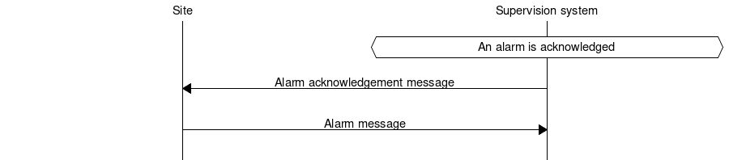
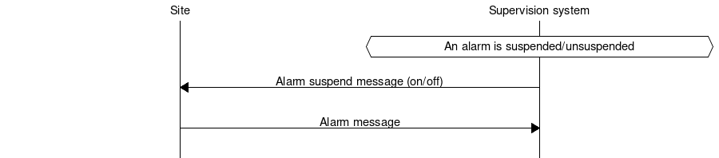
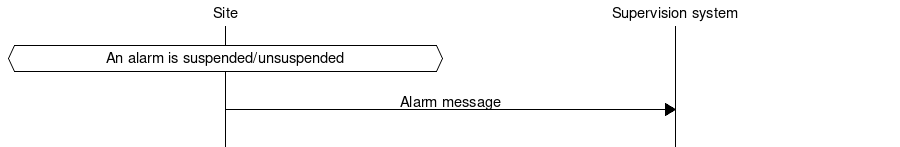
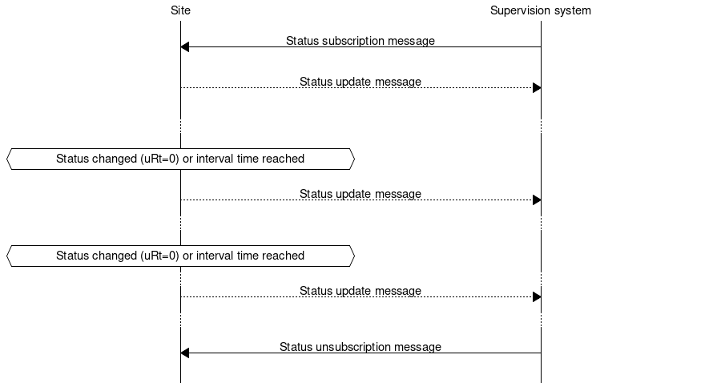

Contens
=======

* `definitions`_
* `introduction`_
* `purpose`_
* `applicability`_
* applicability/`scope`_
* applicability/`object_model`_
* applicability/`transport_of_data`_
* applicability/`basic_structure`_
* applicability/`usage_of_json`_
* `changelog`_
* appendix/`sxl`_

RSMP Specification
==================

Definitions
===========

**SXL**
Signal exchange list

**NTS**
National Traffic management system. Replaces CTS

**Maximo**
STA’s support system for maintenance

**ITS site**
Road side equipment. Covers both field level and local level

**Site**
 See ITS site

**Local road side equipment**
 See ITS site

**Supervision system**
 Control and supervision system for regional and/or national
 level

**Object**
 An object is a abstract term which is used in control and
 supervision systems. An object can have on or more statuses
 that may change depending on changes of circumstance of the
 object or control of the object from external source.
 Communication with the object is made using exchange of
 signals, e.g. commands, status and alarms.

 An object may also be equivalent of a physical equipment. E.g.
 camera, but could also be abstract such as an algorithm.

 An object is identified using the objects component id. Please
 note that an object is not necessarily the same thing as an NTS
 object.

**Aggregated object**
 An aggregated object consists of one or many other objects.
 E.g. Component group (CG)

**Object type**
 An object type is a classification of objects that controls the
 properties of all the objects of the same object type. The
 object type determines how the object is presented in
 supervision system, how it is grouped and which functional
 positions, alarm codes, commands and statuses that exists that
 object type.

**NTS Object**
 Used for objects in NTS

 All control and supervision related functions in NTS consist of
 NTS objects.

 An NTS object can represent on or many objects.

 An NTS objects is identified in the communication interface
 using “externalNtsId”. NTS can not use the format used in
 component-id.

 An object and NTS object and use the same component-id.

**NTS-Object type**
 A NTS object type is a classification of NTS objects.
 Determines among other things which functional positions that
 are possible for the NTS object.

**Component**
 A component is a object or NTS object.

 A component is identified using component-id.

**Component-ID**
 A component-id identifies components.

 The format used for the STA’s sites is specified in the STA
 publication 2007:54 ISSN 1401-9612, e.g. AA+BBCDD=EEEFFGGG.

**XML**
 eXtensible Markup Language

**JSON**
 JavaScript Object Notation

**TCP/IP**
 Transfer Control Protocol/Internet Protocol

**W3C**
 World Wide Web Consortium

**DATEX II**
 European standard for message exchange between traffic systems
 (www.datex2.eu)

**RSMP**
 Road Side Message Protocol

Introduction
============

This document presents a general protocol for communication between
supervision systems and road side equipment, and direct communication
between road side equipments. The aim is to offer a standardized protocol
that works the same way regardless of supplier or type of road side
equipment.

Purpose
=======

The purpose of this protocol is to create a standardized way to
communicate between systems at the local level and systems at the
regional level regardless of supplier and technology. The goal is to
be able to easily add and remove signals in new facilities and
applications without having to expand or change the standards and
guidelines. This means that the protocol, as opposed to many other
standards and protocols do not include detailed information about the
signal exchange but is focused on defining the types of signals which
are then described construction or items specifically. The goal is
that in the long term, based on installed systems and objects, is to
be able to produce signal exchange lists of type object that can be
reused in new contracts so that alarm messages, commands, etc. have
the same names regardless of facility or provider.

The purpose of the signal exchange is to provide information relating
to, for example, traffic control managers and administrators. E.g. the
information needed to monitor and control the road side equipment, as
well as the information that can be used for statistics and analysis
of traffic and equipment's status. For instance, alarms contains
sufficient information to be able to create a work order in Maximo
which is then sent to the operating contractor, ie. sufficient
information about the type of skills and equipment necessary to
correct the error. Additional detailed information about an alarm
(e.g. which I/O card has broken, the LED chain that is out of order,
etc.) can read on site via vendor-specific web interface or operator
panel.

Identified requirements
-----------------------

In order to provide an information exchange that is not dependent of
technology area or vendor specific information - four message types
have been identified that cover all types of information that the
Swedish Transport Administration needs. The information in each
message is dynamic and is defined by technical are or specific
equipment using a specific signal exchange list (SXL). The SXL also
represents the interface between the supervision system / other
facilities and equipment. The four message types are:

- **Alarm**. System, traffic- or monitoring alarms that require action
  by the traffic operator or traffic engineer. Usually sent from the
  equipment to the monitoring system when they occur.

- **Aggregated status**. An aggregated status that gives an overview
  glance of the status of the road side equipment. Usually sent from
  the equipment as soon as it changes to the monitoring system.

- **Status**. Status changes, indications and detailed information
  should be logged or made visible at the monitoring system. Sent upon
  request from the supervision system / other facility or using
  subscription (either at status change or at set time interval).

- **Command**. Commands sent from a supervision system or other
  facility to alter the equipment / object status or control
  principle.

Applicability
=============

Scope
-----

This document is a generic protocol specification for RSMP interface
that describes the protocol transfer mechanisms and function. The
document is a specification that allows for many use cases within and
outside the Swedish Transport Administration. The document is
provided for those who need to implement a RSMP interface.

Responsibility
^^^^^^^^^^^^^^

The Swedish Transport Administration (STA) is providing this interface
specification as information only. The STA is not responsible for any
consequences that implementation of the specification can lead to for
the supplier or any third party.

Object model
------------

This protocol uses the Datex II (datex2.eu) meta-model for its
object model. Meta model consists of a set of rules that describe how
classes and objects are defined. The reason why the Datex II meta-
model has been adopted is that it will eventually provide the
possibility for this protocol to become an international standard that
can later be included with the object model for Datex II. The object
model is technology independent, ie can be implemented in various ways
such as using **ASN.1**, **JSON** or **XML**.

In section basic-structure_ all examples is provided in XML format
for clarity. But the communication between the facility and supervision
systems / other facility uses JSON format. In section usage-of-json_
all message types in both XML and JSON are provided side by side.

Objects used for message exchange is **Alarm** with subclasses **Issue**,
**Acknowledge** and **Suspend**. For other objects there are classes
**AggregatedStatus**, **StatusRequest**, **StatusResponse**,
**CommandRequest**, **CommandResponse**, **Watchdog**, **MessageAck**,
**MessageNotAck**. For detailed information about how these classes are
used, see section basic-structure_.

Transport of data
-----------------

The message flow is different between different types of messages.
Some messages are event driven and sent without a request (push),
while others are interaction driven, ie. they sent in response to a
request from a host system or other system ( client- server). To
ensure that messages reach their destinations a message acknowledgment
is sent for all messages. This gives the application a simple way to
follow up on the message exchange. To communicate between equipments
and supervisions systems a pure TCP connection is used (TCP/IP), and
the data sent is based on the JSON format, ie formatted text.

Communication establishment
^^^^^^^^^^^^^^^^^^^^^^^^^^^

When establishing communication, messages are sent in the following
order.

1. RSMP / SXL version (according to section rsmpsxl-version_)

2. Watchdog (according to section watchdog_)

3. Aggregated status (according to section aggregatedstatus_)

4. All active and blocked alarm are sent (according to section
   alarmmessages_). The alarms that are not sent will be interpreted
   as non-active and non-blocked by the supervision system.

5. Any remaining messages in the equipment's outgoing communication
   buffer are sent

6. Any previous subscriptions to status messages are re-established;
   because they automatically cease at communication disruption

Communication disruption
^^^^^^^^^^^^^^^^^^^^^^^^

In the event of a communications failure the outgoing messages are
stored in the equipment's communication buffer. Once communication is
restored all the messages in the communications buffer are sent.

Any subscriptions to status messages ceases if the communication
failure occurs.

In the event of communications failure or power outage outgoing
communication buffer of equipment not empty, this does not apply
watchdog messages.

The internal communication buffer of the device must at a minimum be
sized to be able to store 1000 messages. At full communication buffer
the FIFO principle applies.

Transport between site and supervision system
^^^^^^^^^^^^^^^^^^^^^^^^^^^^^^^^^^^^^^^^^^^^^

Supervision system acts a socket server and waits for the site to
connect. If the communication were to fail it is the site’s
responsibility to reconnect.

Transport between sites
^^^^^^^^^^^^^^^^^^^^^^^

One site acts as socket server and waits for the other site to
connect. If the communication were to fail it is the connecting site’s
responsibility to reconnect.

.. _basicstructure:

.. _basic-structure:

Basic structure
---------------

Unicode (ISO 10646) and UTF-8 are used for all messages. All messages
are based on the structure presented below. In the following example the
message type is an alarm message.

.. code-block:: xml
   :name: xml-basic

   <?xml version="1.0" encoding="UTF-8"?>
   <roadSideMessage modelBaseVersion="1.0"
      xmlns="http://roadsidemessage.vv.se/1_0_1_4"
      xmlns:xsi="http://www.w3.org/2001/XMLSchema-instance"
      xsi:schemaLocation="http://roadsidemessage.vv.se/1_0_1_4 RoadSideMessage_1_0_1_4.xsd">
       <message xsi:type="Alarm">
           <messageId>{E68A0010-C336-41ac-BD58-5C80A72C7092}</messageId>
           <ntsObjectId>F+40100=416CG100</ntsObjectId>
           <externalNtsId>23055</externalNtsId>
           <componentId>AB+84001=860VA001</componentId>
       </message>
   </roadSideMessage>

The following table is describing the variable content of the message:

========================== ================== =====================================================================================================================================================================================================================
Element                    Value              Description
========================== ================== =====================================================================================================================================================================================================================
messageId                  *(GUID)*           Message identity. Generated as a GUID (Globally unique identifier) in the equipment that sent the message. Only version 4 of Leach-Salz UUID is used.
ntsObjectId *(optional)*   *(Defined in SXL)* Component-id for the NTS object which the message is referring to.
externalNtsId *(optional)* *(Defined in SXL)* Identity for the NTS objects in communication between NTS and other systems. The format is 5 integers (Mentioned in SL31 Object-Identity). Defined in cooperation with representatives from NTS. Unique for the site.
componentId                *(Defined in SXL)* Component id for the object which the message is referring to
========================== ================== =====================================================================================================================================================================================================================

.. _alarmmessages:

Alarm messages
^^^^^^^^^^^^^^

An alarm message is sent to the supervision system when:

- An alarm becomes active / inactive
- An alarm is acknowledged
- An alarm is being suspended / un-suspended

An acknowledgment of an alarm does not cause a single alarm event to
be acknowledged but all alarm events for the specific object with the
associated alarm code id. This approach simplifies both in
implementation but also in handling - if many alarms occur on the same
equipment with short time intervals.

A suspend of an alarm causes all alarms from the specific object with
the associated alarm code id to be suspended.

Alarm messages are event driven and sent to the supervision system
when the alarm occurs. Acknowledgement of alarms and alarm suspend
messages are interaction driven.

Message structure
"""""""""""""""""

Structure for an alarm message

An alarm message has the same structure when it’s sent regardless
whether or not it is a new alarm, being acknowledged or being
suspended, with the exception of “alarmSpecialisation”.

The following table describes the differences:

================================================ =====================================================
Element and value                                Meaning
================================================ =====================================================
<alarmSpecialisation xsi:type=”**Issue**”>       An alarm becomes active/in-active
<alarmSpecialisation xsi:type=”**Acknowledge**”> An alarm is acknowledged
<alarmSpecialisation xsi:type=”**Suspend**”>     Suspension of an alarm is being activated/deactivated
================================================ =====================================================

An alarm message has the structure according to the example below. In the 
following example the message contains an alarm for a lamp error at the
site "AB+84001=860VA001".

.. code-block:: xml
   :name: xml-alarm-issue

   <?xml version="1.0" encoding="utf-8"?>
   <roadSideMessage modelBaseVersion="1.0"
      xmlns="http://roadsidemessage.vv.se/1_0_1_4"
      xmlns:xsi="http://www.w3.org/2001/XMLSchema-instance"
      xsi:schemaLocation="http://roadsidemessage.vv.se/1_0_1_4 RoadSideMessage_1_0_1_4.xsd">
   <message xsi:type="Alarm">
   <messageId>{E68A0010-C336-41ac-BD58-5C80A72C7092}</messageId>
   <ntsObjectId>F+40100=416CG100</ntsObjectId>
   <externalNtsId>23055</externalNtsId>
   <componentId>AB+84001=860VA001</componentId>
   <alarmCodeId>A001</alarmCodeId>
   <externalAlarmCodeId>Lampfel på lykta 1 (röd)</externalAlarmCodeId>
   <externalNtsAlarmCodeId>3143</externalNtsAlarmCodeId>
   <alarmSpecialisation xsi:type="Issue">
      <acknowledgeState>notAcknowledged</acknowledgeState>
      <alarmState>active</alarmState>
      <suspendState>notSuspended</suspendState>
      <timestamp>2009-10-01T11:59:31.571Z</timestamp>
      <category>T</category>
      <priority>2</priority>
      <returnvalues>
         <returnvalue>
             <name>signalgrupp</name>
             <value>1</value>
         </returnvalue>
         <returnvalue>
            <name>färg</name>
            <value>röd</value>
         </returnvalue>
      </returnvalues>
   </alarmSpecialisation>
   </message>
   </roadSideMessage>

The following table is describing the variable content of the message:

Basic (xsi:type = Alarm)

=================================== ========================= =============================================================================================================================================================================
Element                             Value                     Description
=================================== ========================= =============================================================================================================================================================================
alarmCodeId                         *(Defined in SXL)*        Alarm code id. Determined in the signal exchange list (SXL). The examples in this document are defined according to the following format: Ayyy, where yyy is a unique number.
externalAlarmCodeId *(optional)*    *(Manufacturer specific)* Manufacturer specific alarm code and alarm description Manufacturer, model, alarm code och additional alarm description.
externalNtsAlarmCodeId *(optional)* *(Defined in SXL)*        Alarm code in order to identify alarm type during communication with NTS and other system. *(See SL31 Alarm-Code)*
=================================== ========================= =============================================================================================================================================================================

Alarm status

+-------------------+--------------------+------------------------------------------------------------------------------------+
| Element           | Value              | Description                                                                        |
+===================+====================+====================================================================================+
| acknowledegeState | acknowledged       | The alarm is acknowledged                                                          |
|                   +--------------------+------------------------------------------------------------------------------------+
|                   | notAcknowledged    | The alarm is not acknowledged                                                      |
+-------------------+--------------------+------------------------------------------------------------------------------------+
| alarmState        | inactive           | The alarm is inactive                                                              |
|                   +--------------------+------------------------------------------------------------------------------------+
|                   | active             | The alarm is active                                                                |
+-------------------+--------------------+------------------------------------------------------------------------------------+
| suspendState      | suspended          | The alarm is suspended                                                             |
|                   +--------------------+------------------------------------------------------------------------------------+
|                   | notSuspended       | The alarm is not suspended                                                         |
+-------------------+--------------------+------------------------------------------------------------------------------------+
| timestamp         | *(timestamp)*      | Timestamp for when the alarm either occurs, gets acknowledged or gets suspended.   |
|                   |                    | See the contents of **alarmSpecialisation** to determine which type timetamp is    |
|                   |                    | used. The timestamp uses the W3C XML **dateTime** definition with 3 decimal places |
|                   |                    | All timestamps are set at the local level (and not in the supervision system) when |
|                   |                    | the alarm occurs (and not when the message is sent). All timestamps uses UTC.      |
+-------------------+--------------------+------------------------------------------------------------------------------------+
| category          | T *or* D           | A character, either ”T” or ”D”.                                                    |
|                   |                    |                                                                                    |
|                   |                    | | An alarm belongs to one of these categories:                                     |
|                   |                    | | - T. Traffic alarm                                                               |
|                   |                    | | - D. Technical alarm                                                             |
|                   |                    |                                                                                    |
|                   |                    | **Traffic alarm:**                                                                 |
|                   |                    | Traffic alarms indicate events in the traffic related functions or the technical   |
|                   |                    | processes that effects traffic.                                                    |
|                   |                    |                                                                                    |
|                   |                    | | A couple of examples from a tunnel:                                              |
|                   |                    | | - Stopped vehicle                                                                |
|                   |                    | | - Fire alarm                                                                     |
|                   |                    | | - Error which affects message to motorists                                       |
|                   |                    | | - High level of CO2 in traffic room                                              |
|                   |                    | | - Etc.                                                                           |
|                   |                    |                                                                                    |
|                   |                    | **Technical alarm:**                                                               |
|                   |                    | Technical alarms are alarms that do not directly affect the traffic. One example   |
|                   |                    | of a technical alarm is when an impulse fan stops working.                         |
+-------------------+--------------------+------------------------------------------------------------------------------------+
| description       | *(Defined in SXL)* | Description of the alarm. Only defined in SXL and is never actually sent.          |
| *(only in SXL,    |                    | (The format of the description is free of choice but has the following             |
| never actually    |                    | requirements:                                                                      |
| sent)*            |                    | - The text is unique for the object type                                           |
|                   |                    | - The text is defined in cooperation with the Purchaser before use)                |
+-------------------+--------------------+------------------------------------------------------------------------------------+
| priority          | [0-9]              | The priority of the message. The following values are defined:                     |
|                   |                    |                                                                                    |
|                   |                    | 1. Alarm that requires immediate action.                                           |
|                   |                    | 2. Alarm that does not require immediate action, but action is planned during      |
|                   |                    |    the next work shift.                                                            |
|                   |                    | 3. Alarm that will be corrected during the next planned maintenance shift.         |
+-------------------+--------------------+------------------------------------------------------------------------------------+

Return values

+-----------------+--------------------+-----------------------------------------------+
| Element         | Value              | Description                                   |
+=================+====================+===============================================+
| name            | *(Defined in SXL)* | Unique reference of the value                 |
+-----------------+--------------------+-----------------------------------------------+
| type            | *(Defined in SXL)* | The data type of the value.                   |
| *(Only in SXL,  |                    | Defined in the SXL but is not actually sent   |
| not actually    |                    |                                               |
| sent)*          |                    | | General definition:                         |
|                 |                    | | **raw**: Value is expressed as raw value    |
|                 |                    | | **scale** Value is expressed as scale value |
|                 |                    | | **unit**: Value is expressed as units       |
|                 |                    | | **string**: Text information                |
|                 |                    | | **integer**: Numerical value                |
|                 |                    |   (16-bit signed integer), [-32768 – 32767]   |
|                 |                    | | **long**: Numerical value                   |
|                 |                    |   (32-bit signed long)                        |
|                 |                    | | **real**: Float                             |
|                 |                    |   (64-bit double precision floating point)    |
|                 |                    | | **boolean**: Boolean data type              |
|                 |                    | | **ordinal**: Represents index               |
|                 |                    | | **base64**: Binary data expressed in        |
|                 |                    |   base64 format according to RFC-4648         |
+-----------------+--------------------+-----------------------------------------------+
| unit            | *(Defined in SXL)* | The unit of the value. Defined in SXL but     |
| *(Only is SXL,  |                    | are not actually sent                         |
| not actually    |                    |                                               |
| sent)*          |                    |                                               |
+-----------------+--------------------+-----------------------------------------------+
| value           | *(Defined in SXL)* | Value                                         |
+-----------------+--------------------+-----------------------------------------------+

Structure for alarm acknowledgement message

An alarm acknowledgement message has the structure according to the example
below.

.. code-block:: xml
   :name: xml-alarm-ack

   <?xml version="1.0" encoding="utf-8"?>
   <roadSideMessage modelBaseVersion="1.0"
      xmlns="http://roadsidemessage.vv.se/1_0_1_4"
      xmlns:xsi="http://www.w3.org/2001/XMLSchema-instance"
      xsi:schemaLocation="http://roadsidemessage.vv.se/1_0_1_4 RoadSideMessage_1_0_1_4.xsd">
   <message xsi:type="Alarm">
   <messageId>{E68A0010-C336-41ac-BD58-5C80A72C7092}</messageId>
   <ntsObjectId>F+40100=416CG100</ntsObjectId>
   <externalNtsId>23055</externalNtsId>
   <componentId>AB+84001=860VA001</componentId>
   <alarmCodeId>A001</alarmCodeId>
   <externalAlarmCodeId>Larmfel på lykta 1 (röd)</externalAlarmCodeId>
   <externalNtsAlarmCodeId>3143</externalNtsAlarmCodeId>
   <alarmSpecialisation xsi:type="Acknowledge" />
   </message>
   </roadSideMessage>

The following table is describing the variable content of the message:

Basic (xsi:type = Alarm)

+------------------------+--------------------+--------------------------------------------------------------------+
| Element                | Value              | Description                                                        |
+========================+====================+====================================================================+
| alarmCodeId            | *(Defined in SXL)* | Alarm code id. Determined in the signal exchange list (SXL).       |
|                        |                    | The examples in this document are defined according to the         |
|                        |                    | following format: Ayyy, where yyy is a unique number.              |
+------------------------+--------------------+--------------------------------------------------------------------+
| externalAlarmCodeId    | *(Manufacturer     | Manufacturer specific alarm code and alarm description.            |
| *(optional)*           | specific)*         | Manufacturer, model, alarm code och additional alarm description   |
+------------------------+--------------------+--------------------------------------------------------------------+
| externalNtsAlarmCodeId | *(Defined in SXL)* | Alarm code in order to identify alarm type during communication    |
| *(optional)*           |                    | with NTS and other systems. *(See SL31 Alarm-Code)*                |
+------------------------+--------------------+--------------------------------------------------------------------+

Alarm acknowledgement (xsi:type = Acknowledge)

(no content)

Structure for alarm suspend message

An alarm suspend message has the structure according to the example
below.

.. code-block:: xml
   :name: xml-alarm-suspend

   <?xml version="1.0" encoding="utf-8"?>
   <roadSideMessage modelBaseVersion="1.0"
      xmlns="http://roadsidemessage.vv.se/1_0_1_4"
      xmlns:xsi="http://www.w3.org/2001/XMLSchema-instance"
      xsi:schemaLocation="http://roadsidemessage.vv.se/1_0_1_4 RoadSideMessage_1_0_1_4.xsd">
   <message xsi:type="Alarm">
   <messageId>{E68A0010-C336-41ac-BD58-5C80A72C7092}</messageId>
   <ntsObjectId>F+40100=416CG100</ntsObjectId>
   <externalNtsId>23055</externalNtsId>
   <componentId>AB+84001=860VA001</componentId>
   <alarmCodeId>A001</alarmCodeId>
   <externalAlarmCodeId>Larmfel på lykta 1 (röd)</externalAlarmCodeId>
   <externalNtsAlarmCodeId>3143</externalNtsAlarmCodeId>
   <alarmSpecialisation xsi:type="Suspend">
   <suspendAction>suspend</suspendAction>
   </alarmSpecialisation>
   </message>
   </roadSideMessage>

The following table is describing the variable content of the message:

Basic (xsi:type = Alarm)

+------------------------+--------------------+--------------------------------------------------------------------+
| Element                | Value              | Description                                                        |
+========================+====================+====================================================================+
| alarmCodeId            | *(Defined in SXL)* | Alarm code id. Determined in the signal exchange list (SXL).       |
|                        |                    | The examples in this document are defined according to the         |
|                        |                    | following format: Ayyy, where yyy is a unique number.              |
+------------------------+--------------------+--------------------------------------------------------------------+
| externalAlarmCodeId    | *(Manufacturer     | Manufacturer specific alarm code and alarm description.            |
| *(optional)*           | specific)*         | Manufacturer, model, alarm code och additional alarm description   |
+------------------------+--------------------+--------------------------------------------------------------------+
| externalNtsAlarmCodeId | *(Defined in SXL)* | Alarm code in order to identify alarm type during communication    |
| *(optional)*           |                    | with NTS and other system. *(See SL31 Alarm-Code)*                 |
+------------------------+--------------------+--------------------------------------------------------------------+

Alarm suspend (xsi:type = Suspend)

+------------------------+------------------+----------------------------------------------------------------------+
| Element                | Value            | Description                                                          |
+========================+==================+======================================================================+
| suspendAction          | suspend          | Activate suspend of an alarm                                         |
|                        +------------------+----------------------------------------------------------------------+
|                        | resume           | Deactivate a suspend of an alarm                                     |
+------------------------+------------------+----------------------------------------------------------------------+

Message exchange between site and supervision system
""""""""""""""""""""""""""""""""""""""""""""""""""""

Message acknowledgement (see section message-ack_) is implicit in the
following figure.

**An alarm is active/inactive**

1. An alarm message is sent to supervision system with the status of the alarm (the alarm is active/inactive)

**An alarm is acknowledged at the supervision system**

1. An alarm acknowledgement message is sent to the site
2. An alarm message is sent to the supervision system (that the alarm is acknowledged)

**An alarm is acknowledged at the site**

1. An alarm message is being sent to the supervision system with the status of the alarm (that the alarm is acknowledged)

**An alarm is suspended/unsuspended from the supervision system**

1. An alarm suspend message is being sent to the site
2. An alarm message is sent to the supervision system with the status of the alarm (that the suspension is activated/deactivated)

**An alarm is suspended/unsuspended from the site**

1. An alarm message is sent to the supervision system with the status of the alarm (that suspension is activated/deactivated)

Aggregated status message
^^^^^^^^^^^^^^^^^^^^^^^^^

This type of message is sent to the supervision system to inform about the
status of the site.

Aggregated status message are interaction driven and are sent if state
bits, functional position or functional status are changed at the site.

Message structure
"""""""""""""""""

An aggregated status message has the structure according to the example
below.

.. code-block:: xml
   :name: xml-agg-status

   <?xml version="1.0" encoding="utf-8"?>
   <roadSideMessage modelBaseVersion="1.0"
      xmlns="http://roadsidemessage.vv.se/1_0_1_4"
      xmlns:xsi="http://www.w3.org/2001/XMLSchema-instance"
      xsi:schemaLocation="http://roadsidemessage.vv.se/1_0_1_4 RoadSideMessage_1_0_1_4.xsd">
   <message xsi:type="AggregatedStatus">
   <messageId>{E68A0010-C336-41ac-BD58-5C80A72C7092}</messageId>
   <ntsObjectId>F+40100=416CG100</ntsObjectId>
   <externalNtsId>23055</externalNtsId>
   <componentId>F+40100=416CG100</componentId>
   <aggstatusTimeStamp>2009-10-02T14:34:34.345Z</aggstatusTimeStamp>
   <aggregatedStatusSpecialisation>
      <functionalPosition>Trafikstyrning</functionalPosition>
      <functionalState>Automatiskt nedsatt hastighet</functionalState>
      <state>
         <name>1</name>
         <state>false</state>
      </state>
      <state>
         <name>2</name>
         <state>true</state>
      </state>
      <state>
         <name>3</name>
         <state>true</state>
      </state>
      <state>
         <name>4</name>
         <state>false</state>
      </state>
      <state>
         <name>5</name>
         <state>false</state>
      </state>
      <state>
         <name>6</name>
         <state>false</state>
      </state>
      <state>
         <name>7</name>
         <state>false</state>
      </state>
      <state>
         <name>8</name>
         <state>false</state>
      </state>
   </aggregatedStatusSpecialisation>
   </message>
   </roadSideMessage>

The following tables are describing the variable content of the message:

Basic (aggregatedStatus)

================== ============= ==========================================
Element            Value         Description
================== ============= ==========================================
aggstatusTimeStamp *(timestamp)* The timestamp uses the W3C XML dateTime
                                 definition with a 3 decimal places. All
                                 timestamps are set at the local level
                                 (and not in the supervision system) when
                                 the event occurs (and not when the
                                 message is sent). All timestamps uses UTC.
================== ============= ==========================================

Aggregated status (aggregatedStatusSpecialisation)

+--------------------+--------------------+-------------------------+
| Element            | Value              | Description             |
+====================+====================+=========================+
| functionalPosition | *(Defined in SXL)* | Functional position     |
+--------------------+--------------------+-------------------------+
| functionalState    | *(Defined in SXL)* | Functional state        |
| *(optional)*       |                    |                         |
+--------------------+--------------------+-------------------------+
| state              | *(see below)*      | Status bits (see below) |
+--------------------+--------------------+-------------------------+

Status bits (state)

The status bits are a set of 8 bits that describes the state of the site
for NTS. Every bit can either be true or false

+--------------------+--------------------+---------------------------+
| Element            | Value              | Description               |
+====================+====================+===========================+
| state              | true               | State bit                 |
|                    +--------------------+                           |
|                    | false              |                           |
+--------------------+--------------------+---------------------------+
| name               | [1-8]              | Bit nr                    |
|                    |                    | (integer between 1 and 8) |
+--------------------+--------------------+---------------------------+

The principle of aggregating of statuses for each bit is defined by the
associated comments in the signal exchange list (SXL). A generic
description of each bit is presented in the table below

+---------+--------+-------------------------------------+--------------------------+
| Element | Bit    | Description                         | Status                   |
|         | (name) |                                     |                          |
+=========+========+=====================================+==========================+
| state   | 1      | The site is out of operation by the | Light blue – local       |
|         |        | local control system or maintenance | control                  |
|         |        | personnel working.                  |                          |
|         +--------+-------------------------------------+--------------------------+
|         | 2      | Supervision system has no contact   | Purple – Communication   |
|         |        | with the site                       | disruption               |
|         +--------+-------------------------------------+--------------------------+
|         | 3      | The site has an alarm that requires | Red – High priority      |
|         |        | immediate action. (Priority 1)      | alarm                    |
|         +--------+-------------------------------------+--------------------------+
|         | 4      | The site has an alarm that does not | Yellow – Medium          |
|         |        | require immediate action but is     | priority alarm           |
|         |        | planned during the next work shift  |                          |
|         |        | (Priority 2)                        |                          |
|         +--------+-------------------------------------+--------------------------+
|         | 5      | The site has an alarm that will     | Blue – Low priority      |
|         |        | corrected at the next planned       | alarm                    |
|         |        | maintenance shift (Priority 3)      |                          |
|         +--------+-------------------------------------+--------------------------+
|         | 6      | The site is connected and is        | Green - Normal operation |
|         |        | currently in use.                   | – In use                 |
|         +--------+-------------------------------------+--------------------------+
|         | 7      | The site is connected but is        | Dark grey - rest         |
|         |        | currently not is use                |                          |
|         +--------+-------------------------------------+--------------------------+
|         | 8      | The site is not connected to the    | Light grey – Not         |
|         |        | supervision system.                 | Connected                |
+---------+--------+-------------------------------------+--------------------------+

Message exchange between site and supervision system
""""""""""""""""""""""""""""""""""""""""""""""""""""

Message acknowledgement (see section message-ack_) is implicit in the
following figure.

.. image:: img/aggregated_status.png
   :align: center

**(Functional state, functional position or status bits changes at the
site)**

1. An aggregated status message is sent to the supervision system.

Status Messages
^^^^^^^^^^^^^^^

The status message is a type of message that is sent to the
supervision system or other equipment with the status of one or more
requested objects.

The status message can both be interaction driven or event driver and
can be sent during the following prerequisites:

- When status is requested from the supervision system or other equipment.
- According to subscription – either by using a fixed time interval or
  when the status changes.

Message structure
"""""""""""""""""

Structure for a request of a status of one or several objects
^^^^^^^^^^^^^^^^^^^^^^^^^^^^^^^^^^^^^^^^^^^^^^^^^^^^^^^^^^^^^

A status request message has the structure according to the example
below.

.. code-block:: xml
   :name: xml-status-req

   <?xml version="1.0" encoding="utf-8"?>
   <roadSideMessage modelBaseVersion="1.0"
      xmlns="http://roadsidemessage.vv.se/1_0_1_4"
      xmlns:xsi="http://www.w3.org/2001/XMLSchema-instance"
      xsi:schemaLocation="http://roadsidemessage.vv.se/1_0_1_4 RoadSideMessage_1_0_1_4.xsd">
   <message xsi:type="StatusRequest">
   <messageId>{E68A0010-C336-41ac-BD58-5C80A72C7092}</messageId>
   <ntsObjectId>F+40100=416CG100</ntsObjectId>
   <externalNtsId>23055</externalNtsId>
   <componentId>AB+84001=860VA001</componentId>
   <statuses>
      <status>
         <statusCodeId>S003</statusCodeId>
         <name>speed</name>
      </status>
      <status>
         <statusCodeId>S003</statusCodeId>
         <name>occupancy</name>
      </status>
   </statuses>
   </message>
   </roadSideMessage>

The following tables are describing the variable content of the message:

Basic (xsi:type = StatusRequest)

+--------------+--------------------+----------------------------------------------------------------------+
| Element      | Value              | Description                                                          |
+==============+====================+======================================================================+
| statusCodeId | *(Defined in SXL)* | Status code id. Determined by the signal exchange list (SXL).        |
|              |                    | The examples in this document are defined according to the following |
|              |                    | format: syyy, where yyy is a unique number.                          |
+--------------+--------------------+----------------------------------------------------------------------+
| name         | *(Defined in SXL)* | Unique reference                                                     |
+--------------+--------------------+----------------------------------------------------------------------+

Structure for a message with status of one or several objects
^^^^^^^^^^^^^^^^^^^^^^^^^^^^^^^^^^^^^^^^^^^^^^^^^^^^^^^^^^^^^

A message with status of one or several objects has the structure
according to the example below.

.. code-block:: xml
   :name: xml-status-response

   <?xml version="1.0" encoding="utf-8"?>
   <roadSideMessage modelBaseVersion="1.0"
      xmlns="http://roadsidemessage.vv.se/1_0_1_4"
      xmlns:xsi="http://www.w3.org/2001/XMLSchema-instance"
      xsi:schemaLocation="http://roadsidemessage.vv.se/1_0_1_4 RoadSideMessage_1_0_1_4.xsd">
       <message xsi:type="StatusResponse">
           <messageId>{E68A0010-C336-41ac-BD58-5C80A72C7092}</messageId>
           <ntsObjectId>F+40100=416CG100</ntsObjectId>
           <externalNtsId>23055</externalNtsId>
           <componentId>AB+84001=860VA001</componentId>
           <statusTimeStamp>2009-10-02T14:34:34.345Z</statusTimeStamp>
           <returnvalues>
               <returnvalue>
                   <statusCodeId>S003</statusCodeId>
                   <name>speed</name>
                   <status>70</status>
                   <ageState>recent</ageState>
               </returnvalue>
               <returnvalue>
                   <statusCodeId>S003</statusCodeId>
                   <name>occupancy</name>
                   <status>14</status>
                   <ageState>recent</ageState>
               </returnvalue>
           </returnvalues>
       </message>
   </roadSideMessage>

The following table is describing the variable content of the message:

Basic (xsi:type = StatusResponse)

+-----------------+--------------------+--------------------------------------------+
| Element         | Value              | Description                                |
+=================+====================+============================================+
| statusTimeStamp | *(timestamp)*      | The timestamp uses the W3C XML dateTime    |
|                 |                    | definition with a 3 decimal places. All    |
|                 |                    | timestamps are set at the local level (and |
|                 |                    | not in the supervision system) when the    |
|                 |                    | alarm occurs (and not when the message     |
|                 |                    | message is sent). All timestamps uses UTC. |
+-----------------+--------------------+--------------------------------------------+
| description     | *(Defined in SXL)* | Description for the status request.        |
| *(Only in SXL,  |                    | Defined in the SXL but is not actually     |
| not actually    |                    | sent.                                      |
| sent)*          |                    |                                            |
+-----------------+--------------------+--------------------------------------------+

Return values (returnvalue)
^^^^^^^^^^^^^^^^^^^^^^^^^^^

+-----------------+--------------------+-----------------------------------------------+
| Element         | Value              | Description                                   |
+=================+====================+===============================================+
| statusCodeId    | *(Defined in SXL)* | Status code id. Determined by the signal      |
|                 |                    | exchange list (SXL). The examples in this     |
|                 |                    | document are defined according to the         |
|                 |                    | following format: Syyy, where yyy is a        |
|                 |                    | unique number.                                |
+-----------------+--------------------+-----------------------------------------------+
| name            | *(Defined in SXL)* | Unique reference of the value                 |
+-----------------+--------------------+-----------------------------------------------+
| type            | *(Defined in SXL)* | The data type of the value.                   |
| *(Only in SXL,  |                    | Defined in the SXL but is not actually sent   |
| not actually    |                    |                                               |
| sent)*          |                    | | General definition:                         |
|                 |                    | | **raw**: Value is expressed as raw value    |
|                 |                    | | **scale** Value is expressed as scale value |
|                 |                    | | **unit**: Value is expressed as units       |
|                 |                    | | **string**: Text information                |
|                 |                    | | **integer**: Numerical value                |
|                 |                    |   (16-bit signed integer), [-32768 – 32767]   |
|                 |                    | | **long**: Numerical value                   |
|                 |                    |   (32-bit signed long)                        |
|                 |                    | | **real**: Float                             |
|                 |                    |   (64-bit double precision floating point)    |
|                 |                    | | **boolean**: Boolean data type              |
|                 |                    | | **ordinal**: Represents index               |
|                 |                    | | **base64**: Binary data expressed in        |
|                 |                    |   base64 format according to RFC-4648         |
+-----------------+--------------------+-----------------------------------------------+
| unit            | *(Defined in SXL)* | The unit of the value. Defined in SXL but     |
| *(Only is SXL,  |                    | are not actually sent                         |
| not actually    |                    |                                               |
| sent)*          |                    |                                               |
+-----------------+--------------------+-----------------------------------------------+
| status          | *(Defined in SXL)* | Value                                         |
+-----------------+--------------------+-----------------------------------------------+
| ageState        | recent             | The value is up to date                       |
|                 +--------------------+-----------------------------------------------+
|                 | old                | The value is not up to date                   |
|                 +--------------------+-----------------------------------------------+
|                 | unknown            | The value is unknown and no subscription will |
|                 |                    | be performed.                                 |
+-----------------+--------------------+-----------------------------------------------+

Structure for a status subscription request message on one or several objects
^^^^^^^^^^^^^^^^^^^^^^^^^^^^^^^^^^^^^^^^^^^^^^^^^^^^^^^^^^^^^^^^^^^^^^^^^^^^^

A message with the request of subscription to a status has the
structure according to the example below. The message is used for
constructing a list of subscriptions of statuses, digital and analogue
values and events that are desirable to send to supervision system,
e.g. temperature, wind speed, power consumption, manual control.

.. code-block:: xml
   :name: xml-status-subscribe

   <?xml version="1.0" encoding="utf-8"?>
   <roadSideMessage modelBaseVersion="1.0"
      xmlns="http://roadsidemessage.vv.se/1_0_1_4"
      xmlns:xsi="http://www.w3.org/2001/XMLSchema-instance"
      xsi:schemaLocation="http://roadsidemessage.vv.se/1_0_1_4 RoadSideMessage_1_0_1_4.xsd">
       <message xsi:type="StatusSubscribe">
           <messageId>{E68A0010-C336-41ac-BD58-5C80A72C7092}</messageId>
           <ntsObjectId>F+40100=416CG100</ntsObjectId>
           <externalNtsId>23055</externalNtsId>
           <componentId>AB+84001=860VA001</componentId>
           <statuses>
               <status>
                   <statusCodeId>S003</statusCodeId>
                   <name>speed</name>
                   <updateRate>10</updateRate>
               </status>
               <status>
                   <statusCodeId>S003</statusCodeId>
                   <name>occupancy</name>
                   <updateRate>10</updateRate>
               </status>
           </statuses>
       </message>
   </roadSideMessage>

The following table is describing the variable content of the message:

Basic (xsi:type = StatusRequest)

+------------+------------+--------------------------------------------------------+
| Element    | Value      | Description                                            |
+============+============+========================================================+
| updateRate | *(string)* | Determines the interval of which the message should be |
|            |            | sent. Defined in seconds with decimals, e.g. ”2.5” for |
|            |            | 2.5 seconds. Dot (.) is used as decimal point. If “0”  |
|            |            | means that the value should be sent when changed.      |
+------------+------------+--------------------------------------------------------+

Structure for a response message with answer to a request for status subscription for one or several objects
^^^^^^^^^^^^^^^^^^^^^^^^^^^^^^^^^^^^^^^^^^^^^^^^^^^^^^^^^^^^^^^^^^^^^^^^^^^^^^^^^^^^^^^^^^^^^^^^^^^^^^^^^^^^

A response message with answer to a request for status subscription
has the structure according to the example below. This response is
always sent immediately after request for subscription regardless if
the value recently changed or as an effect of the interval for the
subscription. The reason for sending the response immediately is
because subscriptions usually are established shortly after RSMP
connection establishment and the supervision system needs to update
with the current statuses and events.

.. code-block:: xml
   :name: xml-status-update

   <?xml version="1.0" encoding="utf-8"?>
   <roadSideMessage modelBaseVersion="1.0"
      xmlns="http://roadsidemessage.vv.se/1_0_1_4"
      xmlns:xsi="http://www.w3.org/2001/XMLSchema-instance"
      xsi:schemaLocation="http://roadsidemessage.vv.se/1_0_1_4 RoadSideMessage_1_0_1_4.xsd">
       <message xsi:type="StatusUpdate">
           <messageId>{E68A0010-C336-41ac-BD58-5C80A72C7092}</messageId>
           <ntsObjectId>F+40100=416CG100</ntsObjectId>
           <externalNtsId>23055</externalNtsId>
           <componentId>AB+84001=860VA001</componentId>
           <statusTimeStamp>2009-10-02T14:34:34.345Z</statusTimeStamp>
           <returnvalues>
               <returnvalue>
                   <statusCodeId>S003</statusCodeId>
                   <name>speed</name>
                   <status>70</status>
                   <ageState>recent</ageState>
               </returnvalue>
               <returnvalue>
                   <statusCodeId>S003</statusCodeId>
                   <name>occupancy</name>
                   <status>14</status>
                   <ageState>recent</ageState>
               </returnvalue>
           </returnvalues>
       </message>
   </roadSideMessage>

The allowed content is described in Table :num:_table-statusresponse_ and
:num:_table-statusresponse-returnvalues_.

Structure for a status unsubscription message on one or several objects
^^^^^^^^^^^^^^^^^^^^^^^^^^^^^^^^^^^^^^^^^^^^^^^^^^^^^^^^^^^^^^^^^^^^^^^

A message with the request of unsubscription to a status has the structure
according to the example below. The request unsubscribes on one or several
objects. No particular answer is sent for this request, other than the
usual message acknowledgement.

.. code-block:: xml
   :name: xml-status-unsubscribe

   <?xml version="1.0" encoding="utf-8"?>
   <roadSideMessage modelBaseVersion="1.0"
      xmlns="http://roadsidemessage.vv.se/1_0_1_4"
      xmlns:xsi="http://www.w3.org/2001/XMLSchema-instance"
      xsi:schemaLocation="http://roadsidemessage.vv.se/1_0_1_4 RoadSideMessage_1_0_1_4.xsd">
       <message xsi:type="StatusUnSubscribe">
           <messageId>{E68A0010-C336-41ac-BD58-5C80A72C7092}</messageId>
           <ntsObjectId>F+40100=416CG100</ntsObjectId>
           <externalNtsId>23055</externalNtsId>
           <componentId>AB+84001=860VA001</componentId>
           <statuses>
               <status>
                   <statusCodeId>S003</statusCodeId>
                   <name>speed</name>
               </status>
               <status>
                   <statusCodeId>S003</statusCodeId>
                   <name>occupancy</name>
               </status>
           </statuses>
       </message>
   </roadSideMessage>

The allowed content is described in Table :num:_table-statusrequest_

Message exchange between site and supervision system/other equipment - request
""""""""""""""""""""""""""""""""""""""""""""""""""""""""""""""""""""""""""""""

Message acknowledgement (see section message-ack_) is implicit in the
following figure.

1. Request of status for an object
2. Response with status of an object

Message exchange between site and supervision system/other equipment - subscription
"""""""""""""""""""""""""""""""""""""""""""""""""""""""""""""""""""""""""""""""""""

Message acknowledgement (see section message-ack_) is implicit in the
following figure.

1. Update with status of an object

Command messages
^^^^^^^^^^^^^^^^

Command messages are used to give order to do something at the site.
The site responds with a command acknowledgement.

Command messages are interaction driven and are sent when command are
requested on any given object by the supervision system or other equipment

Message structure
"""""""""""""""""

Structure of a command message request

A command request message has the structure according to the example
below. A command request message with the intent to change a value of the
requested object

.. code-block:: xml
   :name: xml-command-req

   <?xml version="1.0" encoding="utf-8"?>
   <roadSideMessage modelBaseVersion="1.0"
      xmlns="http://roadsidemessage.vv.se/1_0_1_4"
      xmlns:xsi="http://www.w3.org/2001/XMLSchema-instance"
      xsi:schemaLocation="http://roadsidemessage.vv.se/1_0_1_4 RoadSideMessage_1_0_1_4.xsd">
       <message xsi:type="CommandRequest">
       <messageId>{E68A0010-C336-41ac-BD58-5C80A72C7092}</messageId>
       <ntsObjectId>F+40100=416CG100</ntsObjectId>
       <externalNtsId>23055</externalNtsId>
       <componentId>AB+84001=860VA001</componentId>
       <arguments>
           <argument>
               <commandCodeId>M002</commandCodeId>
               <name>1</name>
               <command>setValue</command>
               <value>Auto</value>
           </argument>
       </arguments>
       </message>
   </roadSideMessage>

The following table is describing the variable content of the message:

Values to send with the command (arguments)

+-----------------+--------------------+-----------------------------------------------+
| Element         | Value              | Description                                   |
+=================+====================+===============================================+
| commandCodeId   | *(Defined in SXL)* | Command code id. Determined in the signal     |
|                 |                    | exchange list (SXL). The examples in this     |
|                 |                    | document are defined according to the         |
|                 |                    | following format: Myyy, where yyy is a unique |
|                 |                    | number.                                       |
+-----------------+--------------------+-----------------------------------------------+
| name            | *(Defined in SXL)* | Unique reference of the value                 |
+-----------------+--------------------+-----------------------------------------------+
| command         | *(Defined in SXL)* | Command                                       |
+-----------------+--------------------+-----------------------------------------------+
| type            | *(Defined in SXL)* | The data type of the value.                   |
| *(Only in SXL,  |                    | Defined in the SXL but is not actually sent   |
| not actually    |                    |                                               |
| sent)*          |                    | | General definition:                         |
|                 |                    | | **raw**: Value is expressed as raw value    |
|                 |                    | | **scale** Value is expressed as scale value |
|                 |                    | | **unit**: Value is expressed as units       |
|                 |                    | | **string**: Text information                |
|                 |                    | | **integer**: Numerical value                |
|                 |                    |   (16-bit signed integer), [-32768 – 32767]   |
|                 |                    | | **long**: Numerical value                   |
|                 |                    |   (32-bit signed long)                        |
|                 |                    | | **real**: Float                             |
|                 |                    |   (64-bit double precision floating point)    |
|                 |                    | | **boolean**: Boolean data type              |
|                 |                    | | **ordinal**: Represents index               |
|                 |                    | | **base64**: Binary data expressed in        |
|                 |                    |   base64 format according to RFC-4648         |
+-----------------+--------------------+-----------------------------------------------+
| unit            | *(Defined in SXL)* | The unit of the value. Defined in SXL but     |
| *(Only is SXL,  |                    | are not actually sent                         |
| not actually    |                    |                                               |
| sent)*          |                    |                                               |
+-----------------+--------------------+-----------------------------------------------+
| value           | *(Defined in SXL)* | Value                                         |
+-----------------+--------------------+-----------------------------------------------+

Structure of command response message
^^^^^^^^^^^^^^^^^^^^^^^^^^^^^^^^^^^^^

A command response message has the structure according to the example
below. A command response message informs about the updated value of the
requested object.

.. code-block:: xml
   :name: xml-command-response

   <?xml version="1.0" encoding="utf-8"?>
   <roadSideMessage modelBaseVersion="1.0"
      xmlns="http://roadsidemessage.vv.se/1_0_1_4"
      xmlns:xsi="http://www.w3.org/2001/XMLSchema-instance"
      xsi:schemaLocation="http://roadsidemessage.vv.se/1_0_1_4 RoadSideMessage_1_0_1_4.xsd">
       <message xsi:type="CommandResponse">
           <messageId>{E68A0010-C336-41ac-BD58-5C80A72C7092}</messageId>
           <ntsObjectId>F+40100=416CG100</ntsObjectId>
           <externalNtsId>23055</externalNtsId>
           <componentId>AB+84001=860VA001</componentId>
           <commandTimeStamp>2009-10-02T14:34:34.345Z</commandTimeStamp>
           <returnvalues>
               <returnvalue>
                   <commandCodeId>M002</commandCodeId>
                   <ageState>recent</ageState>
                   <name>1</name>
                   <value>Auto</value>
               </returnvalue>
           </returnvalues>
       </message>
   </roadSideMessage>

The following table is describing the variable content of the message:

Basic (xsi:type = CommandResponse)

+------------------+--------------------+------------------------------------------------------------------------------------+
| Element          | Value              | Description                                                                        |
+==================+====================+====================================================================================+
| commandTimeStamp | *(timestamp)*      | The timestamp uses the W3C XML dateTime definition with a 3 decimal places.        |
|                  |                    | All timestamps are set at the local level (and not in the supervision system) when |
|                  |                    | the alarm occurs (and not when the message is sent). All timestamps uses UTC.      |
+------------------+--------------------+------------------------------------------------------------------------------------+

Return values (returnvalue)
^^^^^^^^^^^^^^^^^^^^^^^^^^^

+-----------------+--------------------+-----------------------------------------------+
| Element         | Value              | Description                                   |
+=================+====================+===============================================+
| commandCodeId   | *(Defined in SXL)* | Command code id. Determined in the signal     |
|                 |                    | exchange list (SXL). The examples in this     |
|                 |                    | document are defined according to the         |
|                 |                    | following format: Myyy, where yyy is a unique |
|                 |                    | number.                                       |
+-----------------+--------------------+-----------------------------------------------+
| ageState        | recent             | The value is up to date                       |
|                 +--------------------+-----------------------------------------------+
|                 | old                | The value is not up to date                   |
|                 +--------------------+-----------------------------------------------+
|                 | unknown            | The value is unknown                          |
+-----------------+--------------------+-----------------------------------------------+
| name            | *(Defined in SXL)* | Unique reference of the value                 |
+-----------------+--------------------+-----------------------------------------------+
| type            | *(Defined in SXL)* | The data type of the value.                   |
| *(Only in SXL,  |                    | Defined in the SXL but is not actually sent   |
| not actually    |                    |                                               |
| sent)*          |                    | | General definition:                         |
|                 |                    | | **raw**: Value is expressed as raw value    |
|                 |                    | | **scale** Value is expressed as scale value |
|                 |                    | | **unit**: Value is expressed as units       |
|                 |                    | | **string**: Text information                |
|                 |                    | | **integer**: Numerical value                |
|                 |                    |   (16-bit signed integer), [-32768 – 32767]   |
|                 |                    | | **long**: Numerical value                   |
|                 |                    |   (32-bit signed long)                        |
|                 |                    | | **real**: Float                             |
|                 |                    |   (64-bit double precision floating point)    |
|                 |                    | | **boolean**: Boolean data type              |
|                 |                    | | **ordinal**: Represents index               |
|                 |                    | | **base64**: Binary data expressed in        |
|                 |                    |   base64 format according to RFC-4648         |
+-----------------+--------------------+-----------------------------------------------+
| unit            | *(Defined in SXL)* | The unit of the value. Defined in SXL but     |
| *(Only is SXL,  |                    | are not actually sent                         |
| not actually    |                    |                                               |
| sent)*          |                    |                                               |
+-----------------+--------------------+-----------------------------------------------+
| value           | *(Defined in SXL)* | Value                                         |
+-----------------+--------------------+-----------------------------------------------+

Message exchange between site and supervision system/other equipment
"""""""""""""""""""""""""""""""""""""""""""""""""""""""""""""""""""""

Message acknowledgement (see section message-ack_) is implicit in the
following figure.

1. Command request for an object
2. Command response of an object

.. _message-ack:

Message acknowledgement
^^^^^^^^^^^^^^^^^^^^^^^

Message acknowledgement is sent as an initial answer to all other
messages. This type of message should not be mixed up with alarm
acknowledgement, which has a different function. The purpose of
message acknowledgement is to detect communication disruptions,
function as an acknowledgment that the message has reached its
destination and to verify that the message was understood.

There are two types of message acknowledgement – Message
acknowledgment which confirms that the message was understood and
Message not acknowledged which indicates that the message was not
understood.

The acknowledgement messages are interaction driven and are sent when
any other type message are received.

Message structure – Message acknowledgement
"""""""""""""""""""""""""""""""""""""""""""

An acknowledgement message has the structure according to the example
below.

.. code-block:: xml
   :name: xml-ack

   <?xml version="1.0" encoding="utf-8"?>
   <roadSideMessage modelBaseVersion="1.0"
      xmlns="http://roadsidemessage.vv.se/1_0_1_4"
      xmlns:xsi="http://www.w3.org/2001/XMLSchema-instance"
      xsi:schemaLocation="http://roadsidemessage.vv.se/1_0_1_4 RoadSideMessage_1_0_1_4.xsd">
       <message xsi:type="MessageAck">
           <originalMessageId>{E4FSD010-C336-41ac-BD58-5C80A72C7092}</originalMessageId>
       </message>
   </roadSideMessage>

The following table is describing the variable content of the message:

Basic (xsi:type = MessageAck)

+-------------------+------------+--------------------------------------------------------------------+
| Element           | Value      | Description                                                        |
+===================+============+====================================================================+
| originalMessageId | *(GUID)*   | Message identity. Generated as a GUID (Globally unique identifier) |
|                   |            | in the equipment that sent the message. Only version 4 of          |
|                   |            | Leach-Salz UUID is used. This message identity is used in order to |
|                   |            | inform about which message is being acknowledged.                  |
+-------------------+------------+--------------------------------------------------------------------+

Message structure – Message not acknowledged
""""""""""""""""""""""""""""""""""""""""""""

A not acknowledgement message has the structure according to the example
below.

.. code-block:: xml
   :name: xml-notack

   <?xml version="1.0" encoding="utf-8"?>
   <roadSideMessage modelBaseVersion="1.0"
      xmlns="http://roadsidemessage.vv.se/1_0_1_4"
      xmlns:xsi="http://www.w3.org/2001/XMLSchema-instance"
      xsi:schemaLocation="http://roadsidemessage.vv.se/1_0_1_4 RoadSideMessage_1_0_1_4.xsd">
       <message xsi:type="MessageNotAck">
           <originalMessageId>{E4FSD010-C336-41ac-BD58-5C80A72C7092}</originalMessageId>
           <reason>alarmCode: A054 does not exist</reason>
       </message>
   </roadSideMessage>

The following table is describing the variable content of the message:

Basic (xsi:type = MessageNotAck)

+-------------------+--------------+--------------------------------------------------------------------+
| Element           | Value        | Description                                                        |
+===================+==============+====================================================================+
| originalMessageId | *(GUID)*     | Message identity. Generated as a GUID (Globally unique identifier) |
|                   |              | in the equipment that sent the message. Only version 4 of          |
|                   |              | Leach-Salz UUID is used. This message identity is used in order to |
|                   |              | inform about which message is being acknowledged.                  |
+-------------------+--------------+--------------------------------------------------------------------+
| reason            | *(optional)* | Error message where all relevant information about the nature of   |
|                   |              | the error can be provided.                                         |
+-------------------+--------------+--------------------------------------------------------------------+

Message exchange between site and supervision system/other equipment
""""""""""""""""""""""""""""""""""""""""""""""""""""""""""""""""""""

Supervision system sends initial message

1. A message is sent from supervision system or other equipment
2. The site responds with an message acknowledgement

Site sends initial message

1. A message is sent from the site
2. The supervision system or other equipment responds with an message acknowledgement

.. _rsmpsxl-version:

RSMP/SXL Version
^^^^^^^^^^^^^^^^

Version of RSMP and revision of SXL are always sent directly after
establishing communication. Both communicating systems send this as
their first message and waits for message response until any other
messages are sent. Information regarding all supported RSMP versions
should be included in the version message. The version message should
be implemented in such a way that is should be possible to add
additional tags/variables (e.g. date) without affecting existing
implementations.

If any discrepancies with the version numbers are detected between the
two communicating systems this should be set using a MessageNotAck.
The communication is terminated after that and an internal alarm is
activated in both communicating system. If both communicating systems
support several RSMP versions it is always the latest version that
should be used.

Message structure
"""""""""""""""""

A version message has the structure according to the example below. In
the example below the system has support for RSMP version 1.0, 1.2 and
1.3 and SXL version 1.3 for site "F+40100=416".

.. code-block:: xml
   :name: xml-version

   <?xml version="1.0" encoding="utf-8"?>
   <roadSideMessage modelBaseVersion="1.0"
      xmlns="http://roadsidemessage.vv.se/1_0_1_4"
      xmlns:xsi="http://www.w3.org/2001/XMLSchema-instance"
      xsi:schemaLocation="http://roadsidemessage.vv.se/1_0_1_4/RoadSideMessage_1_0_1_4.xsd">
       <message xsi:type="Version">
           <messageId>{E68A0010-C336-41ac-BD58-5C80A72C7092}</messageId>
           <siteIds>
               <siteId>F+40100=416</siteId>
           </siteIds>
           <rsmpVersions>
               <rsmpVersion>1.0</rsmpVersion>
               <rsmpVersion>1.2</rsmpVersion>
               <rsmpVersion>1.3</rsmpVersion>
           </rsmpVersions>
           <sxlVersion>1.3</sxlVersion>
       </message>
   </roadSideMessage>

The following table is describing the variable content of the message:

Basic (xsi:type = Version)

+-------------+--------------------+--------------------------------------------------------------------+
| Element     | Value              | Description                                                        |
+=============+====================+====================================================================+
| siteId      | *(Defined in SXL)* | Site identity. Used in order to refer to a “logical” identity of a |
|             |                    | site.                                                              |
|             |                    |                                                                    |
|             |                    | | At the STA, the following formats can be used:                   |
|             |                    | - The site id from the STAs component id standard                  |
|             |                    |   VV:publ 2007:54 ISSN 1401-9612. e.g. ”40100”.                    |
|             |                    | - It is also possible to use the full component id                 |
|             |                    |   (VV:publ 2007:54 ISSN 1401-9612) of the grouped object in the    |
|             |                    |   site in case the site id part of the component id is             |
|             |                    |   insufficient in order to uniquely identify a site.               |
|             |                    |                                                                    |
|             |                    | All the site ids that are used in the RSMP connection are sent     |
|             |                    | in the message                                                     |
+-------------+--------------------+--------------------------------------------------------------------+
| rsmpVersion | *(Defined in the   | Version of RSMP. E.g. ”1.0”, ”1.1” or ”1.3”                        |
|             | guideline)*        |                                                                    |
+-------------+--------------------+--------------------------------------------------------------------+
| sxlRevision | *(Defined in SXL)* | Revision of SXL. E.g ”1.3”                                         |
+-------------+--------------------+--------------------------------------------------------------------+

Message exchange between site and supervision system/other equipment
""""""""""""""""""""""""""""""""""""""""""""""""""""""""""""""""""""

Message acknowledgement (see section message-ack_) is implicit in the
following figure.

The site sends a version message

1. Version message is sent from the site

Supervision system/other equipment sends version message

1. Version message is send from supervision system/other equipment

.. _watchdog:

Watchdog
^^^^^^^^

The primary purpose of watchdog messages is to ensure that the
communication remains established and to detect any communication
disruptions between site and supervision system. For any subsystem
alarms are used instead. The secondary purpose of watchdog messages is
to provide a timestamp that can be used for simple time
synchronization. Unless other time synchronization method is used or
other reasons apply, the site should synchronize its clock using the
timestamp from watchdog messages – both at communication
establishment and then at least once every 24 hours.

Watchdog messages are sent in both directions, both from the site and
from the supervision system. At initial communication establishment
(after version message) the watchdog message should be sent.

Message structure
"""""""""""""""""

A watchdog message has the structure according to the example below.

.. code-block:: xml
   :name: xml-watchdog

   <?xml version="1.0" encoding="utf-8"?>
   <roadSideMessage modelBaseVersion="1.0"
      xmlns="http://roadsidemessage.vv.se/1_0_1_4"
      xmlns:xsi="http://www.w3.org/2001/XMLSchema-instance"
      xsi:schemaLocation="http://roadsidemessage.vv.se/1_0_1_4/RoadSideMessage_1_0_1_4.xsd">
       <message xsi:type="Watchdog">
           <messageId>{E68A0010-C336-41ac-BD58-5C80A72C7092}</messageId>
           <watchdogTimestamp>2009-10-02T14:34:34.341Z</watchdogTimestamp>
       </message>
   </roadSideMessage>

The following table is describing the variable content of the message:

Basic (xsi:type = Watchdog)

================== ============= ==========================================
Element            Value         Description
================== ============= ==========================================
watchdogtimestamp  *(timestamp)* The timestamp uses the W3C XML dateTime
                                 definition with a 3 decimal places. All
                                 timestamps are set at the local level
                                 (and not in the supervision system) when
                                 the event occurs (and not when the
                                 message is sent). All timestamps uses UTC.
================== ============= ==========================================

Message exchange between site and supervision system/other equipment
""""""""""""""""""""""""""""""""""""""""""""""""""""""""""""""""""""

Message acknowledgement (see section message-ack_) is implicit in the
following figure.

Site sends watchdog message

1. Watchdog message is sent from site

Supervision system/other equipment sends watchdog message

1. Watchdog message is sent from supervision system/other equipment

.. _usage-of-json:

Usage of JSON
-------------

Comparison of elements
^^^^^^^^^^^^^^^^^^^^^^

The following table present a comparison of the names used in XML
verses JSON. Please note that the JSON elements are formatted as JSON
string elements and not JSON number or JSON boolean.

============================== ===============
Element in XML                 Element in JSON
============================== ===============
acknowledgeState               ack
ageState (status message)      age
ageState (command message)     q
aggregatedStatusSpecialisation aSS
aggstatusTimeStamp             aSTS
alarmCodeId                    aCId
alarmSpecialisation            aSp
alarmState                     aS
timestamp                      ts
arguments                      arg
category                       cat
command                        cO
commandCodeId                  cCI
commandTimeStamp               cTS
componentId                    cId
externalAlarmCodeId            xACId
externalEventCodeId            xECId
externalNtsAlarmCodeId         xNACId
externalNtsId                  xNId
functionalPosition             fP
functionalState                fS
message xsi:type               type
messageId                      mId
name                           n
originalMessageId              oMId
priority                       pri
reason                         rea
returnvalue                    rv
returnvalues (alarm)           rvs
returnvalues (statusresponse)  sS
rsmpVersion                    vers
rsmpVersions                   RSMP
roadSideMessage mType:         rSMsg
ntsObjectId                    ntsOId
siteIds                        siteId
siteId                         sId
source                         source
state                          se
status                         s
statuses                       sS
statusCodeId                   sCI
statusTimestamp                sTs
suspendState                   sS
sxlRevision                    SXL
type                           t
unit                           u
updateRate                     uRt
watchdogTimestamp              wTs
============================== ===============

Wrapping of packets
^^^^^^^^^^^^^^^^^^^

Both Json and XML packets can be tricky to decode unless one always
know that the packet is complete. Json lacks an end tag and an XML end
tag may be embedded in the text source. In order to reliably detect
the end of a packet one must therefore make an own parser of perform
tricks in the code, which is not very good.

In both Json and XML there could exist tab characters (0x09), CR
(0x0d) and LF (0x0a). Are the packets serialized using .NET those
special characters does not exist. Therefore it is a good practice to
use formfeed (0x0c), e.g. ’\f’ in C/C++/C#. Formfeed cannot be
embedded in the packets because those are encoded in UTF-8 so the
parser only needs to search the incoming buffer for 0x0c and deal with
every packet.

Example of wrapping of a packet:

.. code-block:: json
   :name: json-wrapping

    {
        "mType": "rSMsg",
        "type": "Alarm",
        "mId": "d2e9a9a1-a082-44f5-b4e0-6c9233-a204c",
        "ntsOId": "AB+81102=881WA001",
        "xNId": "23055",
        "cId": "AB+81102=881WA001",
        "aCId": "A001",
        "xACId": "Lamp error #14",
        "xNACId": "3052",
        "aSp": "acknowledge",
        "ack": "Acknowledged",
        "aS": "active",
        "sS": "notSuspended",
        "aTs": "2009-10-02T14:34:34.345Z",
        "cat": "b",
        "pri": "2",
        "rvs": [
         {
             "n": "color",
             "v": "red"
         }]
    }<0x0c>

Character between <> is the bytes binary content in hex (ASCII code),
ex <0x0c> is ASCII code 12, e.g. FF (formfeed).

Alarm messages
^^^^^^^^^^^^^^

Structure for an alarm message
""""""""""""""""""""""""""""""

The example below compares the message structure between the XML and JSON
formats. Please note that some lines may be wrapped.

.. code-block:: xml
   :caption: XML

   <?xml version="1.0" encoding="utf-8"?>
   <roadSideMessage modelBaseVersion="1.0"
      xmlns="http://roadsidemessage.vv.se/1_0_1_4"
      xmlns:xsi="http://www.w3.org/2001/XMLSchema-instance"
      xsi:schemaLocation="http://roadsidemessage.vv.se/1_0_1_4 RoadSideMessage_1_0_1_4.xsd">
       <message xsi:type="Alarm">
       <messageId>{E68A0010-C336-41ac-BD58-5C80A72C7092}</messageId>
       <ntsObjectId>F+40100=416CG100</ntsObjectId>
       <externalNtsId>23055</externalNtsId>
       <componentId>AB+84001=860VA001</componentId>
       <alarmCodeId>A001</alarmCodeId>
       <externalAlarmCodeId>Lampfel på lykta 1 (röd)</externalAlarmCodeId>
       <externalNtsAlarmCodeId>3143</externalNtsAlarmCodeId>
       <alarmSpecialisation xsi:type="Issue">
           <acknowledgeState>notAcknowledged</acknowledgeState>
           <alarmState>active</alarmState>
           <suspendState>notSuspended</suspendState>
           <timestamp>2009-10-01T11:59:31.571Z</timestamp>
           <category>D</category>
           <priority>2</priority>
           <returnvalues>
               <returnvalue>
                   <name>signalgrupp</name>
                   <value>1</value>
                   </returnvalue>
               <returnvalue>
                   <name>färg</name>
                   <value>röd</value>
               </returnvalue>
           </returnvalues>
           </alarmSpecialisation>
       </message>
   </roadSideMessage>

.. code-block:: json
   :caption: JSON

   {
       "mType": "rSMsg",
       "type": "Alarm",
       "mId": "E68A0010-C336-41ac-BD58-5C80A72C7092",
       "ntsOId": "F+40100=416CG100",
       "xNId": "23055",
       "cId": "AB+84001=860VA001",
       "aCId": "A001",
       "xACId": "Lampfel på lykta 1 (röd)",
       "xNACId": "3143",
       "aSp": "Issue",
       "ack": "notAcknowledged",
       "aS": "active",
       "sS": "notSuspended",
       "aTs": "2009-10-01T11:59:31.571Z",
       "cat": "D",
       "pri": "2",
       "rvs": [
           {
               "n": "signalgrupp",
               "v": "1"
           },{
               "n": "färg",
               "v": "röd"
           }
       ]
   }

XML/JSON code 1: Comparison of example of alarm message XML/JSON

Structure for alarm acknowledgement message
"""""""""""""""""""""""""""""""""""""""""""

The example below compares the message structure between the XML and JSON
formats. Please note that some lines may be wrapped.

.. code-block:: xml
   :caption: XML

   <?xml version="1.0" encoding="utf-8"?>
   <roadSideMessage modelBaseVersion="1.0"
      xmlns="http://roadsidemessage.vv.se/1_0_1_4"
      xmlns:xsi="http://www.w3.org/2001/XMLSchema-instance"
      xsi:schemaLocation="http://roadsidemessage.vv.se/1_0_1_4 RoadSideMessage_1_0_1_4.xsd">
       <message xsi:type="Alarm">
           <messageId>{E68A0010-C336-41ac-BD58-5C80A72C7092}</messageId>
           <ntsObjectId>F+40100=416CG100</ntsObjectId>
           <externalNtsId>23055</externalNtsId>
           <componentId>AB+84001=860VA001</componentId>
           <alarmCodeId>A001</alarmCodeId>
           <externalAlarmCodeId>Larmfel på lykta 1 (röd)</externalAlarmCodeId>
           <externalNtsAlarmCodeId>3143</externalNtsAlarmCodeId>
           <alarmSpecialisation xsi:type="Acknowledge">
       </message>
   </roadSideMessage>

.. code-block:: json
   :caption: JSON

   {
       "mType": "rSMsg",
       "type": "Alarm",
       "mId": "E68A0010-C336-41ac-BD58-5C80A72C7092",
       "ntsOId": "F+40100=416CG100",
       "xNId": "23055",
       "cId": "AB+84001=860VA001",
       "aCId": "A001",
       "xACId": "Larmfel på lykta 1 (röd)",
       "xNACId": "3143",
       "aSp": "acknowledge",
       "ack": "Acknowledged",
       "aS": "active",
       "sS": "notSuspended",
       "aTs": "2009-10-01T11:59:31.571Z",
       "cat": "b",
       "pri": "2",
       "rvs": [
       {
           "n": "signalgrupp",
           "v": "1"
       },
       {
           "n": "färg",
           "v": "röd"
       }]
   }

XML/JSON code 2: Comparison of example of alarm acknowledgement XML/JSON

Structure for alarm suspend message
"""""""""""""""""""""""""""""""""""

The example below compares the message structure between the XML and JSON
formats. Please note that some lines may be wrapped.

.. code-block:: xml
   :caption: XML

   <?xml version="1.0" encoding="utf-8"?>
   <roadSideMessage modelBaseVersion="1.0"
      xmlns="http://roadsidemessage.vv.se/1_0_1_4"
      xmlns:xsi="http://www.w3.org/2001/XMLSchema-instance"
      xsi:schemaLocation="http://roadsidemessage.vv.se/1_0_1_4 RoadSideMessage_1_0_1_4.xsd">
       <message xsi:type="Alarm">
           <messageId>{E68A0010-C336-41ac-BD58-5C80A72C7092}</messageId>
           <ntsObjectId>F+40100=416CG100</ntsObjectId>
           <externalNtsId>23055</externalNtsId>
           <componentId>AB+84001=860VA001</componentId>
           <alarmCodeId>A001</alarmCodeId>
           <externalAlarmCodeId>Larmfel på lykta 1 (röd)</externalAlarmCodeId>
           <externalNtsAlarmCodeId>3143</externalNtsAlarmCodeId>
           <alarmSpecialisation xsi:type="Suspend">
           <suspendAction>suspend</suspendAction>
           </alarmSpecialisation>
       </message>
   </roadSideMessage>

.. code-block:: json
   :caption: JSON

   {
        "mType": "rSMsg",
        "type": "Alarm",
        "mId": "E68A0010-C336-41ac-BD58-5C80A72C7092",
        "ntsOId": "F+40100=416CG100",
        "xNId": "23055",
        "cId": "AB+84001=860VA001",
        "aCId": "A001",
        "xACId": "Larmfel på lykta 1 (röd)",
        "xNACId": "3143",
        "aSp": "suspend"
   }

XML/JSON code 3: Comparison of example of alarm suspend message XML/JSON

.. _aggregatedstatus:

Aggregated status Message
^^^^^^^^^^^^^^^^^^^^^^^^^

Message structure
"""""""""""""""""

The example below compares the message structure between the XML and JSON
formats. Please note that some lines may be wrapped.

.. code-block:: xml
   :caption: XML

   <?xml version="1.0" encoding="utf-8"?>
   <roadSideMessage modelBaseVersion="1.0" xmlns="http://roadsidemessage.vv.se/1_0_1_4"
      xmlns:xsi="http://www.w3.org/2001/XMLSchema-instance"
      xsi:schemaLocation="http://roadsidemessage.vv.se/1_0_1_4 RoadSideMessage_1_0_1_4.xsd">
       <message xsi:type="AggregatedStatus">
           <messageId>{E68A0010-C336-41ac-BD58-5C80A72C7092}</messageId>
           <ntsObjectId>F+40100=416CG100</ntsObjectId>
           <externalNtsId>23055</externalNtsId>
           <componentId>F+40100=416CG100</componentId>
           <aggstatusTimeStamp>2009-10-02T14:34:34.345Z</aggstatusTimeStamp>
           <aggregatedStatusSpecialisation>
                <functionalPosition>Trafikstyrning</functionalPosition>
                <functionalState>Automatiskt nedsatt hastighet</functionalState>
                <state>
                    <name>1</name>
                    <state>false</state>
                </state>
                <state>
                    <name>2</name>
                    <state>true</state>
                </state>
                <state>
                    <name>3</name>
                    <state>true</state>
                </state>
                <state>
                    <name>4</name>
                    <state>false</state>
                </state>
                <state>
                    <name>5</name>
                    <state>false</state>
                </state>
                <state>
                    <name>6</name>
                    <state>false</state>
                </state>
                <state>
                    <name>7</name>
                    <state>false</state>
                </state>
                <state>
                    <name>8</name>
                    <state>false</state>
                </state>
           </aggregatedStatusSpecialisation>
       </message>
   </roadSideMessage>

.. code-block:: json
   :caption: JSON

   {
       "mType": "rSMsg",
       "type": "AggregatedStatus",
       "mId": "E68A0010-C336-41ac-BD58-5C80A72C7092",
       "ntsOId": "F+40100=416CG100",
       "xNId": "23055",
       "cId": "F+40100=416CG100",
       "aSTS": "2009-10-02T14:34:34.345Z",
       "fP": "Trafikstyrning",
       "fS": "Automatiskt nedsatt hastighet",
       "se": [
           "false",
           "true",
           "true",
           "false",
           "false",
           "false",
           "false",
           "false"
       ]
   }

XML/JSON code 4: Comparison of example of aggregated status message XML/JSON

Status Message
^^^^^^^^^^^^^^

Structure for a request of a status of one or several objects
"""""""""""""""""""""""""""""""""""""""""""""""""""""""""""""

The example below compares the message structure between the XML and JSON
formats. Please note that some lines may be wrapped.

.. code-block:: xml
   :caption: XML

   <?xml version="1.0" encoding="utf-8"?>
   <roadSideMessage modelBaseVersion="1.0"
      xmlns="http://roadsidemessage.vv.se/1_0_1_4"
      xmlns:xsi="http://www.w3.org/2001/XMLSchema-instance"
      xsi:schemaLocation="http://roadsidemessage.vv.se/1_0_1_4 RoadSideMessage_1_0_1_4.xsd">
       <message xsi:type="StatusRequest">
           <messageId>{E68A0010-C336-41ac-BD58-5C80A72C7092}</messageId>
           <ntsObjectId>F+40100=416CG100</ntsObjectId>
           <externalNtsId>23055</externalNtsId>
           <componentId>AB+84001=860VA001</componentId>
           <statuses>
               <status>
                   <statusCodeId>S003</statusCodeId>
                   <name>speed</name>
               </status>
               <status>
                   <statusCodeId>S003</statusCodeId>
                   <name>occupancy</name>
               </status>
           </statuses>
       </message>
   </roadSideMessage>

.. code-block:: json
   :caption: JSON

   {
       "mType": "rSMsg",
       "type": "StatusRequest",
       "mId": "E68A0010-C336-41ac-BD58-5C80A72C7092",
       "ntsOId": "F+40100=416CG100",
       "xNId": "23055",
       "cId": "AB+84001=860VA001",
       "sS":[{
           "sCI": "S003"
           "n": "speed"
       },{
           "sCI": "S003",
           "n":"occupancy"
       }]
   }

XML/JSON code 5: Comparison of example of status request message XML/JSON

Structure for a message with status of one or several objects
"""""""""""""""""""""""""""""""""""""""""""""""""""""""""""""

The example below compares the message structure between the XML and JSON
formats. Please note that some lines may be wrapped.

.. code-block:: xml
   :caption: XML

   <?xml version="1.0" encoding="utf-8"?>
   <roadSideMessage modelBaseVersion="1.0"
      xmlns="http://roadsidemessage.vv.se/1_0_1_4"
      xmlns:xsi="http://www.w3.org/2001/XMLSchema-instance"
      xsi:schemaLocation="http://roadsidemessage.vv.se/1_0_1_4 RoadSideMessage_1_0_1_4.xsd">
       <message xsi:type="StatusResponse">
           <messageId>{E68A0010-C336-41ac-BD58-5C80A72C7092}</messageId>
           <ntsObjectId>F+40100=416CG100</ntsObjectId>
           <externalNtsId>23055</externalNtsId>
           <componentId>AB+84001=860VA001</componentId>
           <statusTimeStamp>2009-10-02T14:34:34.345Z</statusTimeStamp>
           <returnvalues>
               <returnvalue>
                   <statusCodeId>S003</statusCodeId>
                   <ageState>recent</ageState>
                   <name>1</name>
                   <status>70</status>
               </returnvalue>
               <returnvalue>
                   <statusCodeId>S007</statusCodeId>
                   <ageState>unknown</ageState>
                   <name>1</name>
                   <status>0</status>
               </returnvalue>
           </returnvalues>
       </message>
   </roadSideMessage>

.. code-block:: json
   :caption: JSON

   {
       "mType": "rSMsg",
       "type": "StatusResponse",
       "mId": "E68A0010-C336-41ac-BD58-5C80A72C7092",
       "ntsOId": "F+40100=416CG100",
       "xNId": "23055",
       "cId": "AB+84001=860VA001",
       "sTs": "2009-10-02T14:34:34.345Z",
       "sS":[{
           "sCI": "S003",
           "n":"1",   
           "s": "70",
           "q": "recent"
       },{
           "sCI": "S007",
           "n":"1",   
           "s": "0",
           "q": "unknown"
       }]
   }

XML/JSON code 6: Comparison of example of status response message XML/JSON

Structure for a status subscription request message on one or several objects
"""""""""""""""""""""""""""""""""""""""""""""""""""""""""""""""""""""""""""""

The example below compares the message structure between the XML and JSON
formats. Please note that some lines may be wrapped.

.. code-block:: xml
   :caption: XML

   <?xml version="1.0" encoding="utf-8"?>
   <roadSideMessage modelBaseVersion="1.0"
      xmlns="http://roadsidemessage.vv.se/1_0_1_4"
      xmlns:xsi="http://www.w3.org/2001/XMLSchema-instance"
      xsi:schemaLocation="http://roadsidemessage.vv.se/1_0_1_4 RoadSideMessage_1_0_1_4.xsd">
       <message xsi:type="StatusSubscribe">
           <messageId>{E68A0010-C336-41ac-BD58-5C80A72C7092}</messageId>
           <ntsObjectId>F+40100=416CG100</ntsObjectId>
           <externalNtsId>23055</externalNtsId>
           <componentId>AB+84001=860VA001</componentId>
           <statuses>
               <status>
                   <statusCodeId>S003</statusCodeId>
                   <name>speed</name>
                   <updateRate>10</updateRate>
               </status>
               <status>
                   <statusCodeId>S003</statusCodeId>
                   <name>occupancy</name>
                   <updateRate>10</updateRate>
               </status>
           </statuses>
       </message>
   </roadSideMessage>

.. code-block:: json
   :caption: JSON

   {
       "mType": "rSMsg",
       "type": "StatusSubscribe",
       "mId": "E68A0010-C336-41ac-BD58-5C80A72C7092",
       "ntsOId": "F+40100=416CG100",
       "xNId": "23055",
       "cId": "AB+84001=860VA001",
       "sS":[{
           "sCI": "S003",   
           "n": "speed",
           "uRt": "10"
           },{
           "sCI": "S003",   
           "n": "occupancy",
           "uRt": "10"
       }]
   }

XML/JSON code 7: Comparison of example of status subscription message XML/JSON

Structure for a response message with answer to a request for status subscription for one or several objects
""""""""""""""""""""""""""""""""""""""""""""""""""""""""""""""""""""""""""""""""""""""""""""""""""""""""""""

The example below compares the message structure between the XML and JSON
formats. Please note that some lines may be wrapped.

.. code-block:: xml
   :caption: XML

   <?xml version="1.0" encoding="utf-8"?>
   <roadSideMessage modelBaseVersion="1.0"
      xmlns="http://roadsidemessage.vv.se/1_0_1_4"
      xmlns:xsi="http://www.w3.org/2001/XMLSchema-instance"
      xsi:schemaLocation="http://roadsidemessage.vv.se/1_0_1_4 RoadSideMessage_1_0_1_4.xsd">
       <message xsi:type="StatusUpdate">
           <messageId>{E68A0010-C336-41ac-BD58-5C80A72C7092}</messageId>
           <ntsObjectId>F+40100=416CG100</ntsObjectId>
           <externalNtsId>23055</externalNtsId>
           <componentId>AB+84001=860VA001</componentId>
           <statusTimeStamp>2009-10-02T14:34:34.345Z</statusTimeStamp>
           <returnvalues>
               <returnvalue>
                   <statusCodeId>S003</statusCodeId>
                   <ageState>recent</ageState>
                   <name>1</name>
                   <status>70</status>
               </returnvalue>
               <returnvalue>
                   <statusCodeId>S007</statusCodeId>
                   <ageState>unknown</ageState>
                   <name>1</name>
                   <status>0</status>
               </returnvalue>
           </returnvalues>
       </message>
   </roadSideMessage>

.. code-block:: json
   :caption: JSON

   {
       "mType": "rSMsg",
       "type": "StatusUpdate",
       "mId": "E68A0010-C336-41ac-BD58-5C80A72C7092",
       "ntsOId": "F+40100=416CG100",
       "xNId": "23055",
       "cId": "AB+84001=860VA001",
       "sTs": "2009-10-02T14:34:34.345Z",
       "sS":[{
           "sCI": "S003",
           "n": "1",   
           "s": "70",
           "q": "recent"
       },{
           "sCI": "S007",
           "n": "1",   
           "s": "0",
           "q": "unknown"
       }]
   }

XML/JSON code 8: Comparison of example of answer of status subscription message XML/JSON

Structure for a status unsubscription message on one or several objects
"""""""""""""""""""""""""""""""""""""""""""""""""""""""""""""""""""""""

The example below compares the message structure between the XML and JSON
formats. Please note that some lines may be wrapped.

.. code-block:: xml
   :caption: XML

   <?xml version="1.0" encoding="utf-8"?>
   <roadSideMessage modelBaseVersion="1.0"
      xmlns="http://roadsidemessage.vv.se/1_0_1_4"
      xmlns:xsi="http://www.w3.org/2001/XMLSchema-instance"
      xsi:schemaLocation="http://roadsidemessage.vv.se/1_0_1_4 RoadSideMessage_1_0_1_4.xsd">
       <message xsi:type="StatusUnSubscribe">
            <messageId>{E68A0010-C336-41ac-BD58-5C80A72C7092}</messageId>
            <ntsObjectId>F+40100=416CG100</ntsObjectId>
            <externalNtsId>23055</externalNtsId>
            <componentId>AB+84001=860VA001</componentId>
            <statuses>
                <status>
                    <statusCodeId>S003</statusCodeId>
                    <name>speed</name>
                </status>
                <status>
                    <statusCodeId>S003</statusCodeId>
                    <name>occupancy</name>
                </status>
            </statuses>
        </message>
   </roadSideMessage>

.. code-block:: json
   :caption: JSON

   {
       "mType": "rSMsg",
       "type": "StatusUnsubscribe"
       "mId": "E68A0010-C336-41ac-BD58-5C80A72C7092",
       "ntsOId": "F+40100=416CG100",
       "xNId": "23055",
       "cId": "AB+84001=860VA001",
       "sS":[{
           "sCI": "S003",   
           "n": "speed"
       },{
           "sCI": "S003",   
           "n": "occupancy"
       }]
   }

XML/JSON code 9: Comparison of example of answer of status unsubscription message XML/JSON

Command messages
^^^^^^^^^^^^^^^^

Structure of a command message request
""""""""""""""""""""""""""""""""""""""

The example below compares the message structure between the XML and JSON
formats. Please note that some lines may be wrapped.

.. code-block:: xml
   :caption: XML

   <?xml version="1.0" encoding="utf-8"?>
   <roadSideMessage modelBaseVersion="1.0"
      xmlns="http://roadsidemessage.vv.se/1_0_1_4"
      xmlns:xsi="http://www.w3.org/2001/XMLSchema-instance"
      xsi:schemaLocation="http://roadsidemessage.vv.se/1_0_1_4 RoadSideMessage_1_0_1_4.xsd">
       <message xsi:type="CommandRequest">
           <messageId>{E68A0010-C336-41ac-BD58-5C80A72C7092}</messageId>
           <ntsObjectId>F+40100=416CG100</ntsObjectId>
           <externalNtsId>23055</externalNtsId>
           <componentId>AB+84001=860VA001</componentId>
           <arguments>
               <argument>
               <commandCodeId>M002</commandCodeId>
               <name>1</name><command>setValue</command>
               <value>Auto</value>
               </argument>
           </arguments>
       </message>
   </roadSideMessage>

.. code-block:: json
   :caption: JSON

   {
       "mType": "rSMsg",
       "type": "CommandRequest",
       "mId": "E68A0010-C336-41ac-BD58-5C80A72C7092",
       "ntsOId": "F+40100=416CG100",
       "xNId": "23055",
       "cId": "AB+84001=860VA001",
       "arg": [
           {
               "cCI": "M003",
               "n": "1",
               "cO": "setValue",
               "v": "Auto"
           }
       ]
   }

XML/JSON code 10: Comparison of example of command request message XML/JSON

Structure of command response message
"""""""""""""""""""""""""""""""""""""

The example below compares the message structure between the XML and JSON
formats. Please note that some lines may be wrapped.

.. code-block:: xml
   :caption: XML

   <?xml version="1.0" encoding="utf-8"?>
   <roadSideMessage modelBaseVersion="1.0"
      xmlns="http://roadsidemessage.vv.se/1_0_1_4"
      xmlns:xsi="http://www.w3.org/2001/XMLSchema-instance"
      xsi:schemaLocation="http://roadsidemessage.vv.se/1_0_1_4 RoadSideMessage_1_0_1_4.xsd">
       <message xsi:type="CommandResponse">
           <messageId>{E68A0010-C336-41ac-BD58-5C80A72C7092}</messageId>
           <ntsObjectId>F+40100=416CG100</ntsObjectId>
           <externalNtsId>23055</externalNtsId>
           <componentId>AB+84001=860VA001</componentId>
           <commandTimeStamp>2009-10-02T14:34:34.345Z</commandTimeStamp>
           <returnvalues>
               <returnvalue>
                   <commandCodeId>M002</commandCodeId>
                   <ageState>recent</ageState>
                   <name>1</name>
                   <value>Auto</value>
               </returnvalue>
           </returnvalues>
       </message>
   </roadSideMessage>

.. code-block:: json
   :caption: JSON

   {
       "mType": "rSMsg",
       "type": "CommandResponse",
       "mId": "E68A0010-C336-41ac-BD58-5C80A72C7092",
       "ntsOId": "F+40100=416CG100",
       "xNId": "23055",
       "cId": "AB+84001=860VA001",
       "cTS": "2009-10-02T14:34:34.345Z",
       "rvs": [
           {
               "cCI": "M002",
               "age": "recent",
               "n": "1",
               "v": "70"
           }
       ]
   }

XML/JSON code 11: Comparison of example of command response message XML/JSON

Message acknowledgement
^^^^^^^^^^^^^^^^^^^^^^^

Message structure – Message acknowledgement
"""""""""""""""""""""""""""""""""""""""""""

The example below compares the message structure between the XML and JSON
formats. Please note that some lines may be wrapped.

.. code-block:: xml
   :caption: XML

   <?xml version="1.0" encoding="utf-8"?>
   <roadSideMessage modelBaseVersion="1.0"
      xmlns="http://roadsidemessage.vv.se/1_0_1_4"
      xmlns:xsi="http://www.w3.org/2001/XMLSchema-instance"
      xsi:schemaLocation="http://roadsidemessage.vv.se/1_0_1_4 RoadSideMessage_1_0_1_4.xsd">
       <message xsi:type="MessageAck">
           <originalMessageId>{E4FSD010-C336-41ac-BD58-5C80A72C7092}</originalMessageId>
       </message>
   </roadSideMessage>

.. code-block:: json
   :caption: JSON

   {
       "mType": "rSMsg",
       "type": "MessageAck",
       "oMId": "F4FSD010-D587-7A3B-8BD5-5C80A72C7154"
   }

XML/JSON code 12: Comparison of example of message acknowledgement XML/JSON

Message structure – Message not acknowledged
""""""""""""""""""""""""""""""""""""""""""""

The example below compares the message structure between the XML and JSON
formats. Please note that some lines may be wrapped.

.. code-block:: xml
   :caption: XML

   <?xml version="1.0" encoding="utf-8"?>
   <roadSideMessage modelBaseVersion="1.0"
      xmlns="http://roadsidemessage.vv.se/1_0_1_4"
      xmlns:xsi="http://www.w3.org/2001/XMLSchema-instance"
      xsi:schemaLocation="http://roadsidemessage.vv.se/1_0_1_4 RoadSideMessage_1_0_1_4.xsd">
       <message xsi:type="MessageNotAck">
           <originalMessageId>{E4FSD010-C336-41ac-BD58-5C80A72C7092}</originalMessageId>
           <reason>alarmCode: A054 does not exist</reason>
       </message>
   </roadSideMessage>

.. code-block:: json
   :caption: JSON

   {
       "mType": "rSMsg",
       "type": "MessageNotAck",
       "oMId": "F4FSD010-D587-7A3B-8BD5-5C80A72C7154",
       "rea": "alarmCode: A054 does not exist"
   }

XML/JSON code 13: Comparison of example of message not acknowledged XML/JSON

RSMP/SXL Version
^^^^^^^^^^^^^^^^

Message structure
"""""""""""""""""

The example below compares the message structure between the XML and JSON
formats. Please note that some lines may be wrapped.

.. code-block:: xml
   :caption: XML

   <?xml version="1.0" encoding="utf-8"?>
   <roadSideMessage modelBaseVersion="1.0"
      xmlns="http://roadsidemessage.vv.se/1_0_1_4"
      xmlns:xsi="http://www.w3.org/2001/XMLSchema-instance"
      xsi:schemaLocation="http://roadsidemessage.vv.se/1_0_1_4/RoadSideMessage_1_0_1_4.xsd">
       <message xsi:type="Version">
           <messageId>{E68A0010-C336-41ac-BD58-5C80A72C7092}</messageId>
           <siteIds>
               <siteId>F+40100=416CG100</siteId>
           </siteIds>
       <rsmpVersions>
           <rsmpVersion>1.0</rsmpVersion>
           <rsmpVersion>1.2</rsmpVersion>
           <rsmpVersion>1.3</rsmpVersion>
       </rsmpVersions>
       <sxlVersion>1.3</sxlVersion>
       </message>
   </roadSideMessage>

.. code-block:: json
   :caption: JSON

   {
       "mType": "rSMsg",
       "type": "Version",
       "mId": "E68A0010-C336-41ac-BD58-5C80A72C7092",
       "siteId": [
           {"sId": "F+40100=416CG100"}
       ],
       "RSMP": [
           {"vers": "1.0"},
           {"vers": "1.2"},
           {"vers": "1.3"}
       ],
       "SXL":"1.3"
   }

XML/JSON code 14: Comparison of example of version message XML/JSON

Watchdog
^^^^^^^^

Message structure
"""""""""""""""""

The example below compares the message structure between the XML and JSON
formats. Please note that some lines may be wrapped.

.. code-block:: xml
   :caption: XML

   <?xml version="1.0" encoding="utf-8"?>
   <roadSideMessage modelBaseVersion="1.0"
      xmlns="http://roadsidemessage.vv.se/1_0_1_4"
      xmlns:xsi="http://www.w3.org/2001/XMLSchema-instance"
      xsi:schemaLocation="http://roadsidemessage.vv.se/1_0_1_4 RoadSideMessage_1_0_1_4.xsd">
       <message xsi:type="Watchdog">
           <messageId>{E68A0010-C336-41ac-BD58-5C80A72C7092}</messageId>
           <watchdogTimestamp>2009-10-02T14:34:34.345Z</watchdogTimestamp>
       </message>
   </roadSideMessage>

.. code-block:: json
   :caption: JSON

   {
       "mType": "rSMsg",
       "type": "Watchdog",
       "mId": "E68A0010-C336-41ac-BD58-5C80A72C7092",
       "wTs": "2009-10-02T14:34:34.345Z",
   }

XML/JSON code 16: Comparison of watchdog messages XML/JSON

Change log
==========

======= ========== ======================================= ===============
Version Date       Change                                  Name (initals)
======= ========== ======================================= ===============
1.0     2011-05-20 Protocol clarified and watchdog revised DO
3.0     2011-11-04 The protocol is revised                 DO
3.1.1   2011-12-23 Minor revision                          DO
3.1.2   2012-02-29 Minor revision                          DO
======= ========== ======================================= ===============

Guideline - Signal exchange list
================================

Purpose
-------
The purpose with this guideline is to define the format and function of the
signal exchange list. This guideline works as a 'best practice' and does not
define requirements.

Scope
-----
The scope of this guideline is signal exchange list (SXL) which plays a
central role for the function of RSMP. It is recommended to read this
document to get a deeper understanding of for instance implementation
of the RSMP and when designing a new SXL.

Definitions
-----------
All definitions are defined in the RSMP specification.

Responsibility
--------------
The STA provides this interface specification only as information. The
STA does not take responsibility for any consequences which implementation
of the specification can cause manufacturers or third parties.

Signal exchange list
--------------------
The signal exchange list an important functional part of RSMP. The
specification of RSMP is defined in the main document. A template
of the signal exchange list is available on request.

Since the information in every message which is sent with the
communication protocol is dynamic is a predefined signal exchange list
is prerequisite to be able to establish communication. The signal
exchange list defines which message types (signals) which is possible
to send to a specific equipment or object. It is formatted according to
predefined principles which is defined below.

Structure
^^^^^^^^^
The following sections presents the format and contens of the SXL. Each
section corresponds to the names of each sheet in the SXL.

First page
""""""""""
The sheet "First page" defines site(s), revision and date of the SXL.

Object types and object
"""""""""""""""""""""""
The "object types" sheet defines the types of object that can exist in a
site, i.e. "LED".

The object sheet defines the number of each type of object that exists in
the site. If more that one site is defined in the SXL; then one object
sheet needs to be defined for each site.

If more that one site is defined in the same SXL; then the object sheet
is renamed to the name of the site.

The status for an object is suitable to be transmitted to NTS if the
NTS identity (externalNtsId) is defined.

Object definitions
""""""""""""""""""
Depending on applicability, each object type can either have it's own
series or common series of alarm suffix (alarmCodeId), status codes
(statusCodeId) and command codes (commandCodeId).

Single and grouped objects
""""""""""""""""""""""""""
An object can either be categorized as a **single object** or **grouped
object**.

An object is defined under the title **group object** if the object is a
component group according to VV:publ 2007:54 ISSN 1401-9612. Other objects
are defined under **single object**.

If the **externalNtsId** field is used; it means that the object is adapted
to be sent to NTS.

Other sheets
""""""""""""
The sheets **Alarm**, **Aggregated status**, **Status** and **Command**
corresponds to the respective message type which is defined in the RSMP
specification.

- Italic text which is used as title in columns is not part of the
  protocol, but is only used as a guiding explanation text.
- Return values and argument are optional and there is no limitation on
  how many return values and arguments which can be used for a single
  message.

Overview on functional differencies between different message types
"""""""""""""""""""""""""""""""""""""""""""""""""""""""""""""""""""
The following table defines the functional differences between
different message types.

=================  =========================================  ================================
Message type       Sent when                                  Adapted to be transmitted to NTS
=================  =========================================  ================================
Alarm              On change                                  Yes
Aggregated status  On change                                  Yes
Status             On request *or* according to subscription  No
Command            On request                                 Yes, partly (functional status)
=================  =========================================  ================================

Definitions
^^^^^^^^^^^
The following notions are used as titles from the columns in the SXL. All
the notions corresponds to the element with the same name in the
basic structure.

Basic notions
"""""""""""""

===========  ========================================================
Notion       Description
===========  ========================================================
componentId  Component-id for the object which the message relates to
===========  ========================================================

Site
""""

+---------------+---------------------------------------------------------------------+
| Notion        | Description                                                         |
+===============+=====================================================================+
| siteId        | Site identity. Used ino order to refer to a "locical" identity of a |
|               | site.                                                               |
|               |                                                                     |
|               | | At the STA, the following formats can be used:                    |
|               | - The site id from the STAs component id standard                   |
|               |   VV:publ 2007:52 ISSN 1401-9612, e.g. "40100".                     |
|               | - It is also possible to use the full component id                  |
|               |   (VV:publ 2017-52 ISSN 1401-9612) of the grouped object in the     |
|               |   site in case the site id part of the component id is              |
|               |   insufficient to uniquely identify a site.                         |
|               |                                                                     |
|               | All the site ids that are used in the RSMP connection are sent      |
|               | in the message                                                      |
+---------------+---------------------------------------------------------------------+
| ntsObjectId   | Component-id for the NTS object which the message                   |
|               | refers to.                                                          |
+---------------+---------------------------------------------------------------------+
| externalNtsId | Identity to identify corresponding NTS object in the                |
|               | communication between NTS and other systems.                        |
|               | The format is 5 digit integer.                                      |
|               | *(According to SL31 Object-Identity)*                               |
|               | externalNTsId is defined in cooperation with                        |
|               | representatives from NTS and is unique for the site.                |
+---------------+---------------------------------------------------------------------+

Alarm
"""""

 +------------------------+-----------------------------------------------+
 | Notion                 | Description                                   |
 +========================+===============================================+
 | alarmCodeId            | The alarm type unique identity. The examples  |
 |                        | in this document is formatted this way: Ayyy  |
 |                        | where yyy is a uniqe number.                  |
 +------------------------+-----------------------------------------------+
 | description            | Description text for alarm. Not sent during   |
 | *(not sent)*           | message exchange, but is defined in the SXL.  |
 |                        | (The text content is variable, but has the    |
 |                        | following requirements:                       |
 |                        |                                               |
 |                        | - The text should be defined in cooperation   |
 |                        |   with the client before use)                 | 
 +------------------------+-----------------------------------------------+
 | externalAlarmCodeId    | Manufacturer specific alarm code and alarm    |
 |                        | description. Manufacturer, model, alarm code  |
 |                        | and additional alarm description              |
 +------------------------+-----------------------------------------------+
 | externalNtsAlarmCodeId | Alarm code in order to identify alarm type    |
 |                        | during communication with NTS and other       |
 |                        | systems *(See SL31 Alarm-Code)*               |
 +------------------------+-----------------------------------------------+
 | priority               | The priority of the message. The following    |
 |                        | values are defined:                           |
 |                        |                                               |
 |                        | 1. Alarm that requires immediate action.      |
 |                        | 2. Alarm that does not require immediate      |
 |                        |    action, but action is planned during the   |
 |                        |    next work shift.                           |
 |                        | 3. Alarm that will be corrected during the    |
 |                        |    next planned maintenance shift.            |
 +------------------------+-----------------------------------------------+
 | category               | A character, either "T" or "D".               |
 |                        |                                               |
 |                        | | An alarm belongs to one these categories:   |
 |                        | | - T. Traffic alarm                          |
 |                        | | - D. Technical alarm                        |
 |                        |                                               |
 |                        | **Traffic alarm:**                            |
 |                        | Traffic alarms indicate events in the traffic |
 |                        | related functions or the technical processes  |
 |                        | that effects traffic.                         |
 |                        |                                               |
 |                        | | A couple of examples from a tunnel:         |
 |                        | | - Stopped vehicle                           |
 |                        | | - Fire alarm                                |
 |                        | | - Error which affects message to motorists  |
 |                        | | - High level of CO2 in traffic room         |
 |                        | | - Etc.                                      |
 |                        |                                               |
 |                        | **Technical alarm:**                          |
 |                        | Technical alarms are alarms that do not       |
 |                        | directly affect the traffic. One example of a |
 |                        | technical alarm is when an impulse fan stops  |
 |                        | working.                                      |
 +------------------------+-----------------------------------------------+

Aggregated status
"""""""""""""""""

 +------------------------+-----------------------------------------------+
 | Notion                 | Description                                   |
 +========================+===============================================+
 | state                  | Status bits (See "State-Bit-nr")              |
 +------------------------+-----------------------------------------------+
 | functionalPosition     | Functional position. Shows status and command |
 |                        | possibilities of NTS objects. Correlates to   |
 |                        | (ref: Function positions)                     |
 +------------------------+-----------------------------------------------+
 | functionalState        | Functional status. Shows for some NTS object  |
 | *(optional)*           | types the current status and command          |
 |                        | possibilities of components.                  |
 +------------------------+-----------------------------------------------+
 | State-Bit-nr           | State bits is a 8 bit binary field which      |
 |                        | defines the site status for NTS. Each bit     |
 |                        | can either be true or false.                  |
 +------------------------+-----------------------------------------------+

Detailed status
"""""""""""""""

 +------------------------+-----------------------------------------------+
 | Notion                 | Description                                   |
 +========================+===============================================+
 | statusCodeId           | The id of the status code                     |
 +------------------------+-----------------------------------------------+
 | description            | Description for the status request. Not sent  |
 | *(not sent)*           | during message exchange, but is defined in    |
 |                        | SXL. (The text content is variable, but has   |
 |                        | the following requirements:                   |
 |                        |                                               |
 |                        | - The text should be defined in cooperation   |
 |                        |   with the client before use)                 | 
 +------------------------+-----------------------------------------------+

Commands
""""""""

 +------------------------+-----------------------------------------------+
 | Notion                 | Description                                   |
 +========================+===============================================+
 | commandCodeId          | The id of the command code. The examples in   |
 |                        | this document are defined according to the    |
 |                        | following format: Myyy, where yyy is a unique |
 |                        | number.                                       |
 +------------------------+-----------------------------------------------+

The following table defines the different versions of command messages.

 +------------------------+-----------------------------------------------+
 | Notion                 | Description                                   |
 +========================+===============================================+
 | Functional position    | Designed for NTS. Provides command options    |
 |                        | for an NTS object. In order to get the status |
 |                        | the corresponding status functionalPosition   |
 |                        | in Aggregated status is used.                 |
 +------------------------+-----------------------------------------------+
 | Functional state       | Not used                                      |
 +------------------------+-----------------------------------------------+
 | Manouver               | Possible command options for individual       |
 |                        | objects for groups of objects from management |
 |                        | system (not NTS). May also apply to automatic |
 |                        | control. For instance, "start" or "stop"      |
 +------------------------+-----------------------------------------------+
 | Parameter              | Used for modification of technical or         |
 |                        | autonomous traffic parameters of the equipment|
 +------------------------+-----------------------------------------------+

Functional relationships in the signal exchange list
^^^^^^^^^^^^^^^^^^^^^^^^^^^^^^^^^^^^^^^^^^^^^^^^^^^^

Functional states
"""""""""""""""""
The functional which an object can have should also be possible to control.
Therefore should the command codes which are defined in **"Functional
states** in the **Commands** sheet also correlate the functional states
which are defined in **functionalPosition** in "**Aggregated status**".

Arguments and return values
"""""""""""""""""""""""""""
Argument and return values makes it possible to send extra information in
messages. It is possible to send binary data (base64), such as bitmap
pictures or other data, both to a site and to supervision system. The
signal exchange list must clarify exactly which data type which is used
in each case. There is not limitation of the number of arguments and
return values which can be defined for a give message. Argument and return
values is defined as extra columns for each row in the signal exchange
list.

- Arguments can be sent with command messages
- Return values can be send with response on status requests or as extra
  information with alarm messages.

The following table defines the message types which supports arguments and
return values. 

=================  ========  ============
Message type       Argument  Return value
=================  ========  ============
Alarm              No        Yes
Aggregated status  No        No
Status             No        Yes
Commands           Yes       Yes
=================  ========  ============
Argument
~~~~~~~~
The following table defines the format of a argument.

+-----------------+-----------------------------------------------+
| Notion          | Description                                   |
+=================+===============================================+
| name            | Unique reference of the value                 |
+-----------------+-----------------------------------------------+
| type            | The data type of the value.                   |
| *(not sent)*    | Defined in the SXL but is not actually sent   |
|                 |                                               |
|                 | | General definition:                         |
|                 | | **raw**: Value is expressed as raw value    |
|                 | | **scale** Value is expressed as scale value |
|                 | | **unit**: Value is expressed as units       |
|                 | | **string**: Text information                |
|                 | | **integer**: Numerical value                |
|                 |   (16-bit signed integer), [-32768 – 32767]   |
|                 | | **long**: Numerical value                   |
|                 |   (32-bit signed long)                        |
|                 | | **real**: Float                             |
|                 |   (64-bit double precision floating point)    |
|                 | | **boolean**: Boolean data type              |
|                 | | **ordinal**: Represents index               |
|                 | | **base64**: Binary data expressed in        |
|                 |   base64 format according to RFC-4648         |
+-----------------+-----------------------------------------------+
| unit            | The unit of the value. Defined in SXL but     |
| *(not sent)*    | are not actually sent                         |
+-----------------+-----------------------------------------------+
| value           | Value                                         |
+-----------------+-----------------------------------------------+

Return value
~~~~~~~~~~~~
The following table defines the format of a argument. Please note that
return values for status messages also add **statusCodeId** and
**ageState**, se the RSMP specification.

+-----------------+-----------------------------------------------+
| Notion          | Description                                   |
+=================+===============================================+
| name            | Unique reference of the value                 |
+-----------------+-----------------------------------------------+
| type            | The data type of the value.                   |
| *(not sent)*    | Defined in the SXL but is not actually sent   |
|                 |                                               |
|                 | | General definition:                         |
|                 | | **raw**: Value is expressed as raw value    |
|                 | | **scale** Value is expressed as scale value |
|                 | | **unit**: Value is expressed as units       |
|                 | | **string**: Text information                |
|                 | | **integer**: Numerical value                |
|                 |   (16-bit signed integer), [-32768 – 32767]   |
|                 | | **long**: Numerical value                   |
|                 |   (32-bit signed long)                        |
|                 | | **real**: Float                             |
|                 |   (64-bit double precision floating point)    |
|                 | | **boolean**: Boolean data type              |
|                 | | **ordinal**: Represents index               |
|                 | | **base64**: Binary data expressed in        |
|                 |   base64 format according to RFC-4648         |
+-----------------+-----------------------------------------------+
| unit            | The unit of the value. Defined in SXL but     |
| *(not sent)*    | are not actually sent                         |
+-----------------+-----------------------------------------------+
| value           | Value                                         |
+-----------------+-----------------------------------------------+

Configurable data areas
^^^^^^^^^^^^^^^^^^^^^^^

Basic series
""""""""""""
In order to provide the possibility to make the SXL as flexible as possible
the SXL template contains predefined number series of alarms, statues and
commands where data types in return values and priority are predetermined.
The purpose is when there is no defined SXL and when each system is
relatively freely programmable simplify the work to create an SXL establish
a communication flow. The basic serie is primarily designed for small to
mid size sites with moderate need for a large number series.

+--------------+---------------+--------------------------------------------------+
| Message type | Number series | Comment                                          |
+==============+===============+==================================================+
| Alarm        | A1000-A1299   | Reserved for alarm with highest priority (prio 1)|
|              +---------------+--------------------------------------------------+
|              | A2000-A2299   | Reserved for alarm with medium priority (prio 2) |
|              +---------------+--------------------------------------------------+
|              | A3000-A3299   | Reserved for alarm with low priority (prio 3)    |
+--------------+---------------+--------------------------------------------------+
| Status       | S1000-S1299   | Reserved for return values of the type "boolean" |
|              +---------------+--------------------------------------------------+
|              | S2000-S2299   | Reserved for return values of the type "integer" |
|              +---------------+--------------------------------------------------+
|              | S3000-S3299   | Reserved for return values of the type "real"    |
+--------------+---------------+--------------------------------------------------+
| Command      | M1000-M1299   | Reserved for arguments of type "boolean"         |
|              +---------------+--------------------------------------------------+
|              | M2000-M2299   | Reserved for arguments of type "integer"         |
|              +---------------+--------------------------------------------------+
|              | M3000-M3299   | Reserved for arguments of type "real"            |
+--------------+---------------+--------------------------------------------------+

Extended series
"""""""""""""""
In larger sites there may be a need to extend the serie to cover the need.
That is why there is unused space for each message type, for instance,
priority 1 alarms, A1300-A1999.

Version mangement
^^^^^^^^^^^^^^^^^

Version of RSMP
"""""""""""""""
The version of RSMP defines the overall version of RSMP. All documents
which are part of the RSMP specification refers to version of RSMP. The
following table defines the principles for version numbering for each
document.

=================================  ========================
Document                           Principles of versioning
=================================  ========================
RSMP specification                 Version of RSMP
SXL Best practice                  Version of RSMP
Signal exchange list (SXL)         Own version *and* version of RSMP
=================================  ========================

The document "RSMP specification" and "SXL Best practice" uses the
version of RSMP, for instance, "1.0".

The signal exchange list (SXL) has it's own version but which version RSMP
that the SXL uses must de defined.

When a new version RSMP is established all associated documents need to be
updated to reflect this.

Revision of SXL
"""""""""""""""
Revision of SXL is unique for a site. In order to uniquely identify a SXL
for a supervision system the identity of the site (siteId) and it's
version of SXL (sxlRevision) needs to be known. In each SXL there must
defined which version of RSMP which it is conforms to.

In order to support a common SXL for many sites where the alarms, status,
and command message types are mostly shared - but there is a risk of
differences can emerge; it is recommended that a table is added on the
front page of each SXL the sites are using. The following table defines
an example for the design of the table.

======  =============================
Site    Revision of SXL which is used
======  =============================
Site 1  1.1
Site 2  1.0
Site 3  1.1
======  =============================
The purpose is to be able to update the SXL with a new revision and at the
samt time inform about which sites which the revision applies to.

Required signals
^^^^^^^^^^^^^^^^

Status messages
"""""""""""""""

Version of component
~~~~~~~~~~~~~~~~~~~~
To make sure that the site is equipped with the correct version of
components and to simplify troubleshooting there need to exists a special
status to request version of a component.

Current date and time
~~~~~~~~~~~~~~~~~~~~~
To make sure that the site is configured with the correct date and time
there needs to be a special status to request this. This type of status is
especially important for those implementations where the equipment's
protocol interface and the rest of it's logic doesn't share the same
clock. Please note that UTC should be used.

Command messages
""""""""""""""""

Change date and time
~~~~~~~~~~~~~~~~~~~~
If the automatic time synchronization is missing or disabled there should
be a possibility to set the date and time using a special command. Please
note that UTC should be used.

Best practices
^^^^^^^^^^^^^^
In order to fit as many technical areas as possible there some flexibility
while designing a signal exchange list. Below are some suggested
recommendations.

Definition of object types
""""""""""""""""""""""""""
The level of detail in the definition of object types determines the level
of detail of which:

- Messages can be sent, e.g. alarms and status
- Commands of individual object can be performed
- Information can be presented about the site for maintenance engineers in
  supervision system.

The benefits with a high level of details is:

- Provides the possibility to directly with the component identity be able
  to identify which object the status/alarm is relevant to, which help when
  troubleshooting equipment
- Provides the possibility to block alarm for each object identity

The benefit with a low level of detail is:

- Reduced need to update the signal exchange list due to changes at the
  site
  
The disadvantage with the being able to determine to component identity due
to a lower level of detail can be compensated with arguments and return
values.

Reading and writing data
""""""""""""""""""""""""
In RSMP it is recommended to split read/write operations in two different
message types

Read operation
~~~~~~~~~~~~~~
Status messages are recommended for read operations. Read operations works
as "Process value".

Sequence for a read operation:

1. When data is about to be read a status request is sent from supervision
   system or other site to the relevant site.
2. The site responds by sending the value from the equipment. The value
   is attached as a return value.

Write operation
~~~~~~~~~~~~~~~
Commands messages are recommended for write operations. Write operations
works as "Set point"/Desired value.

Sequence for a write operation:

1. When data is about be written a command request is sent from
   supervision system or other site the relevant site. The new value
   is attached as an argument.
2. The site is responding with returning the new value from the site,
   using the corresponding command response. The value from the site is
   attached as a return value.
3. The supervision system/other site compares the sent value (desired)
   with the new value from the site (actual value/process value) and can
   determine if the new value could be sent or or not.

Management of communication interruptions
"""""""""""""""""""""""""""""""""""""""""
In order to efficiently handle communication interruptions, power outages,
or initial startup sequences where alarm status, aggregated status and
other status are unknown by the supervision system since earlier it is
recommended that the following set of messages should be added to the
signal exchange list:

- A command message to request that the site sends alarm status for all
  alarm status for all objects.
- A command message to request that the site sends aggregated status for
  all NTS objects
- A command message to request that the site sends all relevant status
  updates in one and the same status response message (with the help of
  arguments)

Help and references
-------------------

- RSMP - Communication protocol road side equipment
- RSMP - Template Signal Exchange list (SXL)

Change log
----------

======= ========== ==============================================  ==============
Version Date       Change                                          Name (initals)
======= ========== ==============================================  ==============
1.0     2011-05-20 Document established                            DO
3.0     2011-11-04 Configurable data areas and version management  DO
3.1.1   2011-12-23 Minor revision                                  DO
3.1.2   2012-02-29 Minor revision                                  DO
======= ========== ==============================================  ==============

